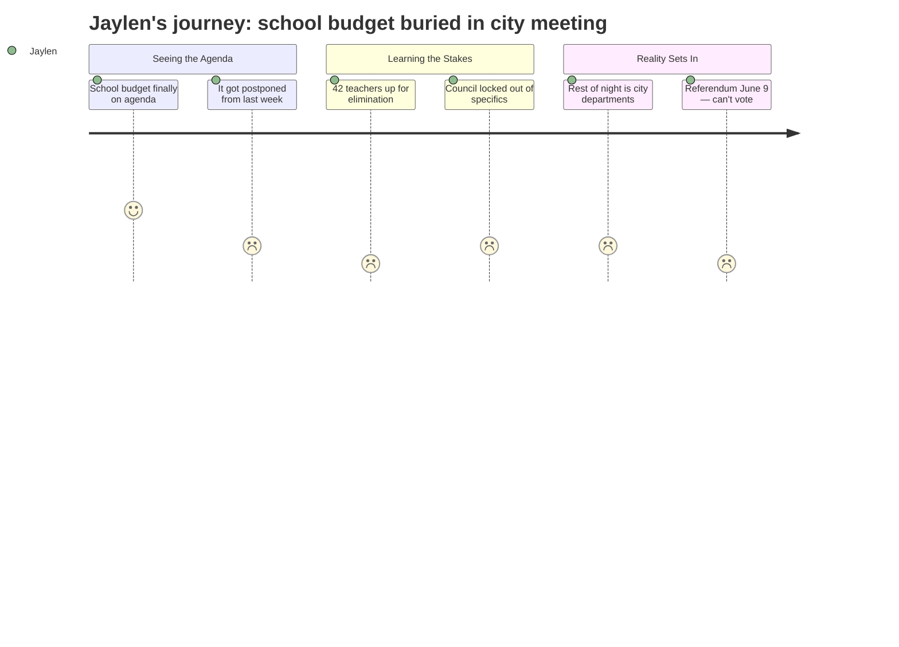

# Interpretation: Jaylen (PERSONA-012)
## Meeting: City Council Regular Meeting -- April 14, 2026 -- 2026-04-14

---

### Structured Points

#### 1. The school budget presentation was postponed — again
- **Fact:** The school budget presentation was originally scheduled for the April 7 City Council public hearing but was postponed because the School Board had not yet adopted a proposed budget. It was rescheduled to this evening, April 14.
- **Source:** Agenda Item B.1, Position Paper of the City Manager: "As the School Board had yet to adopt a proposed budget for FY27 by the April 7, 2026 City Council public hearing date, their budget presentation was postponed to this evening."
- **Emotional valence:** negative
- **Threat level:** 2
- **Open question:** true — If the School Board couldn't finalize a budget on time, does that mean the cuts are still being debated internally? Are programs he cares about still on the table?

#### 2. 42 teachers are proposed for elimination
- **Fact:** The proposed FY27 budget includes elimination of 78 positions total, 42 of which are teachers — roughly 12% of district staff.
- **Source:** Fiscal Context summary (meeting context): "78 positions (12% of staff) are proposed for elimination: 42 teachers, 16 ed techs, 14 facilities/food/transport, 2 administrators, 4 non-bargaining."
- **Emotional valence:** negative
- **Threat level:** 5
- **Open question:** true — Which teachers? Which buildings, departments, programs? The aggregate number says nothing about whether his theater director, AP teachers, or cross-country coach are affected.

#### 3. The district's structural gap is $7.2 million — and the savings cushion is gone
- **Fact:** A roll-forward budget would require an 18–19% property tax increase. The Board capped the increase at 6%, forcing roughly $7.2M in cuts. The fund balance — money the district could use to soften cuts — is essentially depleted.
- **Source:** Fiscal Context summary: "The district faces a $7.2M structural gap… The fund balance (savings) is essentially depleted — no cushion remains."
- **Emotional valence:** negative
- **Threat level:** 4
- **Open question:** false — The scale of the problem is clear. What's unclear is how the cuts will be distributed.

#### 4. The City Council cannot protect specific programs, only the bottom line
- **Fact:** Per state law and the City Charter, the Council can only vote to increase or decrease the total school budget number. It cannot direct the district to save or cut any specific program, school, or position.
- **Source:** Agenda Item B.1, Position Paper: "If Council elects to increase or decrease the School budget amount, it can only do so to the bottom line number per State law and City Charter. Council cannot dictate which specific items to add/cut/increase/decrease, including whether or not a school building is closed."
- **Emotional valence:** negative
- **Threat level:** 3
- **Open question:** true — If the Council can't protect theater or AP courses specifically, who can? Is there any official body that decides which programs survive and which don't?

#### 5. The public gets to comment — and so does Jaylen
- **Fact:** The agenda explicitly schedules public comment as part of the school budget hearing. Councilors can also ask questions and provide guidance after public comment.
- **Source:** Agenda Item B.1, Position Paper: "After members of the public provide their comments, Councilors can then utilize this hearing to provide guidance to the School about their budget request."
- **Emotional valence:** positive
- **Threat level:** 1
- **Open question:** true — Would his testimony actually shift anything, given that the Council can only touch the bottom line?

#### 6. Voters decide on June 9 — but students cannot vote
- **Fact:** The school budget will go to a validation referendum on June 9, 2026. The Council vote to send the budget to voters is scheduled for May 5, 2026.
- **Source:** Agenda Item B.1, Position Paper: "Council votes to send the budget to voters for the validation referendum (which will be held on June 9, 2026)."
- **Emotional valence:** negative
- **Threat level:** 3
- **Open question:** true — The people most directly affected by the budget — current students — have no vote in the outcome.

#### 7. The school budget was one item in a three-hour workshop on city departments
- **Fact:** The full workshop agenda covers ten city departments including Police, Fire, Public Works, Parks and Recreation, and others. The school budget is listed first as a public hearing but then shares the evening with every other city spending priority.
- **Source:** Agenda Item C.1: "Tonight's order of departments include: City Clerk, Human Resources/Benefits, Social Services/GA, Police, Fire, Library, Sustainability, Public Works, Facilities, Parks, Rec, Waterfront & Golf Course."
- **Emotional valence:** neutral
- **Threat level:** 2
- **Open question:** true — How much real time and attention did the school budget actually get? Was there genuine engagement, or was it squeezed between the fire department and the dog park?

---

### Journey Map

---

### Reactions

Okay so basically the school finally had to present their budget to the city council last night — it was supposed to happen the week before but they weren't even ready, like they still hadn't decided what they were cutting. That alone is kind of wild to me. We're talking about 42 teachers getting laid off and they couldn't even have their numbers together on time? Nobody told us that was happening. I found out from the agenda PDF.

The part that actually got me is this: the city council literally cannot tell the school what to keep or cut. They can only vote on the total dollar amount — that's it, state law apparently. So even if a councilor wanted to say "hey don't cut the theater program," they legally can't do that. Which means there's basically no one in this whole process whose job is to protect specific programs. The school board decides internally, and we just find out after. I was thinking maybe if enough people showed up to that meeting and said something, it might actually matter — and technically you can still testify — but I honestly don't know who's making the call on which 42 teachers go.

And then the rest of the meeting was literally the city clerk and the dog park consultant. The school is cutting 12% of its staff and we got lumped into the same agenda as whether South Portland should have a dog park. The vote that decides all of this goes to a referendum on June 9 — I'll still be 16. I can't vote. None of us can. The budget is "for the kids" but we don't get a say in whether it happens. I'm going to the May 5th hearing when the council actually votes to send it to the ballot. I need to know which teachers they're cutting before that happens.