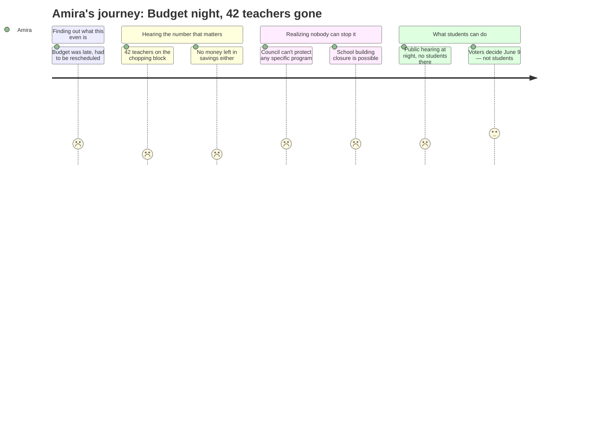

I have all the evidence I need from the meeting context. Let me produce Amira's interpretation now.

---
schema_version: "1.0"
meeting_id: "2026-04-14-city-council"
persona_id: "PERSONA-013"
persona_name: "Amira"
meeting_date: 2026-04-14
meeting_title: "City Council Regular Meeting -- April 14, 2026"
interpretation_date: 2026-04-15
interpreter_model: "claude-sonnet-4-6"
---

# Interpretation: Amira (PERSONA-013)
## Meeting: City Council Regular Meeting -- April 14, 2026 -- 2026-04-14

### Structured Points

#### 1. 42 teachers are being cut
- **Fact:** The proposed FY27 budget includes eliminating 78 positions across the district, including 42 teachers and 16 ed techs — 12% of the total staff.
- **Source:** Fiscal Context summary (meeting context preamble)
- **Emotional valence:** negative
- **Threat level:** 5
- **Open question:** true

#### 2. They couldn't even finish the budget on time
- **Fact:** The school board had not adopted a proposed budget by the April 7 public hearing date, forcing the entire presentation to be postponed a week to April 14.
- **Source:** City Council Agenda, Section B.1 — Position Paper of the City Manager
- **Emotional valence:** negative
- **Threat level:** 2
- **Open question:** true

#### 3. The city council is not allowed to protect specific programs
- **Fact:** Per state law and the City Charter, the Council can only vote to raise or lower the school budget's bottom-line number — it cannot direct the district to keep or cut any specific program, position, or school building.
- **Source:** City Council Agenda, Section B.1 — Position Paper of the City Manager
- **Emotional valence:** negative
- **Threat level:** 3
- **Open question:** true

#### 4. "School building closed" is an option on the table
- **Fact:** The agenda explicitly names school building closure as an example of something the Council cannot control — meaning it is a live possibility the district itself could decide on without Council direction.
- **Source:** City Council Agenda, Section B.1 — Position Paper of the City Manager
- **Emotional valence:** negative
- **Threat level:** 4
- **Open question:** true

#### 5. A public hearing happened — but students were not named as participants
- **Fact:** The agenda describes a public hearing where members of the public can comment and councilors can ask questions. No provision is mentioned for student input, and the hearing was held at 6:30 PM on a Tuesday at City Hall.
- **Source:** City Council Agenda, Section B.1 — Position Paper of the City Manager
- **Emotional valence:** negative
- **Threat level:** 2
- **Open question:** true

#### 6. There will be a voter referendum on June 9
- **Fact:** The Council will vote at a May 5 public hearing to send the school budget to voters, with the validation referendum scheduled for June 9, 2026.
- **Source:** City Council Agenda, Section B.1 — Position Paper of the City Manager
- **Emotional valence:** neutral
- **Threat level:** 1
- **Open question:** true

#### 7. The fund balance is gone — there is no backup plan
- **Fact:** The district's fund balance (its savings cushion) is described as essentially depleted, meaning there is no reserve to soften the impact of cuts on programs or positions.
- **Source:** Fiscal Context summary (meeting context preamble)
- **Emotional valence:** negative
- **Threat level:** 4
- **Open question:** false

### Journey Map

### Reactions

Mom, okay so I looked up what happened at that budget meeting last night and honestly it's kind of scary. The main thing is they're proposing to cut 42 teachers. Not like two or three at the end of the year — 42. And 16 ed techs on top of that. I don't know which ones yet. Nobody does. That's the part that's messing with me because it could be any of them. Remember how I found out about Mrs. Chen leaving from Destiny in the hallway? It's going to be like that again except way bigger.

The part I don't understand is there are these rules where the city council can't even say which specific things get cut. They can only say yes or no to the total number. So even if a councilor went in there wanting to save the music program or the gifted program or whatever, they legally can't. The school board decides what to cut from the inside. And the school board couldn't even get a budget ready by last week — they had to push the whole meeting back a week. I don't know, it just makes me feel like the adults don't have a handle on this.

And there was a public hearing where people could go speak. But it was at 6:30 at night at city hall on a Tuesday, and nobody at school told us about it. There's going to be a vote in June where actual adults get to decide, but I can't vote and neither can any of my friends. Nobody asked what we think. They're deciding what our school is going to look like next year and we're just supposed to find out what they picked.