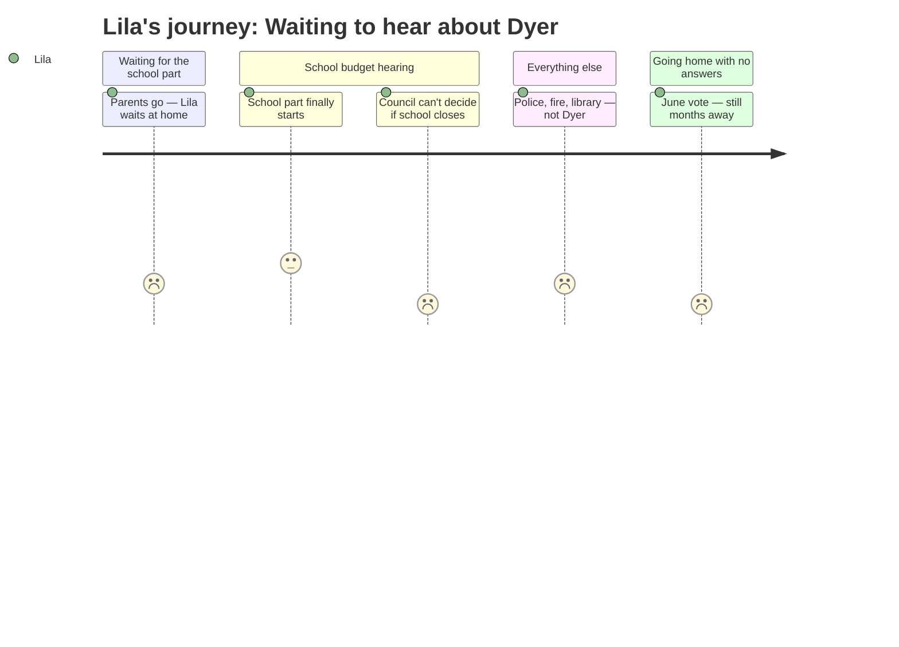

# Interpretation: Lila (PERSONA-014)
## Meeting: City Council Budget Workshop #1 — April 14, 2026

### Structured Points

#### 1. The School Budget Hearing Finally Happened
- **Fact:** The school budget presentation was originally scheduled for April 7 but was postponed because the School Board had not yet adopted a proposed budget. It was rescheduled to this meeting — meaning even the adults running the process were behind.
- **Source:** Agenda Item B.1, City Manager Position Paper ("As the School Board had yet to adopt a proposed budget for FY27 by the April 7, 2026 City Council public hearing date, their budget presentation was postponed to this evening.")
- **Emotional valence:** neutral
- **Threat level:** 2
- **Open question:** true

#### 2. The City Council Cannot Decide Whether Dyer Closes
- **Fact:** State law and the City Charter prohibit the City Council from telling the school district which specific buildings to close or keep open. The Council can only vote on a single bottom-line dollar amount. If they want a different amount, the School Board then decides how to respond.
- **Source:** Agenda Item B.1, City Manager Position Paper ("Council cannot dictate which specific items to add/cut/increase/decrease, including whether or not a school building is closed.")
- **Emotional valence:** negative
- **Threat level:** 4
- **Open question:** true

#### 3. Forty-Two Teachers Could Lose Their Jobs
- **Fact:** The proposed FY27 budget includes eliminating 78 positions total, of which 42 are teachers. This represents 12% of all district staff.
- **Source:** Fiscal Context (FY27 budget figures)
- **Emotional valence:** negative
- **Threat level:** 4
- **Open question:** true

#### 4. Fewer Kids Is the Reason — But Dyer Still Feels Fine
- **Fact:** Elementary enrollment has dropped 23% over four years, from 1,401 students to 1,080. The district says this decline, combined with staffing that grew during those same years, is the core driver of the $7.2M shortfall requiring cuts.
- **Source:** Fiscal Context (FY27 budget figures)
- **Emotional valence:** negative
- **Threat level:** 3
- **Open question:** true

#### 5. The Whole City Gets a Vote in June — But Not Until June
- **Fact:** After tonight's hearing and two more workshops, the Council sends the budget to a voter referendum on June 9, 2026. No final decision is locked in until that vote.
- **Source:** Agenda Item B.1, City Manager Position Paper ("voters for the validation referendum (which will be held on June 9, 2026)")
- **Emotional valence:** neutral
- **Threat level:** 3
- **Open question:** true

#### 6. People from the Community Came to Speak Up
- **Fact:** The public hearing format explicitly provided time for members of the public to give comments before Councilors offered guidance. People from the community showed up and had a voice — not just officials.
- **Source:** Agenda Item B.1, City Manager Position Paper ("After members of the public provide their comments, Councilors can then utilize this hearing to provide guidance...")
- **Emotional valence:** positive
- **Threat level:** 1
- **Open question:** false

#### 7. Most of the Night Had Nothing to Do With Schools
- **Fact:** The bulk of the meeting covered City Clerk, Human Resources, Social Services, Police, Fire, Library, Sustainability, Public Works, Facilities, and Parks — ten separate city departments with no connection to schools or the Dyer closure.
- **Source:** Agenda Item C.1, City Manager Position Paper (department list)
- **Emotional valence:** negative
- **Threat level:** 2
- **Open question:** false

---

### Journey Map

---

### Reactions

My mom and dad went to the big meeting last night about the school stuff. I asked them what happened when they got home and my mom looked really tired. She said they FINALLY talked about the school budget but it was supposed to happen LAST week and they just didn't. And I was like okay but what did they SAY about Dyer, and she said they talked about money and cuts and a lot of numbers. She said 42 teachers might lose their jobs and I started thinking about which teachers and I couldn't stop.

The really confusing part is that even the city council people aren't the ones who decide if Dyer closes. My dad tried to explain it and he said there's like a rule that says they can't say which school closes, only the school board gets to do that. So I was like WHO IS DECIDING THEN? And he said it's complicated. I hate when adults say it's complicated. It means they don't want to explain it or maybe they don't know either. And then there's going to be a vote in June. Like, the WHOLE CITY votes. But that's the end of school. I'll be almost done with 4th grade and I still won't know where I'm going for 5th.

My mom also said most of the meeting wasn't even about schools. It was about the fire department and the library and a dog park. A dog park! And I'm like why are they talking about a dog park when my school might be closing?? My best friend Emma texted me this morning and asked what happened and I said I still don't know. We've been asking since forever and we still just don't know.