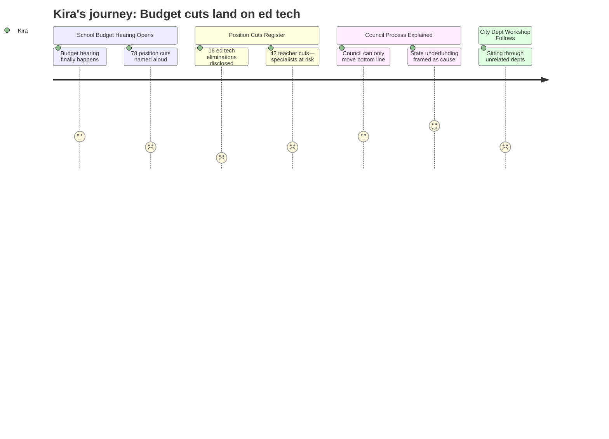

---
schema_version: "1.0"
meeting_id: "2026-04-14-city-council"
persona_id: "PERSONA-015"
persona_name: "Kira"
meeting_date: 2026-04-14
meeting_title: "City Council Regular Meeting -- April 14, 2026"
interpretation_date: 2026-04-15
interpreter_model: "claude-sonnet-4-6"
---

# Interpretation: Kira (PERSONA-015)
## Meeting: City Council Regular Meeting -- April 14, 2026 -- 2026-04-14

---

### Structured Points

#### 1. Budget presentation delayed a full week — then finally heard
- **Fact:** The FY27 school budget presentation was postponed from the April 7 City Council public hearing to April 14 because the School Board had not yet adopted a proposed budget. The presentation was therefore absorbed into this workshop as a de facto combined hearing and working session.
- **Source:** City Council Agenda, Item B.1 — Position Paper of the City Manager
- **Emotional valence:** negative
- **Threat level:** 2
- **Open question:** false

#### 2. Sixteen ed tech positions proposed for elimination
- **Fact:** The proposed FY27 budget includes elimination of 16 ed tech positions, part of a total 78-position reduction affecting 12% of district staff.
- **Source:** Fiscal Context Summary — position elimination breakdown
- **Emotional valence:** negative
- **Threat level:** 5
- **Open question:** true

#### 3. Forty-two teacher positions on the cut list — specialists among the vulnerable
- **Fact:** The proposed budget eliminates 42 teaching positions. The breakdown between classroom generalists and itinerant or specialist roles (such as the positions Kira holds) is not specified in the available evidence.
- **Source:** Fiscal Context Summary — position elimination breakdown
- **Emotional valence:** negative
- **Threat level:** 4
- **Open question:** true

#### 4. Enrollment-staffing narrative may flatten equity investments
- **Fact:** The budget framing notes that enrollment dropped 300 students while staffing grew 82 positions over four years. This framing is presented as a driver of the structural gap, without specifying which positions grew or why.
- **Source:** Fiscal Context Summary — enrollment and staffing figures
- **Emotional valence:** negative
- **Threat level:** 3
- **Open question:** true

#### 5. State pays 20% of actual costs — should be 55%
- **Fact:** The district receives state funding covering approximately 20% of actual per-pupil costs against an expected share of roughly 55%, contributing to the $7.2M structural gap.
- **Source:** Fiscal Context Summary — state funding coverage figures
- **Emotional valence:** neutral
- **Threat level:** 3
- **Open question:** false

#### 6. Council cannot direct which school closes or which programs survive
- **Fact:** Per state law and City Charter, the City Council may only adjust the school budget's bottom-line number — it cannot specify which positions, programs, or buildings are affected. Any bottom-line change sends the decision back to the School Board.
- **Source:** City Council Agenda, Item B.1 — Position Paper of the City Manager
- **Emotional valence:** neutral
- **Threat level:** 2
- **Open question:** true

#### 7. No reconfiguration equity framing visible in public hearing agenda
- **Fact:** The agenda for the school budget hearing lists no agenda items specifically addressing how building reconfiguration decisions will account for equity, MTSS access distribution, or the findings of the 2024 Boundaries and Configurations Steering Committee.
- **Source:** City Council Agenda, Item B.1; reference context — school-integration-policy trove
- **Emotional valence:** negative
- **Threat level:** 3
- **Open question:** true

---

### Journey Map

---

### Reactions

The number that hit me hardest wasn't 42 teachers — it was 16 ed techs. I know those people. At Dyer, at Skillin, at Brown — those are the adults sitting next to kids who can't regulate, who are still learning English, who are waiting on intervention slots because we don't have enough specialists to get to them on time. We've been understaffed on that side of the work for years, and the proposed response to a budget crisis is to cut deeper into it. I don't know yet whether the 42 teachers include the itinerant positions or just classroom roles, and that question kept me awake. Nobody said.

What also stuck with me is this framing that staffing grew while enrollment dropped — like those are two things that happened by accident and nobody noticed. Some of that staffing growth *was* the district finally trying to get ahead of the equity gaps the Boundaries Committee documented in 2024. We added positions because we identified need. Now that work is being dismantled in a single budget cycle and the public narrative is going to be "the district was bloated." I don't have the breakdown of which 82 positions grew and why, and I'm not going to get it in a public hearing. That's what frustrates me most — the equity investments and the inefficiency get collapsed into one number.

The one thing I actually found clarifying tonight, weirdly, was the explanation about what the City Council can and can't do. They can move the bottom line, they can't tell the board which school to close or which specialist to keep. That means the equity dimensions of reconfiguration stay with the board, where they belong. It also means all the public pressure at this hearing — from single-school parents, from people who've never been inside a building other than their own — doesn't actually force the board's hand on the specific decisions. That's the right structure. But it also means the board has to hold the line on doing this right, not just doing it fast. And I haven't seen evidence yet that anyone is asking the question I need answered: after the cuts, which school will still have a full-time MTSS team, and which one won't?