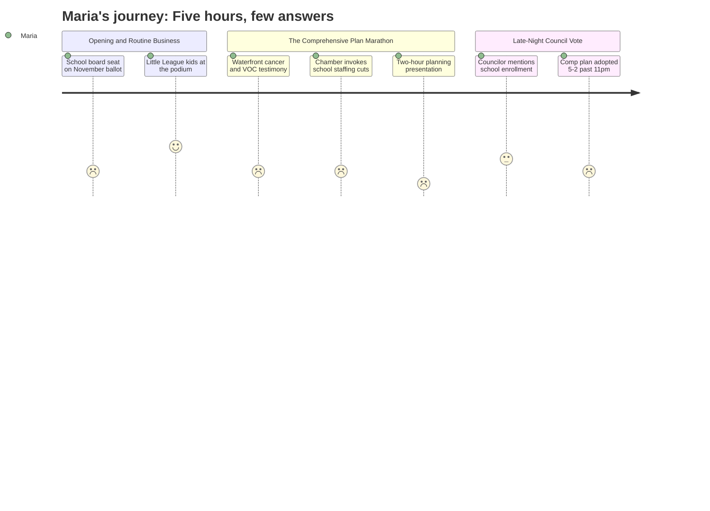

# Interpretation: Maria (PERSONA-001)
## Meeting: City Council Regular Meeting -- April 21, 2026 -- 2026-04-21

### Structured Points

#### 1. School Board Seat Headed to November, Not Filled Now
- **Fact:** Adrian Dowling's District 5 school board seat was accepted as resigned and placed on the November 3, 2026 ballot. The council chose not to appoint a replacement. The item passed with no discussion as part of the consent calendar.
- **Source:** [01:44--02:33] city clerk announcement; Order 180-25-26, consent calendar roll call [07:58]
- **Emotional valence:** negative
- **Threat level:** 3
- **Open question:** true — The school board is actively deciding on a budget that would cut 78 positions. Who, if anyone, is advocating for District 5 families at the table between now and November? Will the seat sit empty during the critical budget vote period?

#### 2. June 9 Budget Referendum Date Is Now Official
- **Fact:** Order 182-25-26 formally sets June 9, 2026 as the date for polling locations to open for the school budget validation referendum election. The item passed with no discussion.
- **Source:** [05:37] consent calendar reading; Order 182-25-26
- **Emotional valence:** neutral
- **Threat level:** 2
- **Open question:** true — What exactly will appear on the June 9 ballot? Maria needs to know whether she's voting to approve or reject the proposed budget, and what a "no" vote actually does.

#### 3. Chamber of Commerce Uses School Staffing Cuts to Argue for Development
- **Fact:** Thomas O'Boyle, advocacy director for the Portland Regional Chamber, argued the council should adopt the comprehensive plan by citing South Portland's "difficult choices around school staffing and facilities," saying that without expanding the tax base through new development, those costs "are not avoided, they are shifted onto existing residents."
- **Source:** [170:31--171:18] (O'Boyle public comment on comprehensive plan)
- **Emotional valence:** negative
- **Threat level:** 3
- **Open question:** true — If new development is the path to funding schools, how many years does it take before a rezoned, remediated, developed waterfront parcel actually generates tax revenue? And what happens to teachers and ed techs in the meantime?

#### 4. A Councilor Says Housing Will "Build Back School Populations"
- **Fact:** During late-night council deliberation on the comprehensive plan, Councilor Scott argued for welcoming new residents and expanding housing as a path to "build back our school populations" and restore the community South Portland wants to be.
- **Source:** [~256:21] (Councilor Scott, via video during council discussion)
- **Emotional valence:** positive
- **Threat level:** 2
- **Open question:** true — Maria is living with enrollment decline right now. Her kids' school is already smaller. Even if more families move to South Portland over the next decade, what does the district look like in the years before that growth arrives?

#### 5. Cancer Residents Testify 700 Feet from the Tanks
- **Fact:** Two residents — Edward Reiner, who lives approximately 700 feet from the Global and Sprague tanks and is in bladder cancer treatment, and Leslie Gatcombe-Hines, a 21-year South Portland resident also in cancer treatment — testified about air quality and environmental health risks in neighborhoods near the eastern waterfront.
- **Source:** [20:25--21:14] (Gatcombe-Hines); [22:01--23:33] (Reiner)
- **Emotional valence:** negative
- **Threat level:** 2
- **Open question:** true — Are South Portland's elementary schools in proximity to these same tank areas? Maria does not know, and this meeting did not address it.

#### 6. Extensive Public Comment Did Not Change the Core Outcome
- **Fact:** Twenty-one speakers offered public comment on the comprehensive plan, with the majority urging the council to delay adoption or reinstate a community-preferred alternative (CALUPA 27) for the eastern waterfront. The council adopted the plan 5-2, with amendments limited to adding one sentence about emissions methodology and correcting missing timeline fields.
- **Source:** Public comment [137:33--220:30]; amendments [243:51--284:23]; final vote [293:44--294:28]
- **Emotional valence:** negative
- **Threat level:** 2
- **Open question:** true — Maria attends school board meetings and prepares specific questions. She now has new data about how much public testimony shapes outcomes in South Portland. What strategy actually works?

#### 7. Nearly Five Hours of Meeting Time on Topics Unrelated to School Budget
- **Fact:** The formal agenda included the comprehensive plan vote (the dominant item), three e-bike ordinances, a transit committee dissolution, a Little League proclamation, and routine consent calendar business. School-related items — the board vacancy and referendum date — were on the consent calendar and received no floor discussion.
- **Source:** Full agenda; transcript [00:10--296:04]
- **Emotional valence:** negative
- **Threat level:** 1
- **Open question:** true — Maria tracked school board meetings and this city council meeting to stay informed. She left knowing almost nothing new about the budget that will affect her children's classrooms. Which body actually decides what happens, and when?

---

### Journey Map

---

### Reactions

Okay so I just got home from that city council meeting and I don't even know where to start. I was there for almost five hours. FIVE HOURS. And the only things that had anything to do with our schools were two items on the consent calendar that nobody even discussed — they just read them out loud and voted yes. One was the school board vacancy (Dowling resigned, District 5, and instead of appointing someone now, they're putting it on the November ballot — so that seat is just... open? During all of this?), and the other was formally setting June 9th as the referendum date. That's it. That's what I got for five hours.

The rest of it was all about this comprehensive plan — basically a 15-year land use map for the city, and whether they should allow development near Bug Light park by the waterfront. I will be honest, I got completely lost. There are all these zones called KLUPAs and subzones and VOC emission modeling questions and sea level rise projections to 8.8 feet by 2120. I'm not exaggerating when I say I understood maybe 20% of what was being said. What I do know is that a ton of residents came out — like 21 people — most of them saying don't develop the waterfront, bring back this thing called CALUPA 27, save the shipyard. And then the council basically voted yes to the plan anyway, with two small changes. So I'm sitting there at 11pm thinking about what this means for getting parent voices heard at school board, because if 21 people speaking doesn't change the core outcome here, what does it take?

The thing that actually made me sit up straight was the Chamber of Commerce guy who got up and said South Portland is facing "difficult choices around school staffing and facilities" and that new development is the answer. He was using our kids — our kids' teachers losing their jobs — as his argument for why the council should approve this developer-friendly land use plan. And look, maybe there's a real connection there. Maybe if the eastern waterfront eventually gets developed, it eventually generates tax revenue that eventually helps the school budget. But that's a lot of "eventuallys" when we're talking about cuts happening right now. I need someone to explain that timeline to me in plain English before I know what to think. I'm going to bring it up in the budget group chat and see if anyone else heard the same thing. June 9th is coming fast and I don't think most parents even know there's a referendum.