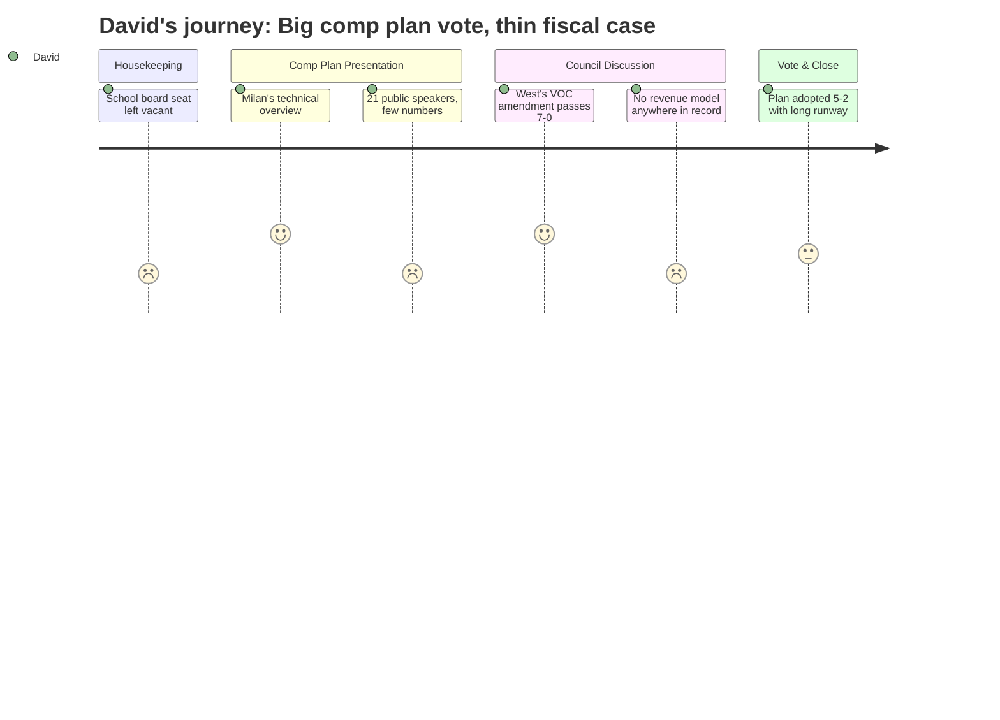

# Interpretation: David (PERSONA-002)
## Meeting: City Council Regular Meeting -- April 21, 2026 -- 2026-04-21

### Structured Points

#### 1. School Board Vacancy Going to November Ballot
- **Fact:** The council accepted Adrian Dowling's resignation from School Board District 5 (term through December 2027) and directed the city clerk to place the seat on the November ballot rather than making an immediate appointment, leaving the seat vacant for roughly seven months during the district's most acute budget crisis in recent memory.
- **Source:** Consent Calendar item, Order 180-25-26 [01:44--05:37]
- **Emotional valence:** negative
- **Threat level:** 3
- **Open question:** true

#### 2. Milan's Presentation Laid Out a Clear — and Very Long — Implementation Runway
- **Fact:** Planning Director Milan Nevajda walked through the full chain from comp plan adoption to actual development: state certification, then roughly three years of zoning work, then development review, then a construction lag of two to three years beyond approval. He estimated new revenue from the Eastern Waterfront is realistically five to seven-plus years away at minimum, even under a favorable vote tonight.
- **Source:** Comp Plan implementation timeline slides [94:35--97:44]
- **Emotional valence:** negative
- **Threat level:** 4
- **Open question:** true

#### 3. The Chamber Speaker Was the Only Voice to Connect Development Directly to the School Budget
- **Fact:** Portland Regional Chamber advocacy director Thomas O'Boyle stated explicitly: "South Portland is facing rising costs, difficult choices around school staffing and facilities, and significant long-term capital needs. Without expanding the tax base through new housing and commercial development, those costs are not avoided, they are shifted onto existing residents." This was the only speaker to name the school staffing crisis as a fiscal reason to adopt the plan. Staff did not raise it, and no councilor picked it up.
- **Source:** Public comment, Thomas O'Boyle [170:31--171:18]
- **Emotional valence:** neutral
- **Threat level:** 3
- **Open question:** true

#### 4. Staff Quantified the VOC Cancer Risk — the Number Was Specific and Went Largely Unexamined
- **Fact:** City Manager Scott stated that current monitoring data, over a 70-year continuous worst-case exposure period for the entire South Portland population, predicts one additional cancer case. He noted this does not address short-term acute impacts and that a new combined DEP/CDC report is expected in June 2026. This is a meaningful data point, but it was offered late in the meeting, in response to a question, and received no follow-up from councilors about the underlying model or its assumptions.
- **Source:** City Manager response during post-public-comment Q&A [225:09--226:42]
- **Emotional valence:** neutral
- **Threat level:** 2
- **Open question:** true

#### 5. An Economist's Net Revenue Estimate of ~$2.5M Went Unchallenged on Either Side
- **Fact:** Economist and resident Marianne Hill stated that development near Bug Light might generate $3-4M in gross new property tax revenue but, after accounting for additional city expenses, would net approximately $2.5M — less than 2% of the city budget — while sea level rise remediation costs approximately $2M per year over 50 years. She presented this as evidence that a park was fiscally comparable. No staff member, no other speaker, and no councilor engaged with the arithmetic or its assumptions.
- **Source:** Public comment, Marianne Hill [175:17--178:26]
- **Emotional valence:** negative
- **Threat level:** 3
- **Open question:** true

#### 6. Councilor West's VOC Amendment Was Targeted, Evidence-Based, and Passed Unanimously
- **Fact:** Councilor West moved to insert the following language into plan sections 5C14 and CALUPA 22B, after the word "occupancy": "The evaluation must incorporate maximum potential emissions." The language was drawn directly from a public commenter (Dave Hebert) who had cited the Maine DEP's own regulatory terminology. The amendment passed 7-0, including the two councilors who ultimately voted against the overall plan.
- **Source:** Council deliberation and roll call vote [242:05--245:23]
- **Emotional valence:** positive
- **Threat level:** 1
- **Open question:** false

#### 7. Comp Plan Adopted 5-2 — but the Fiscal Case Was Never Quantified by Staff
- **Fact:** The council voted 5-2 to adopt the amended comprehensive plan (Coleman and Tipton dissenting). The plan's position papers and staff presentation emphasized policy balance, environmental protections, and housing need. No staff document or presentation in the meeting contained a pro forma tax revenue estimate for the Eastern Waterfront under buildout, a comparison of park maintenance costs versus development revenue, or a per-parcel assessed value projection. The fiscal argument was left entirely to public commenters.
- **Source:** Final roll call vote [293:41--294:28]; Position paper of the City Manager (Agenda item F.6)
- **Emotional valence:** negative
- **Threat level:** 3
- **Open question:** true

### Journey Map

### Reactions

Okay so the big headline is the comp plan passed, five to two. Four years of process, finally done. And honestly the planning director's presentation was pretty solid — he actually walked through the whole pipeline: comp plan, then zoning which takes three years, then development review, then construction lag. So anyone expecting new tax revenue from the Eastern Waterfront before 2032 at the earliest is kidding themselves. That matters a lot right now given what's happening with the school budget.

Here's what bugged me: the chamber of commerce guy was the only person in the room who connected the Eastern Waterfront development question to the school staffing crisis. He said it plainly — without new housing and commercial tax base, those school costs just get pushed onto existing homeowners. That's true. But nobody at the staff level put a number on it. No pro forma, no estimated assessed value at buildout, nothing. You had a public commenter — an economist — saying development would only net $2.5M after expenses, and nobody pushed back on that math or offered an alternative figure. That's a really consequential number to just let sit unchallenged. I want to know what the district's own projections look like.

The thing I'll actually give the council credit for: Councilor West got a unanimous amendment through that requires any VOC health evaluation to use maximum potential to emit values rather than current operating levels. That's actually meaningful. It closes the exact gap that the first public commenter flagged — the fact that Sunoco was running at 30% of permitted capacity in recent years, but could legally scale to full capacity, which would change the health picture entirely. Someone in that room understood that distinction and turned it into enforceable plan language. That's the kind of thing that's easy to miss if you're not reading the DEP permit documents. The school board vacancy sitting open until November, though — seven months with a seat empty during the worst budget year in recent memory — that one's harder to feel good about.