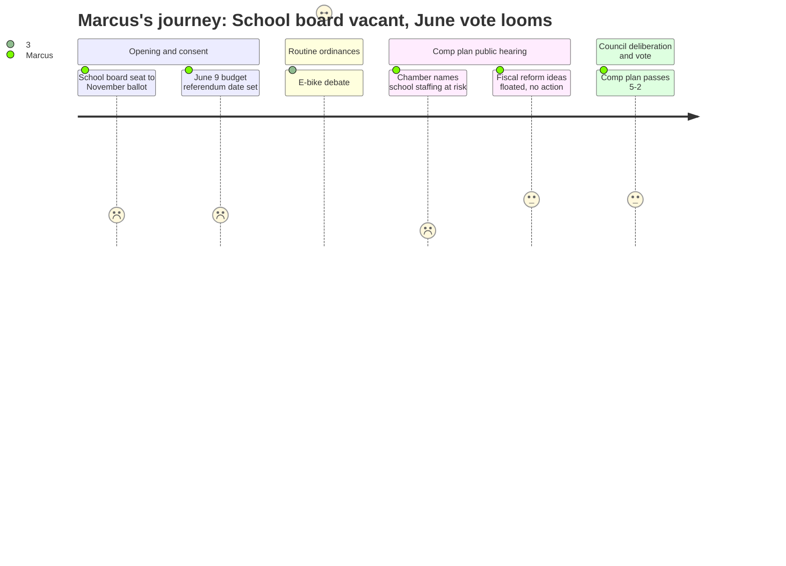

# Interpretation: Marcus (PERSONA-004)
## Meeting: City Council Regular Meeting -- April 21, 2026 -- 2026-04-21

### Structured Points

#### 1. School Board District 5 Seat Heading to November Ballot
- **Fact:** The resignation of school board member Adrian Dowling from the District 5 seat (term expiring December 2027) was formally accepted. The council voted to place the seat on the November 3, 2026 ballot rather than filling it by appointment, leaving the seat vacant until then.
- **Source:** Transcript [00:01:44], clerk's announcement; Order 180-25-26, Consent Calendar item D.3; agenda position paper B.1
- **Emotional valence:** negative
- **Threat level:** 4
- **Open question:** true

#### 2. June 9 Budget Referendum Date Set
- **Fact:** The council voted as part of the consent calendar to set June 9, 2026 as the date for the State Primary and School Budget Validation Referendum Election, at which South Portland voters will decide whether to approve the school budget.
- **Source:** Transcript [00:05:37], clerk's reading of the consent calendar; Order 182-25-26; agenda position paper D.5
- **Emotional valence:** negative
- **Threat level:** 4
- **Open question:** true

#### 3. Chamber of Commerce Uses Teacher Jobs as Development Argument
- **Fact:** Thomas O'Boyle, advocacy director of the Portland Regional Chamber representing 150 South Portland businesses, stated during comprehensive plan public comment: "South Portland is facing rising costs, difficult choices around school staffing and facilities, and significant long-term capital needs. Without expanding the tax base through new housing and commercial development, those costs are not avoided, they are shifted onto existing residents."
- **Source:** Order 187-25-26 public comment, Thomas O'Boyle (Portland Regional Chamber); transcript, comp plan public hearing section
- **Emotional valence:** negative
- **Threat level:** 3
- **Open question:** false

#### 4. Economist's Math Shows Development Revenue Is Thin Relative to the Crisis
- **Fact:** Economist and South Portland resident Marianne Hill calculated that net annual revenue to the city from eastern waterfront development would be approximately $2.5 million -- less than 2% of the city budget -- after subtracting additional expenses, while sea level rise remediation costs approximately $2 million per year.
- **Source:** Order 187-25-26 public comment, Marianne Hill; transcript, comp plan public hearing section
- **Emotional valence:** negative
- **Threat level:** 3
- **Open question:** false

#### 5. Comprehensive Plan Adopted -- Long-Term Tax Base Growth, No Near-Term Relief
- **Fact:** The council voted 5-2 to adopt the South Portland Comprehensive Plan with targeted amendments, including language requiring "maximum potential emissions" evaluation before residential development near petroleum storage facilities. The plan is intended to guide land use for the next 12 years, including eventual housing and commercial growth meant to broaden the tax base.
- **Source:** Transcript [~02:53:00--02:54:00], roll call vote on Order 187-25-26; agenda position paper F.6
- **Emotional valence:** neutral
- **Threat level:** 2
- **Open question:** true

#### 6. Alternative Revenue Ideas Surfaced but No Action Taken
- **Fact:** Multiple public speakers raised alternatives to property tax as the city's primary revenue source, including a resident economist who cited Portland's pilot of a tax on nonprofits ("We have 288 nonprofits here who have hundreds of millions of dollars in property"). The council did not act on or formally acknowledge any of these ideas.
- **Source:** Order 187-25-26 public comment, Marianne Hill and Claire Holman; transcript, comp plan public hearing section
- **Emotional valence:** neutral
- **Threat level:** 2
- **Open question:** true

#### 7. November Council Election Named as Pivotal Moment
- **Fact:** Councilor Coleman explicitly warned during deliberations that three council seats are up in November, and that continuing to delay the comprehensive plan risked a different council reversing direction. For Marcus, the same November election now also includes the school board District 5 seat and the composition of the body that will govern the next budget cycle.
- **Source:** Transcript, council deliberation on Order 187-25-26, Councilor Coleman remarks (~[02:29:00--02:30:00] range)
- **Emotional valence:** negative
- **Threat level:** 3
- **Open question:** true

---

### Journey Map

---

### Reactions

So I actually went. Meeting was at the high school, which is fitting I guess. Five hours. Most of it was people arguing about whether to put condos next to Bug Light Park. Important stuff, I get it -- but here's what I can't shake. They set the date. June 9. That's the school budget referendum. It's on the consent calendar, five seconds, done. Nobody talked about it. And that's the vote that decides whether 42 of my colleagues have jobs in September. It just sailed through on the same list as a Little League proclamation.

The other thing that hit me: Adrian Dowling resigned from the school board -- District 5 seat. And the council voted to put it on the November ballot instead of filling it by appointment. So we're going into the most consequential budget year in the district's history with a vacant school board seat for the next seven months. The union should be paying close attention to who runs for that seat and what they're saying about educator positions. This is not the time to let that go uncontested.

The comp plan passed, for what it's worth. And look, I heard the argument -- grow the tax base, eventually that helps fund schools. One speaker actually ran the math. Net revenue from the eastern waterfront development? About two and a half million dollars a year, years from now, if everything goes right. Less than two percent of the city budget. Meanwhile the school tax is already sixty-one percent of property taxes and we're looking at cutting forty-two teachers this fall. A developer from the Portland Regional Chamber literally stood up and said our staffing crisis is why they need their zoning approved. He used us as the reason. That's where we are. The comp plan being good or bad doesn't touch June 9.