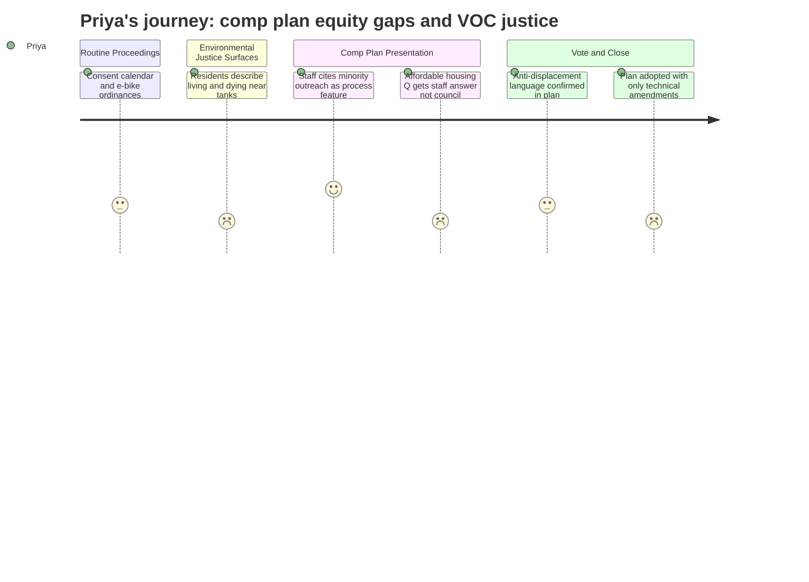

# Interpretation: Priya (PERSONA-005)
## Meeting: City Council Regular Meeting -- April 21, 2026 -- 2026-04-21

### Structured Points

#### 1. Multilingual Outreach in Planning Process -- Claimed but Unverified
- **Fact:** Planning Director Milan Nevajda stated that staff specifically reached out to minority groups and worked with translators to solicit input from populations who "don't have the voice even to speak in the way that we would normally understand it," and attributed this effort to planner Eli Rubin.
- **Source:** Transcript [64:59--66:31]
- **Emotional valence:** positive
- **Threat level:** 2
- **Open question:** true

#### 2. Environmental Justice Hidden Inside the VOC Fight
- **Fact:** Multiple speakers -- including two currently in cancer treatment -- testified that they live within hundreds of feet of the Global and Sprague tanks and cannot afford to leave. One speaker noted that her cancer was genetically determined to be environmental in origin, and another described learning only through a newspaper article -- not from public health authorities -- that the neighborhood had been exposed to benzene at levels exceeding permitted limits.
- **Source:** Transcript [20:25--22:01]; [211:57--214:20]
- **Emotional valence:** negative
- **Threat level:** 5
- **Open question:** true

#### 3. Affordable Housing Question Got a Staff Answer -- Not a Council Commitment
- **Fact:** Audience member Liz Torocca asked directly whether the plan establishes a citywide percentage goal for affordable housing and how affordability is calculated. The planning director provided a substantive answer citing Goals 3A and 7H, defining affordability as below 80% AMI for renters, and naming anti-gentrification and anti-displacement policies. No council member followed up, and no numerical commitment was made or requested.
- **Source:** Transcript [178:00--179:12]; [222:48--224:21]
- **Emotional valence:** negative
- **Threat level:** 3
- **Open question:** true

#### 4. Workforce Housing Squeeze Named, Then Left on the Table
- **Fact:** The planning director explicitly identified households earning 80--120% of area median income as a group "squeezed from both ends" -- too income-qualified for federal and state housing programs, but unable to access market-rate housing -- and stated the plan contains specific recognition of this gap. No council member asked what mechanism in the plan actually addresses this population, and no amendment was proposed on this point.
- **Source:** Transcript [222:48--224:21]
- **Emotional valence:** negative
- **Threat level:** 3
- **Open question:** true

#### 5. Anti-Displacement Language Exists in the Plan -- With No Enforcement Mechanism Described
- **Fact:** The planning director confirmed that Goals 3A and 7H contain anti-gentrification and anti-displacement policies, including protection of existing affordable housing and support for deed-restricted units. The director acknowledged that "gentrification" as a concept "we haven't really approached" has now been included. No speaker or council member asked how compliance or progress on these goals would be measured or reported.
- **Source:** Transcript [222:48--224:21]
- **Emotional valence:** neutral
- **Threat level:** 2
- **Open question:** true

#### 6. The Chamber Explicitly Linked Comp Plan Growth to the School Budget Crisis
- **Fact:** The Portland Regional Chamber's advocacy director testified that "South Portland is facing rising costs, difficult choices around school staffing and facilities, and significant long-term capital needs" and framed adoption of the comp plan -- specifically its housing and commercial growth provisions -- as essential to avoiding those costs being "shifted onto existing residents."
- **Source:** Transcript [170:31--171:18]
- **Emotional valence:** negative
- **Threat level:** 3
- **Open question:** true

#### 7. Councilor Scott Named Belonging and Exclusion as a Housing Equity Issue
- **Fact:** Councilor Heather Scott stated: "I hear so many comments that say, 'I want to live here, and I don't want anyone else, any more people to live here.' And that is a statement that says, 'I belong here, and you don't.'" She connected this to her own experience moving to South Portland and wanting to be welcomed, and explicitly called for South Portland to "build housing that we need" and "welcome new people."
- **Source:** Transcript [255:35--257:07]
- **Emotional valence:** positive
- **Threat level:** 1
- **Open question:** true

#### 8. The Amendments That Passed Were Technical -- Not Equity-Focused
- **Fact:** The council adopted the comprehensive plan with three amendments: (1) a one-sentence addition to VOC health assessment language requiring "maximum potential emissions" to be incorporated; (2) a correction of missing timeline designations in several goals that were confirmed to be PDF export errors; and (3) the motion to incorporate air dispersion and human exposure modeling was defeated 4--3. No amendment addressing affordable housing targets, anti-displacement accountability, or demographic reporting was proposed or debated.
- **Source:** Transcript [243:51--246:09]; [279:17--284:37]; [278:29--279:16]
- **Emotional valence:** negative
- **Threat level:** 3
- **Open question:** false

---

### Journey Map

---

### Reactions

So I was there until almost midnight, and here's what I keep coming back to: two people testified who are currently in cancer treatment, living within walking distance of those tank farms, and one of them found out she'd been exposed to illegal benzene levels through a *newspaper article*. The Maine CDC apparently knew. Nobody told the neighborhood. That's not a regulatory gap -- that's an environmental justice failure. And the people living on those fence lines are not, by and large, the people who can afford to just relocate. The same fiscal pressure that's driving this growth agenda is also the reason those residents stayed. I need us to be honest about that connection.

The planning director mentioned multilingual outreach and working with translators and going to meet minority communities where they are -- and I genuinely perked up at that. That's the kind of process investment that can make a difference. But it was one paragraph in a four-hour meeting, and I left with zero data. How many people were reached? In which languages? What did they say, and where did it land in the final document? Because Goals 3A and 7H have real language in them -- anti-displacement, anti-gentrification, deed-restricted housing -- but that language was named by one audience member's question and answered by staff, and then the council moved on without a single follow-up. That's the tell. The plan says the right things in places. What I can't see yet is who's going to measure progress on them and what happens when they aren't met.

The Chamber rep stood up and said growth is how we fund the schools. And I get the fiscal arithmetic -- I really do -- but that framing erases something important. The school budget cuts that are in the news right now are hitting programs that serve the kids with the least. Those are not abstract numbers. And the answer being offered is: adopt a comp plan that conditionally allows luxury waterfront development, and eventually the tax base grows, and eventually the school gets funded. That is a long chain of assumptions that puts the most vulnerable kids at the end of the line. I don't think the council sees that these are the same story. I need to write something about this before the June ballot.