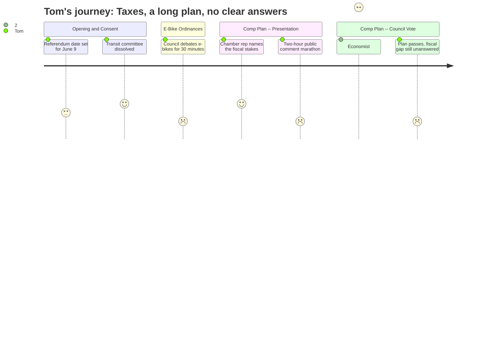

# Interpretation: Tom (PERSONA-006)
## Meeting: City Council Regular Meeting -- April 21, 2026 -- 2026-04-21

### Structured Points

#### 1. School Budget Referendum Locked In for June 9
- **Fact:** The consent calendar (Order 182-25-26) formally set June 9, 2026 as the date for the school budget validation referendum, establishing polling hours of 7 AM to 8 PM at all five district polling locations.
- **Source:** Consent Calendar, Order 182-25-26; Transcript [05:27--05:37]; Agenda Section D.5
- **Emotional valence:** neutral
- **Threat level:** 2
- **Open question:** true — Tom knows the school budget proposes 78 position cuts and a 6% tax increase, but has not yet seen the actual referendum ballot language or a plain-English summary of what a "yes" or "no" vote means for his tax bill.

#### 2. Portland Regional Chamber: New Development Is the Fiscal Relief Valve
- **Fact:** The advocacy director for the Portland Regional Chamber, representing 150 South Portland businesses, stated directly that "South Portland is facing rising costs, difficult choices around school staffing and facilities, and significant long-term capital needs. Without expanding the tax base through new housing and commercial development, those costs are not avoided, they are shifted onto existing residents."
- **Source:** Transcript [171:00--172:08], public comment on Order 187-25-26
- **Emotional valence:** positive
- **Threat level:** 2
- **Open question:** true — Tom agrees with the diagnosis but wants to know the actual numbers: how much new tax revenue would Eastern Waterfront development actually generate, and on what timeline?

#### 3. Economist Puts a Number on Eastern Waterfront Development Revenue — and It's Small
- **Fact:** A self-identified economist and South Portland resident testified that development near the Bug Light area "might bring in three or four million" in annual revenue, but after netting out additional infrastructure expenses, the realistic figure is approximately $2.5 million — "less than 2% of the city's budget." She also cited $100 million in projected sea level rise remediation costs over 50 years, roughly $2 million per year.
- **Source:** Transcript [175:17--178:26], public comment on Order 187-25-26
- **Emotional valence:** negative
- **Threat level:** 3
- **Open question:** true — If the Eastern Waterfront generates barely enough to cover its own future liabilities, what is actually going to close the structural fiscal gap? Nobody answered that question.

#### 4. Sewer Rates and Road Costs Are Also Climbing — With No Funded Plan
- **Fact:** Public commenter Jeremy Naden stated that South Portland sewer rates are projected to rise 22%, with approximately $50 million in wastewater infrastructure needed, and that Broadway carries 24,000 vehicles per day through bottlenecks with "no funded relief." He explicitly warned that "growth without funded infrastructure shifts those costs onto the residents already here."
- **Source:** Transcript [29:30--31:30], Citizen Discussion Part I
- **Emotional valence:** negative
- **Threat level:** 3
- **Open question:** true — Is the 22% sewer rate increase already baked into the tax picture, or is it an additional hit coming on top of the school budget increase?

#### 5. Comprehensive Plan Adopted Without Answering the Fiscal Question
- **Fact:** The council voted 5-2 to adopt the Comprehensive Plan (Order 187-25-26) with three minor technical amendments. No amendment addressing the fiscal cost of infrastructure commitments, impact fees, or the timing of new tax revenue from development passed during the session. The planning director acknowledged that development-generated tax revenue is years away: "We would expect there to be a lag after the zoning is adopted before we ever entertain any formal development proposal."
- **Source:** Transcript [293:41--294:28] (vote); Transcript [97:44--98:00] (timeline lag); Transcript [33:00--34:00] (planning director on revenue)
- **Emotional valence:** negative
- **Threat level:** 3
- **Open question:** true — The plan promises a future tax base expansion but delivers no dollars on any near-term timeline. In the meantime, who pays?

#### 6. Transit Advisory Committee Dissolved — Metro Coverage Cited
- **Fact:** The council unanimously approved Ordinance 24-25-26, repealing the Transit Advisory Committee, on the grounds that South Portland is now represented by four members on the Metro Board of Directors following the transit merger. The committee itself was described as supportive of the change.
- **Source:** Transcript [54:09--56:40]; Agenda Section F.5
- **Emotional valence:** positive
- **Threat level:** 1
- **Open question:** false — A duplicative committee eliminated. Straightforward.

#### 7. Another School Board Seat Is Empty
- **Fact:** The resignation of School Board District 5 member Adrian Dowling, effective April 6, 2026, was formally accepted. The seat will go on the November 3, 2026 ballot rather than being filled by council appointment. This leaves an elected body already managing a crisis-level budget situation one member short for at least seven months.
- **Source:** Transcript [01:44--02:33]; Consent Calendar, Order 180-25-26; Agenda Section B.1
- **Emotional valence:** negative
- **Threat level:** 3
- **Open question:** true — Is the school board currently functioning at full capacity to manage the $7.2M gap and 78-position cut? A seat vacancy during a budget crisis is not a good sign.

---

### Journey Map

---

### Reactions

Went to the council meeting last night. Four hours and fifty-six minutes. They moved it to the high school because they knew it was going to be a circus, and it was. Mostly people talking about the waterfront — the tanks, the park, the Liberty Ships. Look, I understand why they care. But I sat there waiting for someone to answer the one question that actually matters: what is this going to do to my tax bill? The school budget is already proposing a 6% increase, they're cutting 78 positions, and we've got a referendum on June 9 that I'm going to have to vote on. They set that date in the first ten minutes of the meeting and then basically never talked about the schools again.

The one moment I actually sat up was the guy from the Portland Chamber. He said it plain: if you don't grow the tax base through development, the costs don't disappear, they get shifted onto the people already here. That's exactly right. But then an economist gets up and runs the numbers on the waterfront development, and she says the net revenue might be $2.5 million — less than 2% of the city budget. And meanwhile, sewer rates are going up 22%, Broadway has no funded fix, and we've got $100 million in sea level rise work coming. So I'm sitting there thinking: the development doesn't pencil out fast enough to save us, and the park definitely doesn't. Neither one of these options closes the school budget gap by June 9.

They ended up adopting the comprehensive plan, 5-2, which is whatever. It's a fifteen-year guidance document. The planning director said it could be years before any new development actually generates tax revenue — zoning, review, construction, all of it. So we're going to be voting on a school budget with 78 cuts and a 6% increase, and the council just passed a plan that says "someday, maybe, there'll be more tax base." That's not comfort. The meeting ran until 11:30 at night and I still don't know what I'm voting for on June 9 or what a no vote actually does. I need somebody to just tell me: assessed at $350,000, what is this costing me? Nobody said that last night.