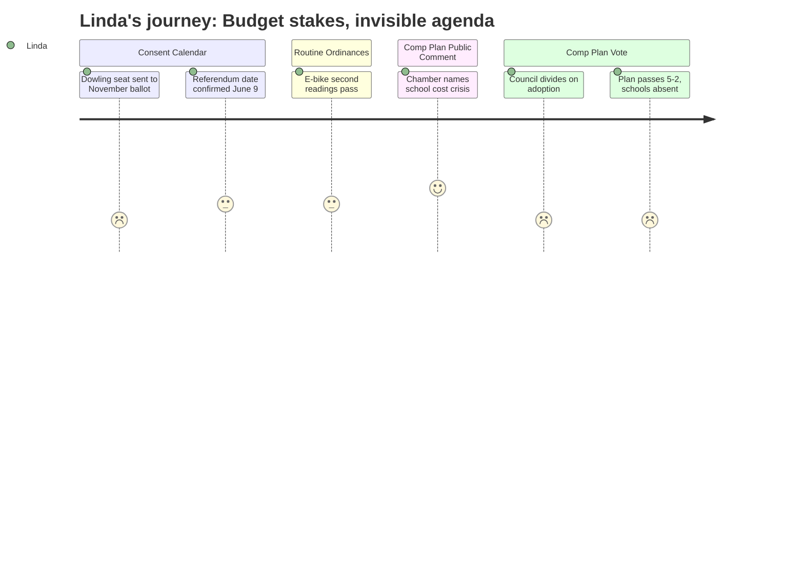

# Interpretation: Linda (PERSONA-007)
## Meeting: City Council Regular Meeting -- April 21, 2026 -- 2026-04-21

### Structured Points

#### 1. Dowling Vacancy Sent to November Ballot, Not Filled by Appointment
- **Fact:** The city clerk announced Adrian Dowling's resignation from School Board District 5, effective April 6, 2026. The council voted unanimously to accept the resignation and place the seat on the November 3, 2026 ballot rather than exercise its charter authority to appoint a replacement. The appointed person's term would have expired when the November winner takes the seat -- a relatively low-stakes interim appointment.
- **Source:** City Clerk announcement at [01:44], Consent Calendar Order 180-25-26 at [05:07]
- **Emotional valence:** negative
- **Threat level:** 4
- **Open question:** true

#### 2. Budget Validation Referendum Officially Set for June 9
- **Fact:** Order 182-25-26 sets June 9, 2026 as the date for the school budget validation referendum, consolidated with the state primary election. Polls open at 7 AM and close at 8 PM across five district polling locations.
- **Source:** Consent Calendar Order 182-25-26 at [05:17]
- **Emotional valence:** neutral
- **Threat level:** 2
- **Open question:** false

#### 3. Chamber of Commerce Explicitly Names School Staffing as a Fiscal Pressure Point
- **Fact:** Portland Regional Chamber advocacy director Thomas O'Boyle, speaking in support of the comprehensive plan, stated directly: "South Portland is facing rising costs, difficult choices around school staffing and facilities, and significant long-term capital needs. Without expanding the tax base through new housing and commercial development, those costs are not avoided, they are shifted onto existing residents."
- **Source:** O'Boyle public comment at approximately [01:11:18]
- **Emotional valence:** positive
- **Threat level:** 2
- **Open question:** false

#### 4. Planning Director Describes a 5-to-8-Year Development Revenue Runway
- **Fact:** Planning Director Milan Nevajda outlined that after plan adoption, the city faces roughly three years of zoning work, followed by additional time for development proposals and a 2-to-3-year construction lag before any new Eastern Waterfront development generates tax revenue. This timeline governs any fiscal benefit the comp plan might produce.
- **Source:** Nevajda implementation timeline presentation at approximately [00:94:35–00:98:00]
- **Emotional valence:** negative
- **Threat level:** 3
- **Open question:** false

#### 5. Comprehensive Plan Passed 5-2, With Mayor and One Councilor Dissenting
- **Fact:** The motion to adopt the Comprehensive Plan with discrete revisions passed 5-2. Councilor Coleman and Mayor Tipton voted no. A secondary amendment to require air dispersion and human exposure modeling -- backed by the mayor -- failed 4-3. The council was visibly divided and the meeting ran past 11 PM.
- **Source:** Roll call votes at approximately [02:93–02:95]
- **Emotional valence:** neutral
- **Threat level:** 2
- **Open question:** true

#### 6. School Budget Received No Direct Attention in a Four-Hour Meeting
- **Fact:** Despite the June 9 validation referendum being six weeks away, the school budget was not a named agenda item, was not discussed by any councilor in their deliberations, and appeared only indirectly -- in the chamber's public comment and in the fiscal framing used by plan supporters. The school board vacancy created at this same meeting was handled in under two minutes.
- **Source:** Full meeting transcript; absence confirmed by review of agenda items F1–F6 and all councilor discussion segments
- **Emotional valence:** negative
- **Threat level:** 3
- **Open question:** true

---

### Journey Map

---

### Reactions

The thing that hit me first tonight wasn't the comp plan -- it was the consent calendar. Adrian's resignation went through in about ninety seconds. Council voted to put his seat on the November ballot. Which, fine, the charter says "may," not "shall," but the timing is genuinely bad. We're heading into the June 9 validation referendum with a vacant District 5 seat. Seven members, now six. That's not a crisis, but it's not nothing either. If someone else has to miss a meeting between now and the end of the school year, we're cutting it close on quorum. I understand the council's instinct to let voters fill it -- I do. But an interim appointment would have expired the moment the November winner was sworn in anyway. It was a low-risk move they chose not to make, and I'm sitting here wondering if that tells me something about how the council is thinking about school board governance right now.

The rest of the night was wall-to-wall comp plan. Four hours, give or take. I wasn't tracking every word -- honestly, by the third wave of public comment about Bug Light I was going through budget emails on my phone -- but I looked up when Thomas O'Boyle from the chamber got up and said explicitly that the city is facing difficult choices around school staffing and facilities and that without tax base growth those costs land on existing residents. That's our argument. That's exactly the argument we've been making in finance committee for two budget cycles. He said it publicly, on the record, in front of the council. I'll take it. The frustrating part is that the comp plan's fiscal payoff is a decade out. The planning director laid out the timeline clearly: three-plus years of zoning, then another two or three before development is generating tax revenue. That doesn't touch FY27. It doesn't touch FY28. It's genuinely important work for the long term, but it has nothing to do with the $7.2 million gap we're staring down right now.

The vote itself -- 5-2, with the mayor on the losing side -- concerns me a little, not because of the comp plan specifically but because a divided council is a harder partner when school budget season heats up. We need that council focused and unified when the validation referendum hits in six weeks, and instead they're running meetings past 11 PM on a land-use document with a 15-year horizon. What keeps me up tonight isn't the comprehensive plan. It's the math: 78 positions, one vacant board seat, a validation vote in six weeks, and this meeting didn't say one word about any of it.