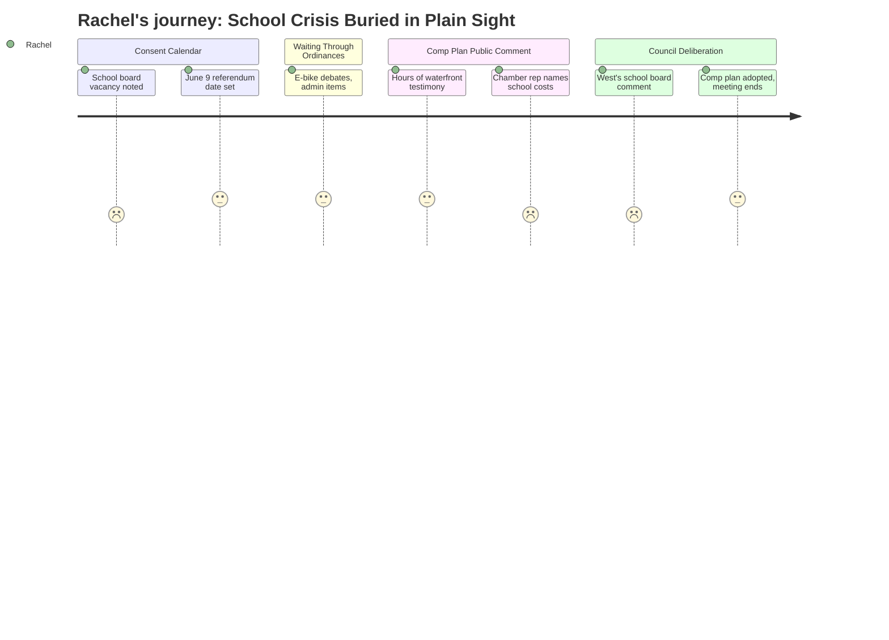

# Interpretation: Rachel (PERSONA-008)
## Meeting: City Council Regular Meeting -- April 21, 2026 -- 2026-04-21

---

### Structured Points

#### 1. School Board District 5 Seat Left Empty Until November
- **Fact:** The council formally accepted the resignation of School Board member Adrian Dowling (District 5) and directed the city clerk to place the vacant seat on the November 3, 2026 ballot. The council did not appoint a replacement. Per city charter, the council had the option to appoint someone; it chose not to. District 5 will have no school board representation from April 6 through at least the November election.
- **Source:** [01:44--02:33], [04:50--07:58], Order 180-25-26 (consent calendar)
- **Emotional valence:** negative
- **Threat level:** 3
- **Open question:** true

#### 2. June 9 School Budget Referendum Date Is Now Locked In
- **Fact:** The council set June 9, 2026 as the date for the school budget validation referendum, at which South Portland voters will formally approve or reject the school budget. This is the same budget under which major position cuts are proposed. Absentee ballots can now be requested; nomination papers for the District 5 seat will be available in late July.
- **Source:** [05:37], Order 182-25-26 (consent calendar)
- **Emotional valence:** neutral
- **Threat level:** 2
- **Open question:** true

#### 3. A Councilor Signals Parents Are Already Fighting Something at the School Board
- **Fact:** Councilor West, while arguing that the council should not rush the comprehensive plan vote, made a passing comparison: "I see what the school board's going through now. They're listening to parents who are asking them to slow down on some ideas." The specific proposals parents are opposing were not named. This comment was made as an analogy, not as a substantive update on school governance, and no other councilor followed up on it.
- **Source:** [235:21]
- **Emotional valence:** negative
- **Threat level:** 4
- **Open question:** true

#### 4. Chamber of Commerce Explicitly Links School Costs to the Development Debate
- **Fact:** Thomas O'Boyle, advocacy director for the Portland Regional Chamber, told the council: "South Portland is facing rising costs, difficult choices around school staffing and facilities, and significant long-term capital needs. Without expanding the tax base through new housing and commercial development, those costs are not avoided, they are shifted onto existing residents." This is the only moment in five hours where school fiscal pressure was named in open session.
- **Source:** [170:51--171:18]
- **Emotional valence:** negative
- **Threat level:** 2
- **Open question:** true

#### 5. No Structural School Decisions Taken at This Meeting
- **Fact:** The city council made no decisions at this meeting regarding school closures, grade-level reconfigurations, attendance zone changes, or redistricting. The two school-related actions -- accepting Dowling's resignation and setting the referendum date -- were administrative consent items that passed unanimously without discussion.
- **Source:** Consent calendar, [04:50--07:58]
- **Emotional valence:** positive
- **Threat level:** 1
- **Open question:** false

#### 6. School Budget Stakes Were Never Named Directly by Any Elected Official
- **Fact:** The school fiscal crisis -- the structural gap, the proposed elimination of 78 positions including 42 teachers, the depleted fund balance -- surfaced only indirectly at this meeting: once through the chamber rep's development argument, and once in West's brief school board analogy. No councilor stated what the referendum is actually asking voters to accept or reject. The specific human stakes for families were absent from the council's public discussion.
- **Source:** [170:51--171:18], [235:21]
- **Emotional valence:** negative
- **Threat level:** 3
- **Open question:** true

---

### Journey Map

---

### Reactions

I honestly don't know why I sat through almost five hours of that. Everything I actually came for was in the first ten minutes -- and it took maybe two minutes total. Adrian Dowling resigned from the school board, the seat is going to the November ballot instead of being filled now, and June 9 is the referendum date. That's it. That's every school-related thing the city council did tonight. Meanwhile they spent four-plus hours debating condos and tank farms and sea level rise on the eastern waterfront.

Here's what's going to bother me. Councilor West -- almost in passing, as a throwaway comparison to the comprehensive plan -- said the school board is "listening to parents who are asking them to slow down on some ideas." And then just... moved on. What ideas? Which school? What timeline? She dropped that and nobody picked it up. Something is already being proposed at the school board level, parents are already organized enough to be pushing back, and the city council mentions it like it's common knowledge and then gets back to talking about CALUPA 22. If you're in the school parent networks you might know what she's referring to. If you're not, you just got a crumb.

And then the chamber of commerce guy gets up during the waterfront debate and says we need new development or else school costs get "shifted onto existing residents." So apparently the condo debate and the school budget crisis are the same story now, and I had to sit through four hours of waterfront testimony to be told that. I need to get to a school board meeting. I need to find out what those "ideas" are that parents are pushing back against, because West said it like everyone already knows, and I'm not sure I do.