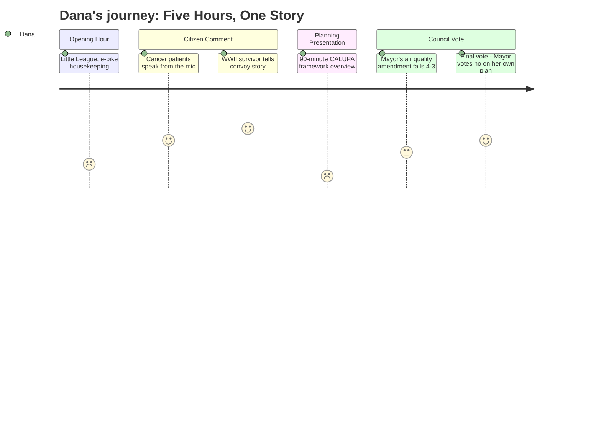

# Interpretation: Dana (PERSONA-009)
## Meeting: City Council Meeting — April 21, 2026 — 2026-04-21

### Structured Points

#### 1. Two Cancer Patients Testify They Live Near the Oil Tanks
- **Fact:** Within the first thirty minutes of citizen comment, two South Portland residents currently undergoing cancer treatment spoke at the microphone. Leslie Gatcombe-Hines stated she has lived near the tanks for 21 years, has been tested genetically, and her doctor has determined her cancer is not hereditary — "therefore it must be environmental." Edward Reiner said he is being treated for bladder cancer, lives approximately 700 feet from the Global and Sprague tanks, and has been interviewed by the Boston Globe about health hazards in the neighborhood.
- **Source:** Transcript [19:38–24:20]
- **Emotional valence:** negative
- **Threat level:** 5
- **Open question:** true

#### 2. Rachel Berger's WWII Story Puts a Human Face on the Memorial Park Argument
- **Fact:** Rachel Berger, identifying herself as age two when World War II began, testified that her family crossed the Atlantic alongside Liberty Ships as part of a convoy — with children instructed to sleep in life jackets. She drew a direct line from those ships to the South Portland waterfront where they were built, calling for a memorial park. She said she was "certain" the Liberty Ships helped her family survive the war.
- **Source:** Transcript [142:14–144:37]
- **Emotional valence:** positive
- **Threat level:** 1
- **Open question:** false

#### 3. Mayor's Air Quality Modeling Amendment Fails 4-3
- **Fact:** Mayor Tipton proposed amending the comprehensive plan to require "air dispersion and human exposure modeling using best available science and data reflective of full permitted or licensed operational capacity" to inform land use decisions near petroleum storage facilities. The amendment failed on a 4-3 roll call, with Councilors West, Pride, Scott, and Matthews voting no. Tipton, Walker, and Coleman voted yes.
- **Source:** Transcript [270:15–279:41]
- **Emotional valence:** negative
- **Threat level:** 4
- **Open question:** true

#### 4. Comprehensive Plan Passes 5-2 — With the Mayor Voting No
- **Fact:** The South Portland Comprehensive Plan was adopted with two revisions on a 5-2 roll call vote. Councilor Coleman and Mayor Tipton both voted against adoption. The plan had been in development for approximately four years and includes a contested framework for the Eastern Waterfront area near Bug Light Park and the oil tank terminals.
- **Source:** Transcript [293:41–294:27]
- **Emotional valence:** negative
- **Threat level:** 3
- **Open question:** true

#### 5. SOS Advocate Discloses He Has Met Privately With the Landowner
- **Fact:** Save Our Shipyard advocate Dave Burkey told the council he has personally met with Dave Packard, whose family owns the Eastern Waterfront property, and stated he is "optimistic that we can work with Dave and his sister, Jennifer, and come up with a green space idea." He asked the council to back that effort. No further details about those discussions were provided at the meeting.
- **Source:** Transcript [185:31–188:44]
- **Emotional valence:** positive
- **Threat level:** 2
- **Open question:** true

#### 6. Chamber Rep Connects the Waterfront Fight to School Staffing Cuts
- **Fact:** Thomas O'Boyle, advocacy director for the Portland Regional Chamber, told the council that "South Portland is facing rising costs, difficult choices around school staffing and facilities, and significant long-term capital needs. Without expanding the tax base through new housing and commercial development, those costs are not avoided, they are shifted onto existing residents." He urged adoption of the plan.
- **Source:** Transcript [170:18–172:07]
- **Emotional valence:** neutral
- **Threat level:** 2
- **Open question:** false

#### 7. School Board Vacancy Will Go to November Ballot — Not Council Appointment
- **Fact:** The council formally accepted the resignation of school board member Adrian Dowling from District 5, effective April 6, 2026. Rather than appointing a replacement, the council directed the city clerk to place the seat on the November 3 ballot for the unexpired term running through December 2027.
- **Source:** Transcript [01:44–02:33]; Agenda, Consent Calendar, Order 180-25/26
- **Emotional valence:** neutral
- **Threat level:** 2
- **Open question:** true

---

### Journey Map

---

### Reactions

Okay, so here's what I've got. Five hours, most of it completely unusable — but there's a real story buried in here and I think it's actually two segments, maybe three if the Packard deal moves.

Lead it this way: the city just passed its big 15-year land use plan for the waterfront, 5-2. The mayor voted against it. That alone is a lede. Why did she vote no? Because she wanted the plan to require actual air quality modeling before anyone can build homes near the oil tanks — and four of her own colleagues shot it down. Meanwhile, two residents currently in cancer treatment stood at the microphone and said they live 700 feet from those same tanks. One of them — her name is Leslie Gatcombe-Hines, she's been there 21 years — said her doctor confirmed her cancer isn't genetic, which means it's environmental. That's your soundbyte. The other guy, Edward Reiner, he told the room he already talked to the Boston Globe about it. We need to book him now before they get to him first.

The counter-narrative you always need? There's a guy from the Portland Regional Chamber who gets up and says look, without this development, the school cuts get worse — he literally named school staffing. So the story writes itself: cancer patients on one side, school budget on the other, and a mayor who ended up on the same side as the cancer patients and still lost the vote.

For the follow, here's the thing I can't stop thinking about: one of the Save Our Shipyard guys — Dave Burkey — let slip at the podium that he's had private conversations with the actual landowner, the Packard family, and he's "optimistic" about a green space deal. That's not nothing. If that goes anywhere, that's the whole story for the fall — and the June 9 school budget referendum is the bridge to keep checking in. B-roll is easy: Bug Light at sunset, the tanks from the water, Broadway at rush hour. Get me Gatcombe-Hines or Reiner on camera by end of week.