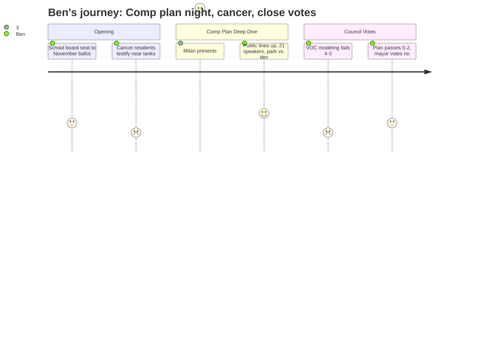

# Interpretation: Ben (PERSONA-010)
## Meeting: City Council Regular Meeting -- April 21, 2026 -- 2026-04-21

### Structured Points

#### 1. Two cancer patients testify 700 feet from the tanks
- **Fact:** Edward Reiner, who lives at 25 Ballard Street, told the council he is currently in cancer treatment for bladder cancer and lives approximately 700 feet from the Global and Sprague tanks. Leslie Gatcombe-Hines of 47 Elmwood Avenue also testified that she is in cancer treatment, that genetic testing ruled out hereditary causes, and that she has lived in her home for 21 years in a neighborhood the EPA maps as moderate cancer risk.
- **Source:** Transcript [21:14] (Gatcombe-Hines), [22:01] (Reiner)
- **Emotional valence:** negative
- **Threat level:** 4
- **Open question:** true — Both residents connected their cancer to environmental exposure. Neither cited a completed epidemiological study linking their diagnoses to the tanks. Reiner specifically called for one. Has any such study been initiated, and who would fund it?

#### 2. Fence line data: one measurement was seven times the state limit
- **Fact:** Councilor West, during council deliberations, stated that fence line monitoring data from the Sunoco site showed 14 measurements exceeding the state level, with one reading seven times the state limit. This was presented as established monitoring data, not a projection.
- **Source:** Transcript [242:20]
- **Emotional valence:** negative
- **Threat level:** 4
- **Open question:** true — The city manager noted that DEP and CDC are due to deliver a combined report this June. Has this fence line data been shared with residents near the site? When was it collected, and is it reflected in the health risk summaries the CDC has provided publicly?

#### 3. The CALUPA 27 backstory: staff proposed it, CPC killed it by a thin vote
- **Fact:** Planning Director Milan Nevajda confirmed that staff proposed a CALUPA 27 — a distinct eastern waterfront policy area — after meeting individually with committee members to find common ground. Councilor West described boarding a plane expecting CALUPA 27 to pass, then landing to find it had failed. The committee modified boundaries instead, producing the 21/22 framework in the final plan.
- **Source:** Transcript [115:39] (Milan on CALUPA 27 history), [233:47] (Councilor West's account)
- **Emotional valence:** neutral
- **Threat level:** 3
- **Open question:** true — How many CPC members voted against CALUPA 27, and were those votes from the full 16-seat committee or a smaller quorum? Councilor West noted some significant decisions were made by a "fairly few members" due to unfilled seats and abstentions, suggesting the outcome was narrower than it might appear.

#### 4. Economist challenges the fiscal case for eastern waterfront development
- **Fact:** Marianne Hill, identifying herself as an economist and South Portland resident, presented a rough calculation: development near Bug Light might generate $3–4M in new tax revenue annually, but after netting out additional expenses, the gain drops to approximately $2.5M — less than 2% of the city's $151M budget — while sea level rise remediation costs roughly $2M per year over 50 years. She also noted South Portland has 288 nonprofits holding hundreds of millions in property, and suggested a small property tax on nonprofits could generate comparable or greater revenue.
- **Source:** Transcript [175:17]–[178:26]
- **Emotional valence:** neutral
- **Threat level:** 3
- **Open question:** true — Neither the planning director nor the city manager responded to Hill's arithmetic during the meeting. Is the $2.5M net figure accurate, and has the city done its own fiscal modeling of the eastern waterfront under different development scenarios?

#### 5. VOC modeling amendment fails 4–3
- **Fact:** Mayor Tipton moved to add language to the plan requiring the city to incorporate "air dispersion and human exposure modeling using best available science and data reflective of full permitted or licensed operational capacity" when making land use decisions near petroleum facilities. Councilors Walker and Coleman voted yes alongside the mayor; Councilors Matthews, West, Pride, and Scott voted no, with several saying the language was too specific for a comprehensive plan.
- **Source:** Transcript [278:54]
- **Emotional valence:** negative
- **Threat level:** 4
- **Open question:** true — Councilor Scott said she would support the HEM4 modeling concept in an ordinance or workshop context. Is there a vehicle for that to happen before the zoning process begins, and would that zoning process be completed before any residential development application reaches the planning board?

#### 6. Plan passes 5–2 with the mayor and Councilor Coleman voting no
- **Fact:** After approving three discrete amendments — the "maximum potential to emit" language in 5C14 and CALUPA 22B, a directive to fill in missing timeline designations, and a correction to reflect the plan as originally intended — the council voted to adopt the plan with those revisions. Councilor Coleman and Mayor Tipton voted no. Planning Director Nevajda said the next step is state recertification, then a multi-year zoning process, with residential development "several years" away at minimum.
- **Source:** Transcript [293:41] (vote), [96:58] (zoning timeline)
- **Emotional valence:** neutral
- **Threat level:** 3
- **Open question:** true — The mayor voted against the plan she helped chair the meeting for. What specifically drove her no vote — Coleman's CALUPA 27 concerns, the VOC modeling defeat, or something else? Her vote was not explained on the record.

#### 7. One resident says he has met with the Packard family and is "optimistic" about green space
- **Fact:** Dave Burkey, presenting for the Save Our Shipyard group, stated near the end of public comment: "I have met with Dave Packard, and I'm actually optimistic that we can work with Dave and his sister, Jennifer, and come up with green space idea." He did not describe the meeting's content, any terms discussed, or the Packards' stated position.
- **Source:** Transcript [187:54]
- **Emotional valence:** positive
- **Threat level:** 2
- **Open question:** true — This is the most concrete development on the eastern waterfront story, but it came as an aside in a public comment, not as a verified negotiating update. What has the Packard family actually said about green space, and is the city involved in or aware of those conversations?

#### 8. School board seat goes to the November ballot — not an appointment
- **Fact:** Adrian Dowling's resignation from School Board District 5 (term through December 2027) was formally accepted. Rather than having the council appoint a replacement, the clerk will place the seat on the November 3 ballot, with petition papers available in late July. The seat will be vacant through November.
- **Source:** Transcript [01:44], Agenda Order #180-25/26
- **Emotional valence:** neutral
- **Threat level:** 2
- **Open question:** true — With 78 positions proposed for elimination and a school budget referendum on June 9, the board will be operating one seat short through the most consequential budget vote in years. Does that vacancy matter for quorum or decision-making authority in the months ahead?

---

### Journey Map

---

### Reactions

Okay, so the lede is not the vote. The lede is the two people who stood up and said they're in cancer treatment, living 700 feet from the tanks, and one of them — Leslie Gatcombe-Hines — said genetic testing ruled out hereditary causes so it must be environmental. That's not advocacy language, that's a person telling you what her doctor told her. Edward Reiner said he was interviewed by the Boston Globe about this. I'm calling both of them this week. That's the piece. Everything else — the three-hour planning presentation, the CALUPA 22 sub-area D height limits, the corridor transit-oriented development language — all of that is context for why those two people at that microphone matter.

Here's the other thing I'm sitting with. Councilor West got up there and said fence line monitoring at the Sunoco site showed 14 readings over the state limit, one of them seven times the limit. That's not a community group's allegation, that's a sitting council member citing monitoring data in a council vote. And then four of her colleagues voted down an amendment that would have required the city to model emissions at full operational capacity before allowing residential development near those tanks. I'm not saying the no votes were wrong — some of them made a reasonable point that modeling methodology doesn't belong in a comp plan — but the combination of those two facts is a story. "Here's what the fence line data shows. Here's what the council decided." I'm going to need to get the actual monitoring reports. The city manager said DEP and CDC are delivering a combined report this June, which is also the month of the school budget referendum. That's going to be a busy June.

The comp plan passed, 5-2, which is the headline everyone else will write. But I want to write the CALUPA 27 piece, because that's the story the vote doesn't tell. Staff proposed it — the planning director confirmed this on the record — as a way to thread the needle between development advocates and the Save Our Shipyard folks. Councilor West described getting on a plane thinking it was going to pass and landing to find it hadn't. It failed in committee by what sounds like a thin margin on a night when not all 16 seats were occupied. Now the community has drafted their own version, which hasn't been vetted by anyone on staff, and one resident says he's had a private conversation with the Packard family and is "optimistic." That's a lot of threads. And none of it is in the plan that just passed. What I need to explain to my readers is: the plan passing doesn't decide what happens at Bug Light. It opens a multi-year zoning process where those decisions will actually get made. And who's on the council when that zoning comes forward — three seats are up in November — is probably more consequential than anything that happened last night.