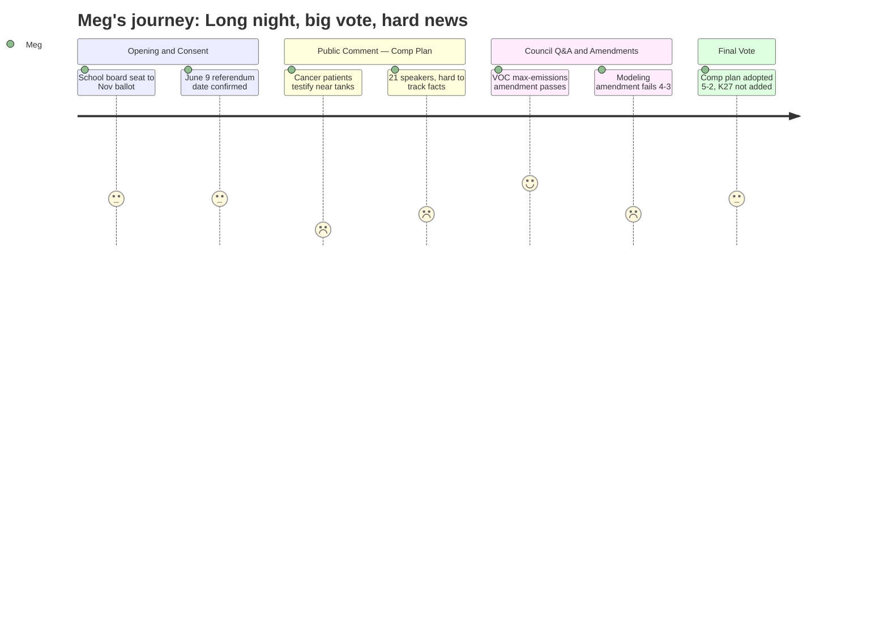

# Interpretation: Meg (PERSONA-011)
## Meeting: City Council Regular Meeting -- April 21, 2026 -- 2026-04-21

### Structured Points

#### 1. School Board Seat Going to November Ballot
- **Fact:** Adrian Dowling resigned from School Board District 5 on April 6, 2026. The council voted unanimously to put the vacant seat on the November 3, 2026 ballot rather than filling it by appointment. Nomination papers will be available in late July.
- **Source:** Transcript [01:44]; Order 180-25/26 on consent calendar [05:37]
- **Emotional valence:** neutral
- **Threat level:** 2
- **Open question:** true — Who is likely to run? Will the seat sit empty for seven-plus months during the ongoing school budget crisis?

#### 2. June 9 Is the School Budget Validation Referendum
- **Fact:** Order 182-25/26, passed unanimously on the consent calendar, sets June 9, 2026 as the date for both the state primary and the school budget validation referendum. Polls open 7:00 AM, close 8:00 PM. Absentee ballots can be requested now.
- **Source:** Order 182-25/26; Transcript consent calendar [05:37]
- **Emotional valence:** neutral
- **Threat level:** 3
- **Open question:** true — Given the $7.2M cut proposal and 78 positions on the line, the vote on that budget is high-stakes; Meg's networks will need to know this date well in advance.

#### 3. Two South Portland Residents Testified They Are in Active Cancer Treatment Near the Tanks
- **Fact:** Leslie Gatcombe-Hines (47 Elmwood Ave, 21-year resident) testified she is currently in cancer treatment, that genetic testing ruled out a hereditary cause, and that she has previously measured VOC contamination in the air near her home. Edward Reiner (25 Ballard Street, about 700 feet from Global and Sprague tanks) testified he is in treatment for bladder cancer and has been interviewed by The Boston Globe about health hazards in the neighborhood.
- **Source:** Transcript [21:14] and [22:47]
- **Emotional valence:** negative
- **Threat level:** 4
- **Open question:** true — Meg's networks include families near Ferry Village and Willard Beach; she will want to know whether the fence line monitoring data mentioned later in the meeting has been shared with nearby residents.

#### 4. Fence Line Monitoring Showed 14 Exceedances, One at Seven Times the State Level
- **Fact:** During council discussion, Councilor West stated that recent fence line monitoring at the Sunoco site showed 14 measurements exceeding the state standard, with one measurement at seven times the state level. Councilor West called this "not acceptable" and "not safe."
- **Source:** Transcript [242:20] (approximate)
- **Emotional valence:** negative
- **Threat level:** 5
- **Open question:** true — The planning director confirmed a combined CDC/DEP health report is due this June. It is not clear how residents near the fence line have been notified of past exceedances.

#### 5. Comprehensive Plan Adopted 5-2, Eastern Waterfront Development Still on the Table
- **Fact:** The council voted 5-2 to adopt the 2040 South Portland Comprehensive Plan with discrete amendments. Councilor Coleman and Mayor Tipton voted no. Under the adopted plan, the Eastern Waterfront (CALUPAs 21 and 22) retains a "unique growth" designation allowing potential future residential development, subject to VOC health assessments and council findings. CALUPA 27, the community-proposed marine protection and heritage area, was not added to the plan.
- **Source:** Transcript roll call vote [293:41]; council discussion [231:26]–[293:41]
- **Emotional valence:** negative
- **Threat level:** 3
- **Open question:** true — The plan is now going to the state for certification. Meg's network in Ferry Village will want to know: what does this mean for their neighborhood in practical terms, and how soon could zoning changes follow?

#### 6. One Safety Amendment Passed: "Maximum Potential Emissions" Language Added
- **Fact:** The council voted 7-0 to add a single sentence to sections 5C14 and CALUPA 22B requiring that any health evaluation near tank facilities "must incorporate maximum potential emissions" — meaning the assessment must use the tank's full permitted capacity, not current operating levels. This language was proposed by a public commenter, Dave Hebert, and adopted by Councilor West as a formal amendment.
- **Source:** Transcript [235:21] (Hebert's original comment); amendment vote [245:23]
- **Emotional valence:** positive
- **Threat level:** 2
- **Open question:** false

#### 7. Stronger Health Modeling Amendment Failed 4-3
- **Fact:** Mayor Tipton proposed adding language requiring the city to incorporate air dispersion and human exposure modeling using data "reflective of full permitted or licensed operational capacity" for land use decisions near petroleum storage facilities. This broader modeling amendment failed 4-3. Councilors Matthews, West, Pride, and Scott voted no; Councilors Walker, Coleman, and Mayor Tipton voted yes.
- **Source:** Transcript amendment vote [278:54]
- **Emotional valence:** negative
- **Threat level:** 3
- **Open question:** true — The council mentioned a potential environmental health workshop as a future venue to revisit modeling. No date or commitment was given.

#### 8. "Save Our Shipyard" Advocates Made Progress Outside the Meeting Room
- **Fact:** Public commenter Dave Burkey stated he has met with landowner Dave Packard and described himself as "optimistic that we can work with Dave and his sister, Jennifer" on a green space outcome. He asked the council to back that effort. This is the first time a community advocate publicly described active discussions with the property owner at a public forum.
- **Source:** Transcript [187:06]
- **Emotional valence:** positive
- **Threat level:** 1
- **Open question:** true — No details were provided about what a potential agreement might look like, the timeline, or whether the property owner has confirmed interest.

---

### Journey Map

---

### Reactions

Ok so here's the recap. Long one tonight — almost five hours. The big vote was the 2040 Comprehensive Plan, and they passed it 5-2. Coleman and Tipton voted NO. What that means for the shipyard/Bug Light area: development is still on the table. They did NOT add the CALUPA 27 protection zone that the Save Our Shipyard people wanted. The plan has a bunch of conditions that have to be met before anyone can build residential near the tanks, but the door is open. Important: this doesn't mean anything gets built tomorrow. Planning director said zoning changes alone take years, then development review, then actual construction — he said realistically we're talking like 5-7 years minimum before anything could happen. So this is a framework vote, not a "here come the condos" vote.

Two things that should be in everyone's group chats: First, **June 9 is the school budget referendum**. Same day as the state primary. That's when we vote on whether to approve the district's budget proposal — the one with all the cuts. Mark it. Second, there was a VOC/air quality amendment that passed 7-0. They added language saying any health evaluation near the tank farms has to use the tanks' *maximum permitted capacity*, not whatever they're currently running at. That matters because Sunoco has been running way below capacity and the health assessments have reflected that lower level. This forces them to model the worst case. That's actually a real thing that passed.

The part I can't stop thinking about: two people testified that they're currently in cancer treatment and live within a mile of the tanks. One of them said genetic testing ruled out a hereditary cause for her cancer. Council also disclosed tonight that recent fence line monitoring at Sunoco showed 14 readings above the state safety level, and one was **seven times** the state limit. A combined CDC/DEP health report is apparently due this June. I need to find out if anyone in my neighborhood has been notified about those exceedances, because based on tonight, the answer sounds like no.