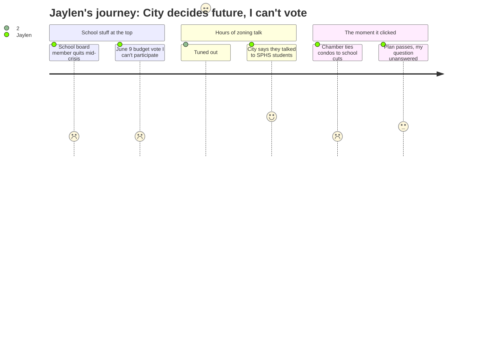

# Interpretation: Jaylen (PERSONA-012)
## Meeting: City Council Regular Meeting -- April 21, 2026 -- 2026-04-21

---

### Structured Points

#### 1. This whole meeting was at my school — and nobody told students
- **Fact:** The April 21 City Council meeting was moved from City Hall to the South Portland High School Lecture Hall to accommodate expected large public turnout. The mayor acknowledged the venue change and thanked attendees for accommodating it.
- **Source:** Agenda header ("South Portland High School, Lecture Hall, Highland Ave"); [00:04:05]
- **Emotional valence:** neutral
- **Threat level:** 1
- **Open question:** false

#### 2. A school board member just quit — in the middle of the budget crisis
- **Fact:** School board member Adrian Dowling resigned from District 5 on April 6, 2026. The council accepted the resignation and directed his seat to go on the November 3 ballot rather than filling it by appointment. The seat remains vacant until then.
- **Source:** [00:01:44]; Consent Calendar Order #180-25/26
- **Emotional valence:** negative
- **Threat level:** 3
- **Open question:** true

#### 3. The school budget vote is June 9 — and I don't get to vote
- **Fact:** The council formally scheduled the June 9, 2026 election, which combines the State Primary with a School Budget Validation Referendum. South Portland residents will vote on whether to approve the district's proposed budget. Jaylen is 16 and ineligible to vote.
- **Source:** Consent Calendar Order #182-25/26; [00:05:30]
- **Emotional valence:** negative
- **Threat level:** 4
- **Open question:** true

#### 4. A business group said teacher cuts and condo construction are the same problem
- **Fact:** Thomas O'Boyle of the Portland Regional Chamber, speaking in support of the comprehensive plan, stated: "South Portland is facing rising costs, difficult choices around school staffing and facilities, and significant long-term capital needs. Without expanding the tax base through new housing and commercial development, those costs are not avoided, they are shifted onto existing residents."
- **Source:** Public comment, Comprehensive Plan (Order #187-25/26)
- **Emotional valence:** negative
- **Threat level:** 4
- **Open question:** true

#### 5. The city says it talked to SPHS students while making this plan
- **Fact:** Planning Director Milan Nevajda stated that outreach for the comprehensive plan specifically included "coming and having meetings with South Portland high school kids," as part of a deliberate effort to reach voices that don't typically attend public meetings.
- **Source:** Comprehensive Plan presentation, Order #187-25/26 [~01:05:00]
- **Emotional valence:** positive
- **Threat level:** 1
- **Open question:** true

#### 6. The development that supposedly fixes the school budget problem is years away
- **Fact:** Nevajda laid out a multi-step implementation timeline: state recertification, then a roughly three-year zoning process, then development review, then construction before new tax revenue materializes. The plan adopted tonight initiates that chain — it does not generate revenue.
- **Source:** Comprehensive Plan implementation timeline, Order #187-25/26 [~01:34:00–01:37:00]
- **Emotional valence:** negative
- **Threat level:** 4
- **Open question:** true

#### 7. The council passed the plan 5-2, with small changes
- **Fact:** The council voted 5–2 to adopt the comprehensive plan with targeted amendments, including language requiring that residential development near tank facilities incorporate maximum potential emissions data. Councilor Coleman and Mayor Tipton voted no. The plan now goes to the state for recertification.
- **Source:** Roll call vote [~04:33:00–04:34:28]
- **Emotional valence:** neutral
- **Threat level:** 2
- **Open question:** true

---

### Journey Map

---

### Reactions

So they moved the city council meeting to our school Tuesday night — the lecture hall — and I genuinely found out after the fact, not because anyone told students. Apparently they expected a huge crowd over this development argument near Bug Light and needed the space. Which, fine. But the first thing they announced was that a school board member just quit — Adrian Dowling, District 5 — no explanation given, just resigned. This is happening right now, while the district is trying to figure out how to cut 42 teachers. I don't know why he left, nobody said, but it's not a great sign. And then they set the date for the school budget referendum: June 9. That's when actual South Portland residents get to vote on the school budget. My theater program, my coach's job, whatever AP classes I might be counting on for senior year — all of it goes through that vote. I'm 16. I can't vote. Random adults who haven't been inside this building since forever can vote. But not me, the actual person sitting in these classrooms every day.

The rest of the meeting was basically four hours about this big document called the Comprehensive Plan — it's a zoning map for what South Portland looks like in 2040, with all these acronyms and special zones and sea level rise projections. I mostly couldn't follow it. But there was this one moment that I can't stop thinking about. A guy from a business group got up and said, pretty much directly, that South Portland is facing "difficult choices around school staffing and facilities" and that the only solution is building more housing and growing the tax base. He connected the condos — the whole argument they were having about what to build near Bug Light — to whether my school keeps teachers. Like those are literally the same problem and the same solution. That was the one part of the whole night where I actually leaned in.

There was also this thing where the planning director mentioned they'd held meetings with South Portland high school students when they were developing this plan. Which is good I guess, but nobody I know was in those meetings, and nobody reported back what students said. And even if the plan is perfect, the timeline they walked through is like three years just for zoning, then more for construction — it's years before any of this generates tax money. So I came away with the same question I walked in with: what actually happens to theater, to AP classes, to cross-country funding between now and when all of this maybe works out? Nobody at that meeting was asking that. The meeting was at my school, they talked about my school's budget crisis, and my question was still not on the agenda.