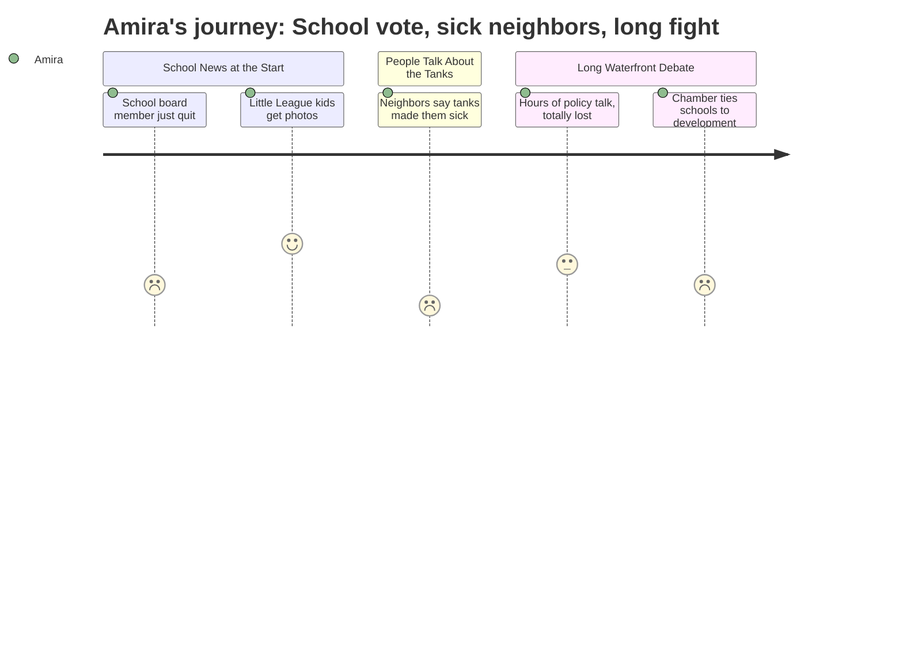

# Interpretation: Amira (PERSONA-013)
## Meeting: City Council Regular Meeting -- April 21, 2026 -- 2026-04-21

### Structured Points

#### 1. Someone quit the school board, and no one's replacing them yet
- **Fact:** School board member Adrian Dowling resigned his District 5 seat on April 6. The council accepted the resignation and directed that the seat be placed on the November 2026 ballot rather than filled immediately by appointment.
- **Source:** [01:44–02:33] city clerk announcement; Order 180-25-26 on consent calendar
- **Emotional valence:** negative
- **Threat level:** 3
- **Open question:** true

#### 2. There's a vote on the school budget happening June 9th
- **Fact:** The council set the date and polling locations for the "school budget validation referendum election" on June 9, 2026 — the public vote that will determine whether the proposed budget, including all its cuts, is approved.
- **Source:** [05:28–05:37] Order 182-25-26, consent calendar
- **Emotional valence:** negative
- **Threat level:** 4
- **Open question:** true

#### 3. People who live near the oil tanks said they have cancer
- **Fact:** Three residents gave public testimony during citizen comment. One said she is currently in cancer treatment and that genetic testing ruled out a hereditary cause. Another said he has bladder cancer and lives 700 feet from the Global and Sprague tanks. A third said he runs past the tanks every morning and described it as "devastating" to know they affect his health.
- **Source:** [20:25–27:27] Leslie Gatcombe Hines, Edward Reiner, Milo Small
- **Emotional valence:** negative
- **Threat level:** 4
- **Open question:** true

#### 4. A speaker said a 10-year-old can barely cross Broadway safely
- **Fact:** Resident Carolyn Foley testified that traffic on Broadway is already so dangerous that a child can't safely cross the street, and that adding more development and cars to the area would make it worse.
- **Source:** [24:20–25:08] Carolyn Foley
- **Emotional valence:** negative
- **Threat level:** 2
- **Open question:** false

#### 5. Little League kids came up and got recognized
- **Fact:** The council voted to recognize South Portland Little League's 75th anniversary. Young players and their families were invited to the front of the room to receive the proclamation and take a photo with the council.
- **Source:** [08:44–11:04] proclamation reading and ceremony
- **Emotional valence:** positive
- **Threat level:** 1
- **Open question:** false

#### 6. A business group said school cuts are connected to the waterfront fight
- **Fact:** A representative of the Portland Regional Chamber of Commerce told the council that South Portland "faces rising costs, difficult choices around school staffing and facilities," and that without new development expanding the tax base, those costs "are not avoided, they are shifted onto existing residents."
- **Source:** [170:31–172:08] Thomas O'Boyle, Portland Regional Chamber
- **Emotional valence:** negative
- **Threat level:** 4
- **Open question:** true

---

### Journey Map

---

### Reactions

So the part about the school budget — there's actually a vote on June 9th, like a real vote that determines if the cuts happen. I didn't know that. Nobody at school said anything about a vote. And also the school board person for District 5 just quit, so that seat is empty until November. I don't even know who was on the school board before this, but it feels like not great timing when everything is already getting cut.

But honestly, Mom, the thing I keep thinking about is the people talking about the tanks near Bug Light. Like multiple people got up and said they actually have cancer right now — one woman said the doctors told her it's not genetic so it has to be from the environment. Another man said he lives 700 feet from the tanks and he has bladder cancer. And this other guy said he runs past those tanks every single morning and it's "devastating" knowing that. And the council was literally spending the whole night deciding whether to let people build apartments near there? I don't understand how those two things go together. Like, people are getting sick, and the answer is more buildings?

I sat through the whole meeting video and I honestly could not follow most of it. There were all these words — KLUPAs, growth designations, VOC modeling — and I have no idea what any of that means. But one man from a business group said South Portland has "difficult choices around school staffing and facilities" and if they don't build more stuff, regular people pay more. So I think the waterfront and the school cuts are the same problem, but nobody said it like that. They just kept talking in circles for like four hours. One lady actually said most people in South Portland have no idea this is happening because there's no newspaper anymore. Which, yeah. I only found out because you asked me to look it up.