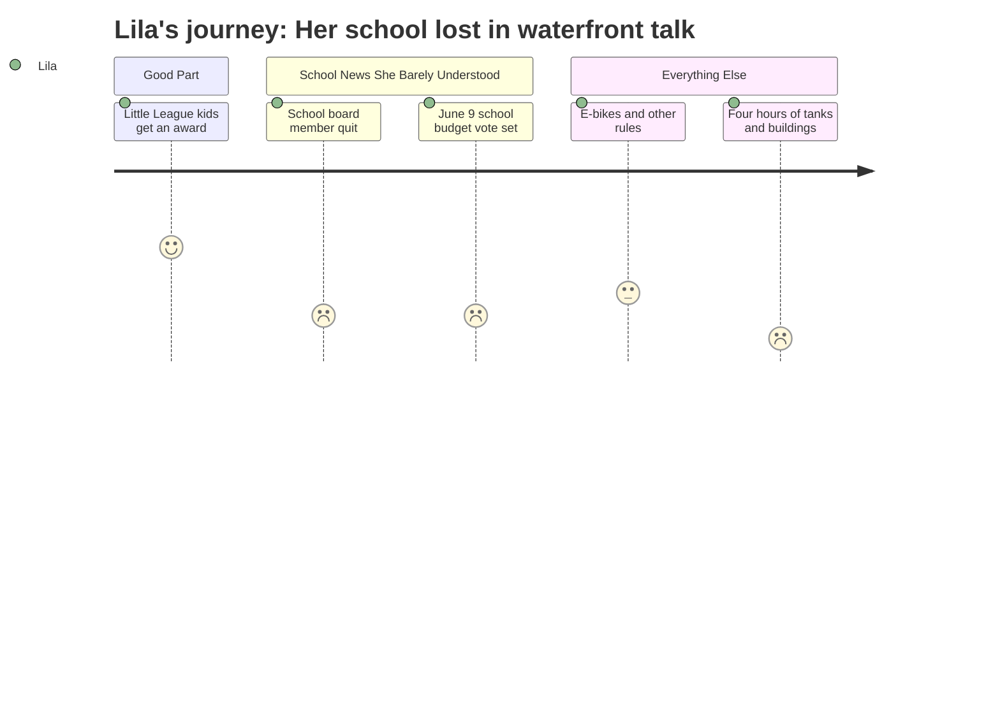

# Interpretation: Lila (PERSONA-014)
## Meeting: City Council Regular Meeting -- April 21, 2026 -- 2026-04-21

### Structured Points

#### 1. Kids Got a Certificate
- **Fact:** The council invited South Portland Little League players to the front of the room, read a proclamation celebrating 75 years of Little League, and took a photo with the kids.
- **Source:** Transcript [08:44–11:04]
- **Emotional valence:** positive
- **Threat level:** 1
- **Open question:** false

#### 2. A School Board Member Quit
- **Fact:** The city clerk announced that Adrian Dowling resigned from School Board District 5 on April 6, 2026. The seat will stay open until the November election unless the council appoints someone first.
- **Source:** Transcript [01:44–02:33]; Consent Calendar Order #180-25/26
- **Emotional valence:** negative
- **Threat level:** 3
- **Open question:** true

#### 3. There Will Be a Vote About the School Budget on June 9
- **Fact:** The council set June 9, 2026 as the date for the School Budget Validation Referendum Election. Voters will decide whether to approve the school budget.
- **Source:** Transcript [05:37]; Consent Calendar Order #182-25/26
- **Emotional valence:** negative
- **Threat level:** 4
- **Open question:** true

#### 4. A Business Group Speaker Said Schools Are Struggling
- **Fact:** The Portland Regional Chamber's representative told the council that South Portland "is facing rising costs, difficult choices around school staffing and facilities," and named that as a reason the city needs more development to grow its tax base.
- **Source:** Transcript [171:18] (Thomas O'Boyle, advocacy director, Portland Regional Chamber)
- **Emotional valence:** negative
- **Threat level:** 3
- **Open question:** true

#### 5. One Councilor Said South Portland Needs to "Build Back School Populations"
- **Fact:** Councilor Scott, in her comments on the comprehensive plan, said the city needs to create housing and "build back our school populations," linking enrollment decline to the city's housing and development choices.
- **Source:** Transcript [256:21] (Councilor Scott)
- **Emotional valence:** neutral
- **Threat level:** 2
- **Open question:** true

#### 6. The Meeting Spent Almost Five Hours on Something Else Entirely
- **Fact:** The bulk of the meeting — approximately four hours of presentation, public comment, and council deliberation — was devoted to adopting the South Portland Comprehensive Plan, a 15-year land use policy document focused on the Eastern Waterfront, housing, and development corridors. Dyer Elementary and the school reconfiguration were not discussed.
- **Source:** Transcript [57:12–295:15]; Order #187-25/26
- **Emotional valence:** neutral
- **Threat level:** 2
- **Open question:** true

---

### Journey Map

---

### Reactions

So my dad went to a city council meeting last night and it was SO long, like they didn't even get home until almost midnight. He said the first part was actually kind of cool because there were Little League kids there and they got a certificate from the city and everything. I kind of wish I could have gone to that part. But then I heard him say something about the school board — like someone on the school board QUIT? And I was like, wait, isn't the school board the people who are deciding about Dyer? And he said yeah but it's complicated. I don't really get it. But it doesn't feel good.

And then there's gonna be a vote on June 9 about the school budget. Dad tried to explain it to me but it was really confusing. He said it's like the whole city gets to vote on whether the school money is okay. And I was like, what happens if they say no? And he got this look on his face. I don't know. I keep asking about Dyer and what's going to happen to my class and whether me and Maya and Jordan are going to the same school next year. And the adults keep saying "we don't know yet" or "it's complicated." But it's not complicated to me. I just want to know if my school is closing.

The thing that's really weird is that my dad was gone for almost five hours and basically nobody talked about Dyer at all. They talked about some tanks near the water and whether to build buildings there and a park. And one lady talked about ships from World War II? I don't know. I asked my dad if anyone said anything about schools and he said not really, just one guy said something really fast. I don't understand why they spent all that time on buildings near the water but nobody said anything about kids who don't know where they're going to school next year. That doesn't make sense to me.