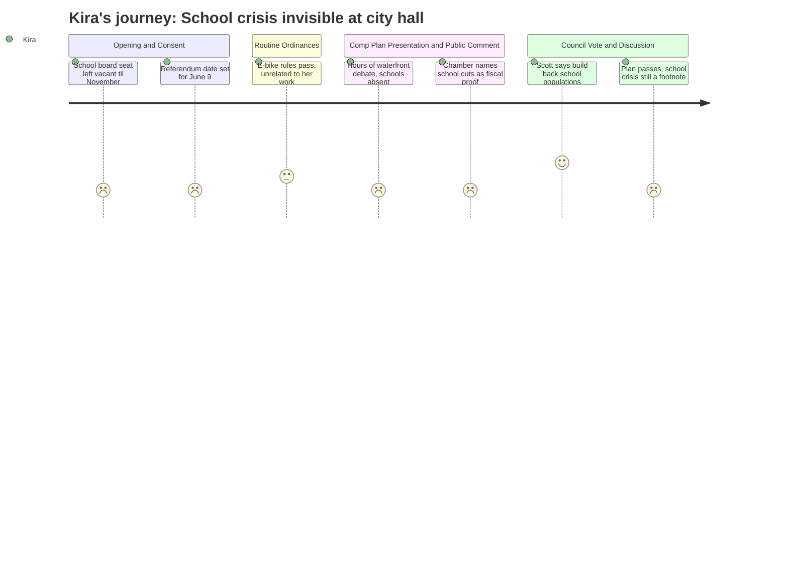

# Interpretation: Kira (PERSONA-015)
## Meeting: City Council Regular Meeting -- April 21, 2026 -- 2026-04-21

### Structured Points

#### 1. School board vacancy accepted, seat left open until November
- **Fact:** The council voted to formally accept Adrian Dowling's resignation from the District 5 school board seat and directed the city clerk to place the vacancy on the November 3, 2026 ballot rather than appointing a replacement. No one will fill that seat until after the election, at the earliest.
- **Source:** [01:44--07:58], Order 180-25-26
- **Emotional valence:** negative
- **Threat level:** 4
- **Open question:** true — The board is already navigating the most consequential budget decisions in years. Who is speaking for District 5 families through June and into the fall, when cuts will be implemented?

#### 2. Budget referendum date locked in for June 9, paired with state primary
- **Fact:** Order 182-25-26 sets June 9, 2026 as the date for the school budget validation referendum, alongside the state primary election. This is the vote that will determine whether the district's proposed budget — including the position cuts — gets public approval.
- **Source:** [05:37--07:58], Order 182-25-26
- **Emotional valence:** neutral
- **Threat level:** 4
- **Open question:** true — Pairing the school referendum with a primary election changes the electorate composition. What's the district's plan for public education between now and June 9?

#### 3. Chamber of Commerce frames school staffing cuts as proof of fiscal urgency — without engaging what those cuts mean
- **Fact:** The Portland Regional Chamber's advocacy director cited "difficult choices around school staffing and facilities" as evidence that South Portland needs tax base expansion through the comp plan's housing development. The school crisis was used as an argument for the comp plan, not examined on its own terms.
- **Source:** [171:08--171:30]
- **Emotional valence:** negative
- **Threat level:** 2
- **Open question:** true — The Chamber is right that development could eventually broaden the tax base. But "eventually" is a decade away and doesn't address what happens to students who need services starting next September.

#### 4. Councilor Scott explicitly connects housing growth to school enrollment recovery
- **Fact:** During council discussion of the comprehensive plan, Councilor Scott stated she hoped new residents would be welcomed and that the community would "build back our school populations" through housing development.
- **Source:** [256:21--257:07]
- **Emotional valence:** positive
- **Threat level:** 1
- **Open question:** true — A councilor seeing the enrollment-housing connection is meaningful. But even accelerated development on the Hill Street tank farm or eastern waterfront is a 7-to-10-year pipeline before school-age families arrive. What bridges the immediate gap?

#### 5. City infrastructure obligations leave no room for municipal school relief
- **Fact:** A public commenter noted that South Portland faces approximately $50 million in needed wastewater work, with sewer rates already rising 22%, and Broadway carrying 24,000 vehicles daily with no funded relief. The city's own capital needs are significant and unfunded.
- **Source:** [29:54--30:42]
- **Emotional valence:** negative
- **Threat level:** 3
- **Open question:** false — This confirms what Kira already suspected: the city has no capacity to cushion the schools. The structural gap has to be solved within the district.

#### 6. Hill Street tank farm targeted for mixed residential use — potential long-term enrollment signal
- **Fact:** The comprehensive plan as adopted includes KLUPA 16 language calling for the Nutter Hill tank farm to become mixed-use development focused primarily on housing, with a speaker from the Toss the Tanks initiative citing an estimated $4 million annual property tax gain from redevelopment.
- **Source:** [161:58--162:43], [262:31--263:17]
- **Emotional valence:** positive
- **Threat level:** 1
- **Open question:** true — If families with children eventually move into that neighborhood, Kira's schools benefit. But the timeline and the demographic mix of that housing remain entirely unknown.

#### 7. Nearly five hours of meeting; the school crisis appeared in one sentence of one public comment
- **Fact:** Across a meeting that ran past 11:30 p.m. and included dozens of public speakers and extended council debate, no councilor raised the school budget situation, the June referendum, or the proposed elimination of positions. The school crisis appeared only as background data in the Chamber speaker's remarks.
- **Source:** Meeting transcript in full; see [171:08--171:30] for the sole substantive reference
- **Emotional valence:** negative
- **Threat level:** 3
- **Open question:** true — Is anyone on the city council prepared to publicly engage with the referendum and help move public understanding before June 9?

---

### Journey Map

---

### Reactions

So the school board has a vacancy. During this. The council voted to just put it on the November ballot — which means District 5 has no representative from now through at minimum the fall, and that's after the referendum, after the June 9 vote, after whatever cuts get implemented over the summer. I sat there watching that item go through the consent calendar in about thirty seconds and I genuinely had to remind myself to breathe. A full board seat, gone, at the exact moment when the board needs every voice it can get. I get that appointing someone is complicated and there are charter rules, but the timing is just brutal.

The referendum date being June 9 is the other thing I keep turning over. That's barely six weeks from now. It's paired with a primary election, which brings out a different mix of voters than a standalone school vote would. I don't know what the district's plan is for reaching families who don't already know what's at stake — because most people don't. Most people I talk to at school pickup don't understand what this vote actually means for next year's classrooms. And from what I saw at this council meeting, the city isn't racing to help close that information gap. The school situation got exactly one sentence of substance from the Chamber guy, who used it as an argument for why we need to approve the comp plan. Which — fine, I understand the fiscal logic. But the kids on my caseload at three different buildings are not a data point in a development argument. They're kids who need services right now, not after the waterfront is built out in 2035.

Here's the one thing I held onto: Councilor Scott said "build back our school populations" out loud, in the context of welcoming new families. That's not nothing. That's a sitting councilor who sees the connection between enrollment decline and the housing trajectory. The Hill Street tank farm going mixed residential, the comp plan creating the conditions for actual families to move into South Portland — that matters to me as someone who watches class sizes and caseloads every single day. But I left that meeting knowing that the long game on housing and enrollment doesn't help the kids I'm serving right now, doesn't protect the positions being cut, doesn't answer what happens if June 9 goes the wrong way. Five hours of meeting about waterfront futures, and the thing that's happening to this community's schools right now barely made it onto the page.