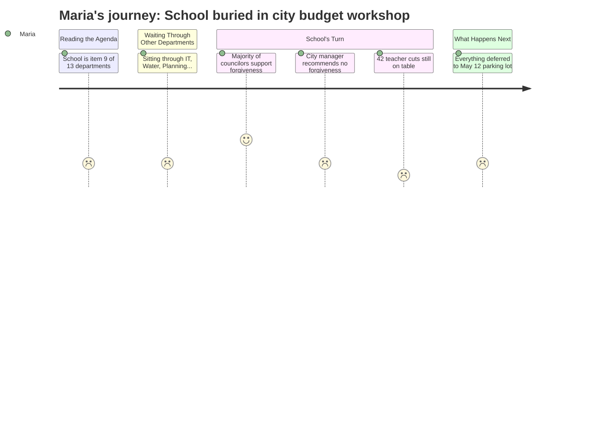

# Interpretation: Maria (PERSONA-001)
## Meeting: City Council Regular Meeting -- April 28, 2026 -- 2026-04-28

---

### Structured Points

#### 1. School buried as one item among thirteen
- **Fact:** The school department is agenda item 9 of 13 departments presenting at this workshop, allocated approximately 10–15 minutes. It follows Water Resource Protection, Code Enforcement, Planning, and Economic Development.
- **Source:** City Council Agenda — 2026-04-28, Budget Workshop #2 schedule in City Manager Position Paper
- **Emotional valence:** negative
- **Threat level:** 2
- **Open question:** true

#### 2. City staff officially recommends against forgiving the school's fund balance debt
- **Fact:** The City Manager's position paper states staff recommends no forgiveness of the fund balance the school owes the city, warning that forgiveness would either delay city capital needs or require a tax increase on the city side.
- **Source:** City Council Agenda — 2026-04-28, City Manager Position Paper (NOTE paragraph)
- **Emotional valence:** negative
- **Threat level:** 3
- **Open question:** true

#### 3. But a majority of councilors already said they support some forgiveness
- **Fact:** At the April 14 workshop, a majority of councilors indicated support for forgiving some level of fund balance for the school. The school estimates its actual overage is $1–$1.5 million, lower than the city's $3 million conservative estimate.
- **Source:** City Council Agenda — 2026-04-28, City Manager Position Paper (NOTE paragraph)
- **Emotional valence:** positive
- **Threat level:** 2
- **Open question:** true

#### 4. 42 teacher positions remain proposed for elimination
- **Fact:** The district's FY27 budget proposal includes elimination of 78 total positions — 12% of all staff — including 42 teachers and 16 ed techs. These cuts are what closes the structural gap given the 6% tax ceiling.
- **Source:** FY27 fiscal context (background); school budget materials referenced at spsdme.org/page/budget27
- **Emotional valence:** negative
- **Threat level:** 5
- **Open question:** true

#### 5. State is underfunding South Portland by a large margin
- **Fact:** State funding currently covers approximately 20% of actual costs, compared to a formula obligation closer to 55%. This structural state-level failure is a primary driver of the local gap.
- **Source:** FY27 fiscal context (background); school budget materials referenced in City Council Agenda — 2026-04-28
- **Emotional valence:** negative
- **Threat level:** 4
- **Open question:** false

#### 6. The real decision doesn't happen tonight — it happens May 12
- **Fact:** All items placed in the "parking lot" at the April 14 and April 28 workshops will be decided at a third workshop on May 12. Tonight's councilors can flag items but cannot finalize anything.
- **Source:** City Council Agenda — 2026-04-28, City Manager Position Paper (workshop schedule and parking lot process)
- **Emotional valence:** neutral
- **Threat level:** 2
- **Open question:** true

#### 7. The parking lot's current net effect adds more to taxes, not less
- **Fact:** As of this meeting, the aggregate of all parking lot items from Workshop #1 and #2 adds a net $1.28 million in new property tax needs — pushing the projected increase from 5.1% to approximately 6.5%.
- **Source:** City Council Agenda — 2026-04-28, City Manager Position Paper (parking lot summary)
- **Emotional valence:** negative
- **Threat level:** 3
- **Open question:** true

---

### Journey Map

---

### Reactions

Okay so I just got home. The kids are asleep. I need to decompress because that was a lot. First thing — it was a *city council* meeting, not a school board meeting. I keep forgetting these are different bodies. The school budget stuff was literally item nine out of thirteen. Nine. They had to sit through the IT department and Water Resource Protection before anyone said a word about our kids. I don't know why I expected otherwise but it still stings every time.

The actually important thing: there's a fight happening over something called the fund balance, which is basically money the school borrowed from the city during an overage year. The city manager is saying the school has to pay it back, no exceptions — his whole argument is it would hurt city capital projects. But here's the thing — a majority of councilors already said at the April 14 meeting that they *want* to forgive at least some of it. And the school is saying they only need about $1 to $1.5 million forgiven, not the $3 million everyone was originally panicking about. So there's actually a real chance this happens. That would take some pressure off. Not enough to save all 42 teachers, but something.

The part that makes me want to scream is that nothing actually gets decided tonight. Everything goes into the "parking lot" and then they vote on May 12. So I'm going to have to show up *again* and sit through another three-hour meeting to find out if my daughter's music teacher still has a job next fall. I'm putting it in my calendar right now: May 12. And I'm going to bring questions, because what I still cannot get a straight answer on is *which* teachers, *which* schools, *which* programs. The 42-teacher number is in every document but nobody will say "here's what Dyer School loses." That's what I need to know. That's what every parent in my group chat needs to know.