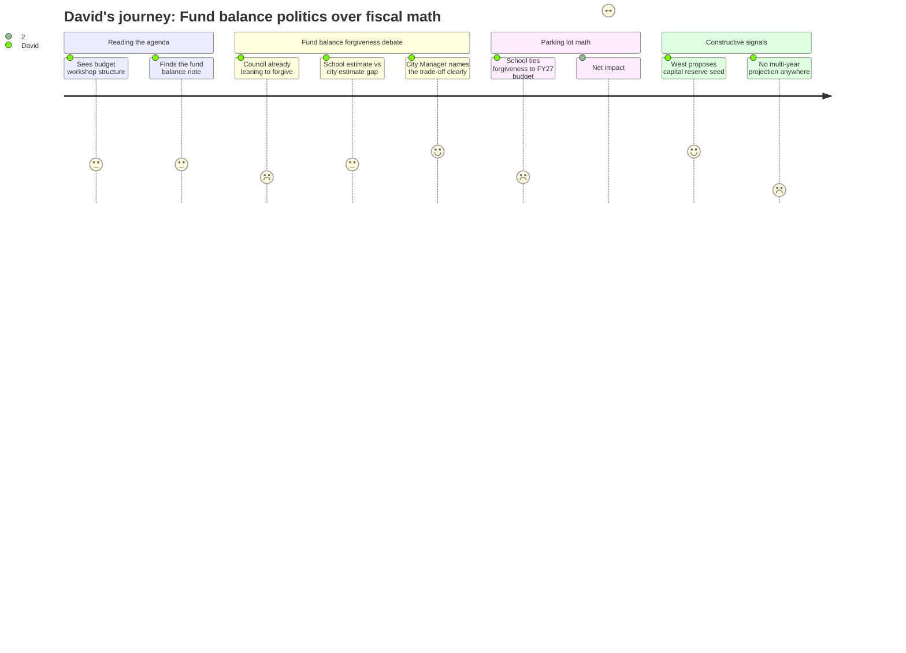

### Reactions

So the big thing out of last night's workshop is the fund balance fight. The city staff is recommending against forgiving what the school owes — and they lay out exactly why in plain language: either you delay capital purchases, or you raise city-side taxes to replace the money. That's a real trade-off, stated clearly. What bugs me is the council already signaled they're leaning toward forgiveness two weeks ago, before tonight's workshop even happened. That means tonight's "discussion" is basically theater, and the school knows it — which is exactly why they're asking council to commit to a specific dollar amount with formal budget implications attached. That's not a conversation, that's a close.

The number discrepancy bothers me too. The city budgeted $3M conservatively for this forgiveness. The school is saying the real number is $1–$1.5M. That's a $1.5M gap in estimates on the same question. I'd want to see the underlying assumptions before I'd take either number at face value. And neither side has put a multi-year projection on the table — we're negotiating a one-time fix to what looks like a structural problem, and nobody seems to want to model what year three looks like.

One thing I actually liked: Councilor West — who wasn't even there — submitted a written request to seed a capital building reserve from any surplus fund balance or school repayment above the 12% threshold. That's exactly the kind of discipline that should be baked into how the city manages this, instead of treating every surplus as available for the next political ask. Parking lot math right now puts us at a 6.5% tax rate increase if everything goes through — that's not where we started this process.