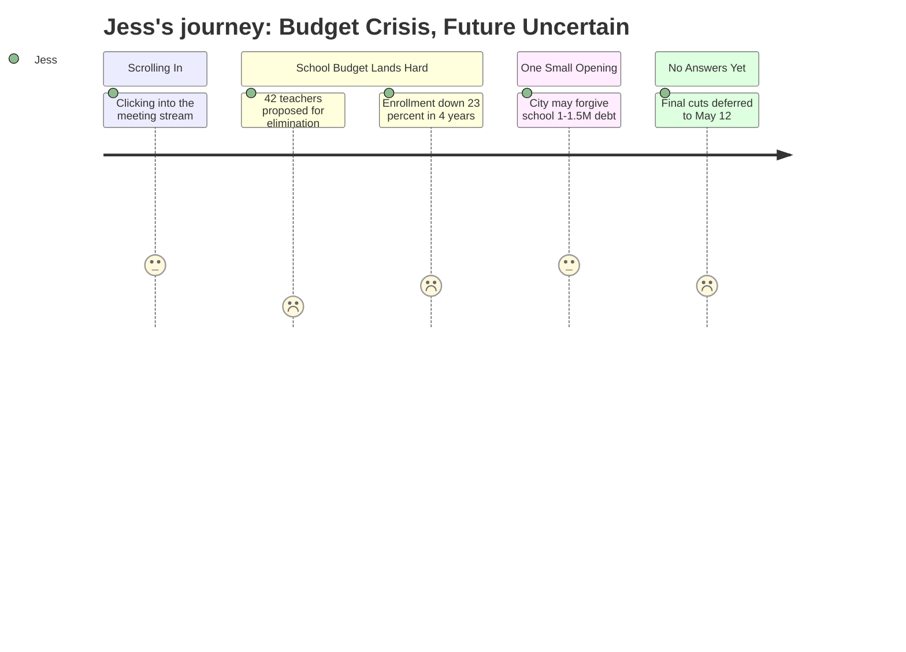

# Interpretation: Jess (PERSONA-003)
## Meeting: City Council Regular Meeting -- April 28, 2026 -- 2026-04-28

---

### Structured Points

#### 1. 42 Teacher Positions Proposed for Elimination
- **Fact:** The district's FY27 budget proposal includes eliminating 42 teacher positions as part of a 78-position reduction — 12% of all district staff.
- **Source:** Fiscal Context, meeting overview
- **Emotional valence:** negative
- **Threat level:** 5
- **Open question:** true — Which grade levels are losing teachers? Which schools? What will class sizes look like when her child enters in 2–3 years?

#### 2. Elementary Enrollment Has Fallen 23% in Four Years
- **Fact:** Elementary enrollment dropped from 1,401 to 1,080 students over the past four years — a loss of roughly 300 children.
- **Source:** Fiscal Context, meeting overview
- **Emotional valence:** negative
- **Threat level:** 4
- **Open question:** true — Why are families leaving? Is this a signal that the district is in long-term decline, or a demographic shift? Are other families in her position making the same calculation she is?

#### 3. Fund Balance (Savings Reserve) Is Essentially Gone
- **Fact:** The district's financial reserve is described as essentially depleted, leaving no financial cushion for unexpected costs or enrollment shifts.
- **Source:** Fiscal Context, meeting overview
- **Emotional valence:** negative
- **Threat level:** 4
- **Open question:** true — If something goes wrong between now and when her child enrolls — a bad winter, a state funding cut — what happens? There is no safety net described.

#### 4. City May Forgive $1–1.5M the School Owes Them
- **Fact:** A majority of councilors indicated support for forgiving some portion of a fund balance obligation the school owes the city. School officials believe the actual amount needed is $1–$1.5M; the city manager recommends against forgiveness, citing impacts to the city's own capital purchasing capacity.
- **Source:** City Council Budget Workshop #2 Position Paper, Agenda Item B.1
- **Emotional valence:** positive
- **Threat level:** 2
- **Open question:** true — This hasn't been decided yet. The city manager is pushing back. Will this relief actually materialize, and does it meaningfully change the scale of the cuts?

#### 5. State Funding Covers Only 20% Instead of the Expected 55%
- **Fact:** State aid covers approximately 20% of actual school costs, far below the roughly 55% it is designed to provide under state funding formulas.
- **Source:** Fiscal Context, meeting overview
- **Emotional valence:** negative
- **Threat level:** 3
- **Open question:** true — Is this a temporary gap or a structural state-level problem that will persist when her child is in school? Nobody in this meeting addressed the trajectory of state aid.

#### 6. South Portland's Per-Pupil Cost Is the Highest Among Comparable Districts
- **Fact:** The district spends $26,651 per pupil, described as the highest among comparable districts in the region.
- **Source:** Fiscal Context, meeting overview
- **Emotional valence:** neutral
- **Threat level:** 2
- **Open question:** true — Does this mean high-quality programs and investment, or does it mean administrative inefficiency and misaligned spending? The meeting does not explain what drives the high per-pupil figure, and the simultaneous push to cut 78 positions makes the number confusing rather than reassuring.

#### 7. No Final Decisions Until May 12 — Everything in a "Parking Lot"
- **Fact:** The April 28 workshop does not finalize any budget decisions. All proposed additions and cuts are deferred to a third workshop on May 12, where the council will resolve a "parking lot" of outstanding items.
- **Source:** City Council Budget Workshop #2 Position Paper, Agenda Item B.1; Proposed Workshop Schedule, Agenda Item C.1
- **Emotional valence:** neutral
- **Threat level:** 2
- **Open question:** true — Will any of the proposed teacher eliminations be reversed before May 12? What is the realistic range of outcomes, and where does the school budget land?

---

### Journey Map

---

### Reactions

Okay so I finally watched part of that city council meeting someone shared in the daycare Facebook group, and I honestly wish I hadn't because now I can't stop thinking about it. They're talking about cutting *forty-two teachers*. Out of the whole district. That's not like, trimming around the edges — that's gutting it. And my daughter isn't even in kindergarten yet. By the time she walks into a classroom, what's even going to be left?

The thing that really scared me was the enrollment number. Elementary enrollment is down 23% in *four years*. That's 300 kids. Where did those families go? They didn't explain it. They just said it like it's normal. And I'm sitting here thinking — are those families smarter than me? Did they already figure out something I'm still trying to work out? Because if families are leaving *now*, and the district is broke, and they're cutting teachers to make up the difference... what does that trajectory look like in 2028?

There was one thing that wasn't totally bleak — apparently the city council is considering forgiving, like, $1 to $1.5 million that the school owes them, which would help a little. The city manager said don't do it, but the council seemed like they might anyway. But even that isn't decided yet — everything gets pushed to some May 12 meeting where they'll supposedly figure it all out. So I'm just... waiting. Watching a district that's already losing kids make decisions that will still be baked in by the time my kid gets there, and nobody at that table was talking about what it means for families who haven't even started yet.