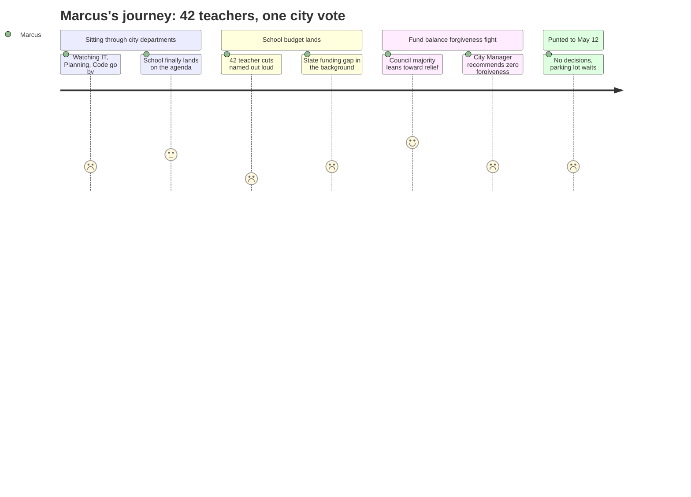

# Interpretation: Marcus (PERSONA-004)
## Meeting: City Council Regular Meeting -- April 28, 2026 -- 2026-04-28

### Structured Points

#### 1. 42 Teaching Positions Proposed for Elimination
- **Fact:** The FY27 budget proposal includes elimination of 78 total positions, of which 42 are teachers -- more than half of all proposed cuts, and a number that would cascade into larger class sizes and eliminated sections across every building.
- **Source:** Fiscal Context, FY27 Budget Figures
- **Emotional valence:** negative
- **Threat level:** 5
- **Open question:** true

#### 2. Council Majority Indicated Support for Some Fund Balance Forgiveness
- **Fact:** At the April 14 workshop, a majority of councilors signaled openness to forgiving some portion of the fund balance the school owes the city -- offering a potential, if unquantified, source of fiscal relief for the school budget.
- **Source:** City Manager Position Paper, Agenda Item B.1
- **Emotional valence:** positive
- **Threat level:** 2
- **Open question:** true

#### 3. City Manager Recommends Against Any Forgiveness
- **Fact:** Despite that council sentiment, City Manager staff explicitly recommends zero forgiveness, warning it would either divert funds from city capital needs or force a city-side tax increase to compensate.
- **Source:** City Manager Position Paper, Agenda Item B.1
- **Emotional valence:** negative
- **Threat level:** 4
- **Open question:** true

#### 4. School's Actual Ask Is $1–$1.5M, Not the $3M the City Reserved
- **Fact:** The city had budgeted a conservative $3M as the school's anticipated overage. School officials say the real figure is closer to $1–$1.5M -- narrowing the ask, but not resolving whether the city will agree to forgive any of it.
- **Source:** City Manager Position Paper, Agenda Item B.1
- **Emotional valence:** neutral
- **Threat level:** 3
- **Open question:** true

#### 5. State Underfunding Is the Root Cause No One Foregrounded Tonight
- **Fact:** State funding covers approximately 20% of actual school costs against an expected 55% -- a structural gap that dwarfs the cuts under discussion and is entirely outside the district's control. This figure appeared in the fiscal context but did not drive the framing of tonight's discussion.
- **Source:** Fiscal Context, FY27 Budget Figures
- **Emotional valence:** negative
- **Threat level:** 4
- **Open question:** true

#### 6. "Staffing Grew While Enrollment Dropped" Is the Operative Political Narrative
- **Fact:** The budget framing highlights that the district added 82 positions while elementary enrollment fell by 300 students (23%) over four years -- a framing that implies overhiring without publicly accounting for why those positions were added.
- **Source:** Fiscal Context, FY27 Budget Figures
- **Emotional valence:** negative
- **Threat level:** 3
- **Open question:** true

#### 7. No Decisions Made Tonight -- Everything Deferred to May 12
- **Fact:** The fund balance forgiveness question and all other parking lot items were explicitly deferred to the May 12 final budget workshop, where the council will make binding choices. Tonight produced no commitments on school funding.
- **Source:** City Manager Position Paper, Agenda Item B.1; Proposed Workshop Schedule, Agenda Item C.1
- **Emotional valence:** neutral
- **Threat level:** 3
- **Open question:** true

---

### Journey Map

---

### Reactions

So they finally got to the school part of the agenda -- after sitting through IT, Code Enforcement, the Planning department, probably an hour of stuff that has nothing to do with my job or my colleagues' jobs. And at the end of it, nothing is decided. The big question tonight was whether the city is going to forgive the $1 to $1.5 million the school owes them in fund balance. Which, by the way, is less than half what the city had been holding in reserve -- the school is asking for $1.5 million, not $3 million. That's actually the school being conservative. And apparently a majority of councilors said at the last meeting they're open to forgiving some of it. But the City Manager stood up tonight and said his staff recommends no forgiveness, none of it. So you've got the elected officials leaning one way and the administration pulling the other, and nobody can tell us how many of those 42 positions come back if the city says yes. That math has not been done publicly, or if it has, they didn't share it at the workshop.

The thing that bothers me most is the framing they keep using. "Staffing grew by 82 positions while enrollment dropped by 300 students." They say it like it's an indictment -- like we built a bloated machine for no reason. Nobody asked out loud: why did those 82 positions get added? Were they special ed mandates? Mental health supports the state required? New programs the board approved? Nobody said that. And nobody led with the actual driver, which is that the state is supposed to cover 55% of our costs and is covering about 20%. That's the hole. That's why we're here. But the story being told in that room is that we overstaffed and now the teachers have to pay for it.

May 12 is the one that matters. That's when the parking lot items get resolved -- including the forgiveness question. I'll be watching that one closely. If the city says no, there's more pressure on the school budget, which means more pressure on those 42 positions. If they say yes to even $1 million, that's real money, that might be positions. But we're going into a two-week wait with no clear signals, and in the meantime my colleagues are updating their résumés. That's just where we are.