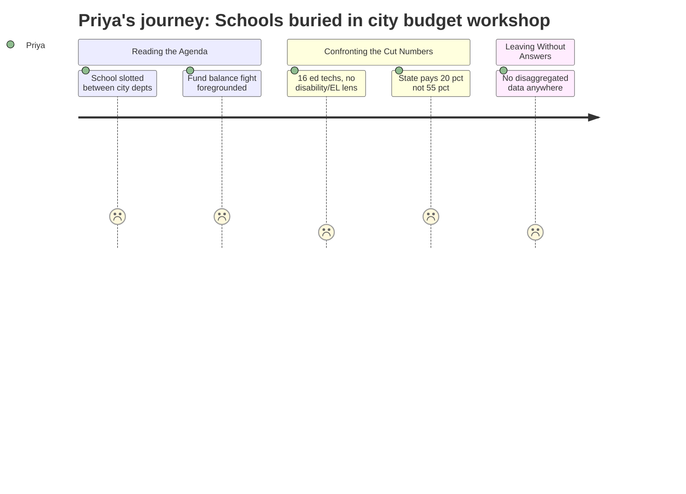

```markdown
---
schema_version: "1.0"
meeting_id: "2026-04-28-city-council"
persona_id: "PERSONA-005"
persona_name: "Priya"
meeting_date: 2026-04-28
meeting_title: "City Council Regular Meeting -- April 28, 2026"
interpretation_date: 2026-04-28
interpreter_model: "claude-sonnet-4-6"
---

# Interpretation: Priya (PERSONA-005)
## Meeting: City Council Regular Meeting -- April 28, 2026 -- 2026-04-28

---

### Structured Points

#### 1. Sixteen Ed Tech Positions Proposed for Elimination
- **Fact:** The FY27 budget materials identify 16 ed tech positions among the 78 proposed eliminations. Ed techs are the primary in-classroom support staff for students with IEPs and English learners — two of the most resource-dependent populations in the district.
- **Source:** FY27 Budget materials, fiscal context summary (position elimination breakdown)
- **Emotional valence:** negative
- **Threat level:** 5
- **Open question:** true

#### 2. Forty-Two Teacher Cuts Announced Without School or Program Disaggregation
- **Fact:** Budget materials presented to the Council identify 42 teacher positions for elimination, but no public breakdown by school, grade level, or program type appears in the agenda materials.
- **Source:** FY27 Budget materials, fiscal context summary; City Council Agenda, Budget Workshop #2, April 28, 2026
- **Emotional valence:** negative
- **Threat level:** 4
- **Open question:** true

#### 3. City Manager Recommends Against Fund Balance Forgiveness for Schools
- **Fact:** The city manager's position paper explicitly recommends against forgiving the school department's ~$1–1.5M fund balance overage, citing risk to city capital reserves. The school believes the actual overage is at the lower end of this range.
- **Source:** City Manager Position Paper, Budget Workshop #2, April 28, 2026
- **Emotional valence:** negative
- **Threat level:** 3
- **Open question:** false

#### 4. State Funding Covers 20% of Actual Costs When Formula Should Deliver 55%
- **Fact:** Budget materials document that state aid covers only approximately 20% of actual district costs, against a statutory expectation of roughly 55%. This structural underfunding places disproportionate burden on local property taxes — a funding mechanism that does not track student need.
- **Source:** FY27 Budget materials, fiscal context summary (state funding coverage figures)
- **Emotional valence:** negative
- **Threat level:** 4
- **Open question:** false

#### 5. School Budget Presented as One Line Item Among City Departments
- **Fact:** The agenda positions the school department's budget presentation between Water Resource Protection and Finance, with the same five-to-fifteen minute window allotted to other city departments. No equity framework, no student population disaggregation, and no reference to high-need student impacts appear in the framing materials circulated to councilors.
- **Source:** City Council Agenda, Budget Workshop #2, April 28, 2026 (workshop schedule)
- **Emotional valence:** negative
- **Threat level:** 2
- **Open question:** true

#### 6. Enrollment Decline Framed as a Staffing Mismatch, Not a Demographic Reality
- **Fact:** Budget materials describe a 23% elementary enrollment decline (1,401 to 1,080 students over four years) as a cost-driver requiring staff reduction. The materials do not examine which student populations remain, whether demographic concentration has increased in specific schools, or what the service implications are for high-need students who did not leave.
- **Source:** FY27 Budget materials, fiscal context summary (enrollment and staffing figures)
- **Emotional valence:** negative
- **Threat level:** 3
- **Open question:** true

#### 7. Per-Pupil Spending Cited as a Fiscal Concern Without Within-District Equity Data
- **Fact:** The district's per-pupil expenditure of $26,651 — identified as the highest among comparable districts — is cited in budget materials as evidence of cost pressure. No accompanying breakdown of how that spending is distributed across schools or student subgroups is included in the materials presented to the Council.
- **Source:** FY27 Budget materials, fiscal context summary (per-pupil cost figure)
- **Emotional valence:** neutral
- **Threat level:** 3
- **Open question:** true

---

### Journey Map



---

### Reactions

So I went to this thing expecting at least some acknowledgment that the cuts would land differently on different kids. And I left with nothing. The budget materials circulated to councilors list 16 ed tech positions for elimination. That's it — just a number. No mention that ed techs are the people sitting next to kids with IEPs, the people helping a newly arrived student navigate a classroom where nobody speaks their language yet. The city manager's paper talks about fund balance and capital reserves. The agenda slots the school between Water Resource Protection and Finance. The whole structure of the meeting treats the school budget like a plumbing contract — something to be balanced, not something with human consequences that are distributed unevenly across a population.

What I keep coming back to is the 42 teacher cuts. There is nothing in the materials — nothing — that tells you which schools those positions are at, which programs are being gutted, which grade levels. The enrollment decline is described as a mismatch between headcount and staffing, which — fine, there's a real fiscal problem there. But a 23% decline at the elementary level does not mean the remaining students have lower needs. If anything, the families who have the easiest time leaving are not the families with kids in self-contained special education rooms or kids in EL services. The kids who stayed are more likely to be the kids who need the most. That's not speculation — that's what the district's own steering committee documented two years ago. And now we're cutting 16 ed techs with zero analysis of what that means for that population.

The state funding number hit me hard too. Twenty percent of actual costs, when the formula is supposed to deliver 55%. That is not a local budget problem. That's the state systematically underfunding public education and letting towns absorb the gap through property taxes — a mechanism that has nothing to do with student need and everything to do with property values. I'm not letting the district off the hook for its own spending decisions, but the city manager recommending against fund balance forgiveness for schools, when the structural cause of the shortfall is a 35-point gap in state aid, that's a conversation that deserved a different frame than capital reserves. Nobody in that room appeared to be holding the equity dimension of that choice.
```