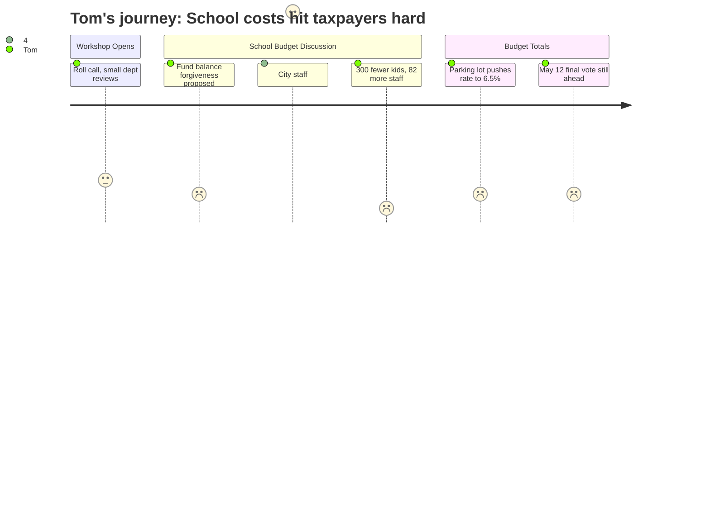

# Interpretation: Tom (PERSONA-006)
## Meeting: City Council Budget Workshop #2 -- April 28, 2026 -- 2026-04-28

### Structured Points

#### 1. Parking lot total could push tax rate increase from 5.1% to 6.5%
- **Fact:** The combined parking lot items from the first two budget workshops total $1,281,555 in added property tax needs. If all items are funded, the projected tax rate increase rises from 5.1% to 6.5% — an additional 1.4 percentage points on top of the baseline.
- **Source:** City Council Agenda, Budget Workshop #2 — April 28, 2026, Position Paper (Section B.1)
- **Emotional valence:** negative
- **Threat level:** 4
- **Open question:** true

#### 2. School asking council to forgive $1–$1.5M in fund balance overage
- **Fact:** A majority of councilors have already signaled support for forgiving some portion of the school department's fund balance overage. The school estimates the actual shortfall is $1–$1.5M; the city had projected as much as $3M. The school is now pressing council to commit to a specific forgiveness amount, which it says will affect FY27 budget planning.
- **Source:** City Council Agenda, Budget Workshop #2 — April 28, 2026, Position Paper (Section B.1), school fund balance note
- **Emotional valence:** negative
- **Threat level:** 4
- **Open question:** true

#### 3. City staff explicitly recommends against any fund balance forgiveness
- **Fact:** The City Manager and Finance staff recommend zero forgiveness of the school's fund balance overage. Their stated reason: forgiving the debt would force the city to either defer capital purchases it had planned to fund from reserves, or raise property taxes on the city side to cover the gap.
- **Source:** City Council Agenda, Budget Workshop #2 — April 28, 2026, Position Paper (Section B.1), school fund balance note
- **Emotional valence:** positive
- **Threat level:** 1
- **Open question:** false

#### 4. Enrollment dropped 23% while staffing grew by 82 positions
- **Fact:** Over the past four years, South Portland elementary enrollment fell from 1,401 to 1,080 students — a loss of roughly 321 students, or 23%. During the same period, district staffing increased by 82 positions. This divergence is a central driver of the current $7.2M structural budget gap.
- **Source:** Fiscal context summary, FY27 Budget 4.28.26 Council Meeting.pdf (agenda attachment)
- **Emotional valence:** negative
- **Threat level:** 5
- **Open question:** true

#### 5. Per-pupil spending of $26,651 is highest among comparable districts
- **Fact:** South Portland's per-pupil cost stands at $26,651, which the district's own budget materials identify as the highest figure among comparable Maine school districts.
- **Source:** Fiscal context summary, FY27 Budget 4.28.26 Council Meeting.pdf (agenda attachment)
- **Emotional valence:** negative
- **Threat level:** 4
- **Open question:** true

#### 6. State covers only 20% of costs — the expected share is 55%
- **Fact:** State education funding covers approximately 20% of South Portland's actual per-pupil costs. The formula-based expectation is roughly 55%. The 35-point shortfall is passed directly to local property taxpayers and is a significant driver of the structural gap.
- **Source:** Fiscal context summary, FY27 Budget 4.28.26 Council Meeting.pdf (agenda attachment)
- **Emotional valence:** negative
- **Threat level:** 3
- **Open question:** true

#### 7. 78 positions proposed for elimination to hold the 6% ceiling
- **Fact:** To close the $7.2M structural gap and hold the tax increase to 6%, the district is proposing elimination of 78 positions: 42 teachers, 16 ed techs, 14 facilities/food/transport workers, 2 administrators, and 4 non-bargaining employees. The school tax currently represents 61% of total property taxes.
- **Source:** Fiscal context summary, FY27 Budget 4.28.26 Council Meeting.pdf (agenda attachment)
- **Emotional valence:** neutral
- **Threat level:** 3
- **Open question:** true

---

### Journey Map

---

### Reactions

So I sat through most of that meeting last night and the number that's stuck with me is this: enrollment dropped by over 300 kids in four years — that's almost a quarter of the students gone — and the district hired 82 more employees during that same stretch. Not cut. Hired. I don't know how you look at that and say there's no fat to trim. If my business lost a quarter of its customers and I added staff, I'd be out of business. They're just asking us to pay for it instead.

And now the council — most of them anyway — want to forgive the school's overspending. The school is saying, fine, it's only $1.5 million, not the $3 million the city thought. But the city's own finance people are telling council: if you write that off, you either don't fix the roads, or you raise taxes to replace the money. That's a straight transfer from city taxpayers to cover a school budget that already ran over. At least somebody in that building is saying the right thing — I'll give the finance staff credit for that. Whether the council listens is another question.

Here's what I'm watching for at the May 12 meeting. Right now the parking lot adds another 1.4% on top of everything else, and we're already looking at a 5% base increase before that. Add the forgiveness, add the parking lot items, and we could be heading toward 6.5% or more on the city side alone — and the school side is 61% of my tax bill on top of that. The per-pupil cost here is already the highest of any comparable district in the state. I'm not saying cut the teachers — those 78 jobs going away is real — but I want someone to explain to me when the staffing is finally going to match the enrollment. Because it sure hasn't yet.