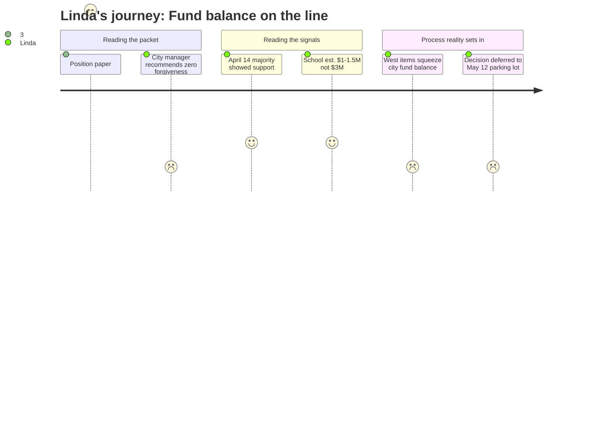

# Interpretation: Linda (PERSONA-007)
## Meeting: City Council Regular Meeting -- April 28, 2026 -- 2026-04-28

---

### Structured Points

#### 1. Council majority previously signaled support for some fund balance forgiveness
- **Fact:** The city manager's position paper confirms that at the April 14 workshop, a majority of councilors indicated they were supportive of forgiving some level of fund balance owed by the School to the City.
- **Source:** City Manager Position Paper, Budget Workshop #2 Agenda, Section B.1 ("NOTE" paragraph)
- **Emotional valence:** positive
- **Threat level:** 2
- **Open question:** true — "a majority" is not a committed vote. How firm is that support, and which councilors are persuadable in either direction?

#### 2. School department's own estimate of the overage is $1–1.5M, well below the city's $3M ceiling
- **Fact:** The city manager notes the School Department believes the actual fund balance shortfall that needs to be forgiven will be approximately $1–$1.5 million, compared to the city's conservative planning figure of $3 million.
- **Source:** City Manager Position Paper, Budget Workshop #2 Agenda, Section B.1 ("NOTE" paragraph)
- **Emotional valence:** positive
- **Threat level:** 1
- **Open question:** false — this is the district's own number and should be traceable to the attached school budget materials. It's a favorable variance from the planning ceiling.

#### 3. City manager formally recommends zero forgiveness
- **Fact:** The city manager's stated staff position is to recommend no forgiveness of the fund balance owed by the School, citing the impact on city capital purchases and the risk of requiring a city-side tax increase to compensate.
- **Source:** City Manager Position Paper, Budget Workshop #2 Agenda, Section B.1 ("NOTE" paragraph)
- **Emotional valence:** negative
- **Threat level:** 4
- **Open question:** true — staff recommendations carry weight. If a councilor is on the fence, the city manager's opposition gives them cover to vote no. How many of the "majority" from April 14 will hold?

#### 4. Council has not yet locked in a specific forgiveness amount — decision deferred to May 12
- **Fact:** The school department is specifically asking councilors to specify the dollar amount they will forgive tonight, but the parking lot structure means this decision will be made at the third and final budget workshop on May 12, not at this meeting.
- **Source:** City Manager Position Paper, Budget Workshop #2 Agenda, Sections B.1 and C.1
- **Emotional valence:** negative
- **Threat level:** 3
- **Open question:** true — the school's FY27 budget planning depends on this number. Every day without a committed figure from the council is a day the district cannot finalize how many positions it must cut.

#### 5. Councilor West's parking lot items put additional pressure on the city's own fund balance
- **Fact:** Councilor West (absent) requested two items be added to the parking lot: remove $250,000 in city fund balance use from the city's own budget, and add any excess fund balance above the 12% goal to a capital building reserve — reducing the city's own fiscal flexibility.
- **Source:** City Manager Position Paper, Budget Workshop #2 Agenda, Section B.1 (West parking lot items)
- **Emotional valence:** negative
- **Threat level:** 2
- **Open question:** true — if these items move forward, they shrink the pool of city-side resources that could be used to accommodate school forgiveness, making the city manager's "no forgiveness" recommendation politically easier to sustain.

#### 6. The cumulative parking lot as of April 23 projects a 6.5% total property tax rate increase
- **Fact:** The agenda states that all items currently in the parking lot, if funded and cut as proposed, would result in an additional 1.4% tax rate increase above the current 5.1% trajectory — reaching 6.5% total.
- **Source:** City Manager Position Paper, Budget Workshop #2 Agenda, Section B.1 (parking lot summary paragraph)
- **Emotional valence:** negative
- **Threat level:** 3
- **Open question:** true — this figure does not yet include the impact of whatever fund balance forgiveness, if any, the council grants to the school. The final rate could shift further.

#### 7. School budget materials formally presented to council tonight
- **Fact:** The school department's own agenda item and two attached documents — a cover letter and the FY27 budget presentation — are part of tonight's council packet, meaning this is the school's formal pitch directly to the council body.
- **Source:** City Council Agenda Item listing: "4.28.26 City Council Agenda Item from SPSD.pdf" and "FY27 Budget 4.28.26 Council Meeting.pdf"
- **Emotional valence:** neutral
- **Threat level:** 2
- **Open question:** true — the content of those attached documents is not summarized in the agenda. The framing the superintendent or business manager chose for that council presentation matters enormously and is not visible here.

---

### Journey Map

---

### Reactions

The number that actually matters to me tonight is $1–1.5 million. That's what our business office says we actually owe back, not the $3 million the city was planning around. That is a meaningful difference and it should make this a lot easier for councilors to say yes. The problem is the city manager is on record recommending zero — zero — and that gives anyone who was lukewarm on April 14 a reason to flip. I've seen "a majority indicated they were supportive" turn into a 4-3 the other direction before. Until I hear it as a motion on May 12 with a dollar figure attached, I'm not counting on anything.

What gets me is the timeline. The school is explicitly asking the council to name a number tonight so we can do our budget math. And instead it goes to the parking lot. I understand that's how their process works — you can't just blurt out appropriations at a workshop — but we are still planning around a range, not a commitment. Seventy-eight positions proposed for elimination. Forty-two teachers. And we're still waiting on the council to tell us whether we're starting from a $1.5 million hole or a zero hole. That difference may not change the final position count much given the scale of the cuts, but it changes how we sequence the reductions and what we can hold back from the superintendent's recommendation.

The Councilor West parking lot items also caught my eye. Taking $250K out of city fund balance use and seeding a capital reserve with excess — fine, that's responsible governance on the city side, I get it. But those moves reduce the city's own breathing room, which makes the "we can't afford forgiveness because it hurts our capital needs" argument stronger heading into May 12. I don't think West is wrong to ask for those items. I just think the timing is rough. We need to go into that final workshop having done some informal coalition work with whatever councilors are genuinely movable. Because if we get nothing on forgiveness and the levy ceiling still can't close the full gap, those 78 positions are not the end of the conversation.