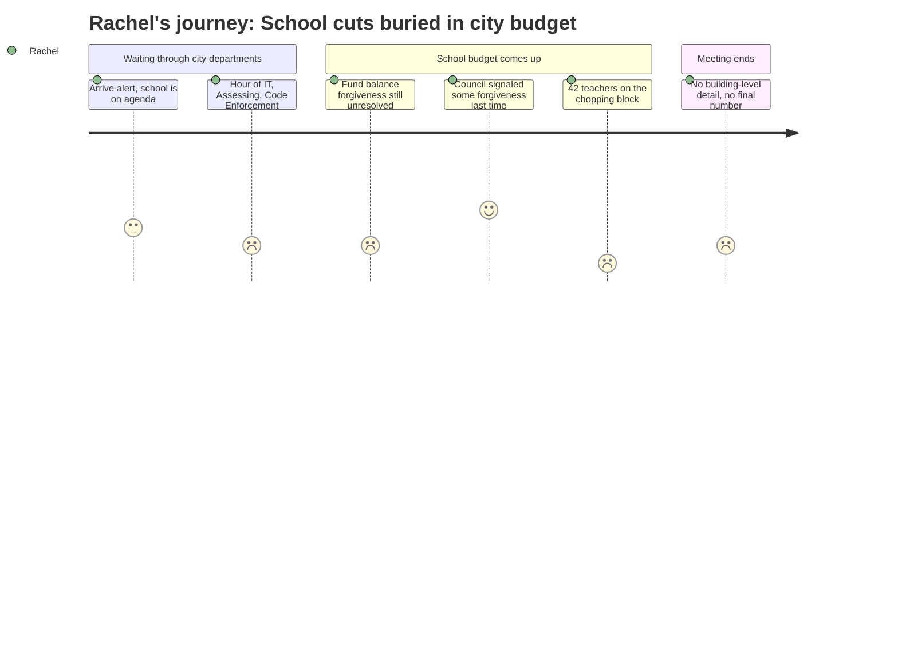

```markdown
---
schema_version: "1.0"
meeting_id: "2026-04-28-city-council"
persona_id: "PERSONA-008"
persona_name: "Rachel"
meeting_date: 2026-04-28
meeting_title: "City Council Regular Meeting -- April 28, 2026"
interpretation_date: 2026-04-28
interpreter_model: "claude-sonnet-4-6"
---

# Interpretation: Rachel (PERSONA-008)
## Meeting: City Council Regular Meeting -- April 28, 2026 -- 2026-04-28

### Structured Points

#### 1. 42 Teachers Proposed for Elimination
- **Fact:** The proposed FY27 budget includes eliminating 78 positions districtwide, including 42 classroom teachers — the largest single category of cuts.
- **Source:** Fiscal Context (position elimination summary)
- **Emotional valence:** negative
- **Threat level:** 5
- **Open question:** true — Which schools lose which teachers? Which grade levels? Are any buildings targeted more heavily than others?

#### 2. Elementary Enrollment Down 23% in Four Years
- **Fact:** Elementary enrollment has fallen from 1,401 to 1,080 students over four years — a 23% decline — while staffing grew by 82 positions over the same period.
- **Source:** Fiscal Context (enrollment and staffing summary)
- **Emotional valence:** negative
- **Threat level:** 4
- **Open question:** true — A 23% enrollment drop across elementary schools is exactly the kind of data point that precedes consolidation or closure discussions. The agenda does not address whether building-level changes are under consideration.

#### 3. City Staff Recommends Against Fund Balance Forgiveness
- **Fact:** The City Manager's office formally recommends that the City Council not forgive the school department's fund balance overage, arguing that forgiveness would either delay city capital projects or require a city-side tax increase to compensate.
- **Source:** Agenda Note, Budget Workshop #2 (City Manager position paper)
- **Emotional valence:** negative
- **Threat level:** 3
- **Open question:** true — If the council follows staff's recommendation, the school department must repay the overage. It is not stated in the agenda what additional cuts that would require.

#### 4. School Officials Believe Actual Overage Is $1–1.5M, Not $3M
- **Fact:** While the city budgeted conservatively for a $3M school fund balance shortfall, school officials say the actual amount will be $1–1.5M — a significantly smaller figure than earlier estimates.
- **Source:** Agenda Note, Budget Workshop #2 (City Manager position paper)
- **Emotional valence:** positive
- **Threat level:** 2
- **Open question:** false — The lower figure is somewhat reassuring: the school's budget hole is smaller than worst-case projections. Council members are being asked to specify a forgiveness amount, meaning some forgiveness remains on the table.

#### 5. Council Support for Some Forgiveness Signaled at Prior Workshop
- **Fact:** At the April 14 budget workshop, a majority of councilors indicated support for forgiving some level of the school fund balance overage.
- **Source:** Agenda Note, Budget Workshop #2 (City Manager position paper)
- **Emotional valence:** positive
- **Threat level:** 2
- **Open question:** true — "Some level" is not a number. Until the council specifies an amount, the school department cannot finalize its FY27 budget or know how many additional cuts are required.

#### 6. School Section Buried Deep in a Long Municipal Agenda
- **Fact:** The school department is listed ninth of twelve department segments in tonight's workshop schedule, after SPCTV, IT, Assessing, Water Resource Protection, Code Enforcement, Planning, and Economic Development.
- **Source:** Agenda, Budget Workshop #2, Tonight's Schedule
- **Emotional valence:** negative
- **Threat level:** 2
- **Open question:** false — This is a structural feature of the city's budget process, not a decision. But Rachel would experience it viscerally: sitting through hours of municipal line items before the part that affects her children.

#### 7. No Building-Level or School-Specific Information in Council Materials
- **Fact:** The agenda materials and fiscal context describe districtwide cuts and totals but do not identify which elementary schools, grades, or programs are specifically targeted for reductions.
- **Source:** Agenda attachments referenced (FY27 Budget 4.28.26 Council Meeting.pdf) — no building-specific breakdown visible in agenda text
- **Emotional valence:** negative
- **Threat level:** 3
- **Open question:** true — Without school-by-school detail, Rachel cannot tell whether her children's building is absorbing more than its share of the 42 teacher cuts.

---

### Journey Map



---

### Reactions

So I sat there for like two hours watching them talk about the golf course fund balance and whether to put $250,000 into a capital reserve before they even got to the schools. And when they finally did — okay, some of it was not as bad as I feared. The actual amount the schools overspent is closer to $1.5 million, not the $3 million the city had been planning for. And apparently a majority of councilors already said they'd forgive some of it at the last meeting. So that part felt like maybe it won't blow everything up.

But then I'm looking at these numbers and they're talking about cutting 42 teachers. Forty-two. That's not trimming the edges — that's gutting classrooms. And nobody said which schools. Nobody said which grades. The whole thing was districtwide totals and structural gaps and fund balances, and I'm sitting there thinking, is it my kids' school? Is it their teacher? And I genuinely cannot tell because they never said. Enrollment is down 23% at the elementary level — I get that, the numbers are what they are — but that kind of decline is exactly what they use to justify closing a school or moving all the third graders somewhere else. They didn't say that tonight. But they didn't say they weren't doing it either.

The thing that's going to keep me up is that I still don't have an answer to the basic question: what happens to my kids' school specifically? The council won't vote on the parking lot items until May 12th, so nothing is settled yet. I need to find out if there's a building-level breakdown in those PDF attachments they mentioned and whether the school board has any materials that show how those 42 teacher cuts are distributed across buildings. Because "districtwide" doesn't mean my school is fine. It just means nobody told me yet.
```