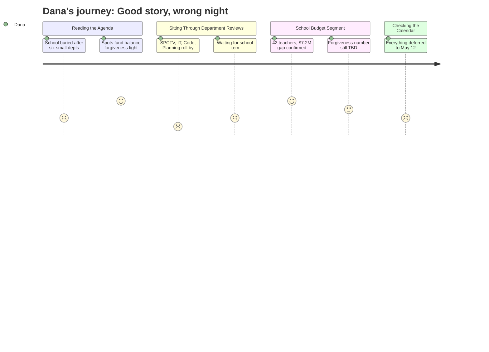

# Interpretation: Dana (PERSONA-009)
## Meeting: City Council Budget Workshop #2 — April 28, 2026

### Structured Points

#### 1. City Hall vs. the School: Fund Balance Forgiveness Fight
- **Fact:** A majority of councilors at the April 14 workshop signaled support for forgiving some portion of a fund balance debt the school owes the city. City staff is explicitly recommending against any forgiveness, warning it will force either delayed capital projects or a tax increase on the city side of the ledger.
- **Source:** City Council Budget Workshop #2 Agenda — Position Paper of the City Manager, note under School item
- **Emotional valence:** negative
- **Threat level:** 4
- **Open question:** true

#### 2. 42 Teachers Could Lose Their Jobs This Fall
- **Fact:** The district is proposing elimination of 78 positions — including 42 teachers, 16 ed techs, and 14 in facilities, food, and transport — to close a $7.2M structural gap under a 6% tax increase ceiling.
- **Source:** Fiscal context; referenced in attached school materials (FY27 Budget 4.28.26 Council Meeting.pdf)
- **Emotional valence:** negative
- **Threat level:** 5
- **Open question:** true

#### 3. The Forgiveness Number Is Still Moving
- **Fact:** The city conservatively estimated the school needs $3M in fund balance forgiveness. School officials say the actual figure is $1–$1.5M. The council is being asked tonight to commit to a specific dollar amount — not a percentage — so the school can finalize its FY27 budget.
- **Source:** City Council Budget Workshop #2 Agenda — Position Paper of the City Manager, note under School item
- **Emotional valence:** neutral
- **Threat level:** 3
- **Open question:** true

#### 4. Tonight Is a Staging Meeting — May 12 Is the Real Vote
- **Fact:** No budget decisions are finalized tonight. All councilor add/cut requests go into a "parking lot" for resolution at the May 12 final workshop, where the council will "ultimately decide."
- **Source:** City Council Budget Workshop #2 Agenda — Position Paper of the City Manager
- **Emotional valence:** neutral
- **Threat level:** 2
- **Open question:** false

#### 5. Tax Rate Could Climb From 5.1% to 6.5%
- **Fact:** If all items currently in the parking lot are funded as proposed, the combined net effect would push the additional tax rate increase from 5.1% to 6.5% — a 1.4 percentage point jump on top of what's already baked in.
- **Source:** City Council Budget Workshop #2 Agenda — Position Paper of the City Manager, Parking Lot summary note
- **Emotional valence:** negative
- **Threat level:** 3
- **Open question:** false

#### 6. School Tax Is 61 Cents of Every Property Tax Dollar
- **Fact:** The school department accounts for 61% of South Portland's total property tax levy. The district's per-pupil cost of $26,651 is the highest among comparable districts — and enrollment has fallen 23% in four years.
- **Source:** Fiscal context
- **Emotional valence:** negative
- **Threat level:** 3
- **Open question:** false

#### 7. Absent Councilor Still Steering the Parking Lot
- **Fact:** Councilor West could not attend but submitted two specific parking lot requests in advance: remove $250,000 in fund balance use from the tax buydown, and seed a capital building reserve from any unused fund balance.
- **Source:** City Council Budget Workshop #2 Agenda — Position Paper of the City Manager, Councilor West note
- **Emotional valence:** neutral
- **Threat level:** 1
- **Open question:** false

### Journey Map

### Reactions

Okay, pitching this to you straight. The story is real — 42 teachers potentially out the door, a city council that's been told by their own staff not to bail out the school but looks like they're going to anyway, and a tax bill that could go up either way. That's a two-minute segment. The problem is tonight is not the night to send a crew. Everything goes into what they call a "parking lot" and the actual decisions happen May 12. Tonight is basically a scheduling meeting with a long warm-up act about the Water Resource Protection department.

The gold is in the fund balance fight. The city did the math and said the school probably needs $3 million forgiven. The school came back and said actually it's more like $1 to $1.5 million. So now the council is being asked to name a number tonight — not a percentage, a specific dollar amount — and city staff is on the record saying don't do it at all. That's a legitimate conflict: three different numbers, three different interests, and a school district that can't close its budget until the city makes a call. The angle is: City Hall and the school board can't agree on how big the bailout should be, while teachers wait to find out if they still have jobs in September.

May 12 is the meeting worth setting up a shot for. Before then, I want one of those 42 teachers on camera — preferably someone mid-career, South Portland kid, coaching a sport, the works. Lede is: "South Portland could cut dozens of teachers this fall, but first the city council has to decide how much of the school's debt to just write off." For b-roll, I'm going to one of the elementary schools — enrollment is down 300 kids in four years, so empty hallways will carry the visual. If I can get a skeptical councilor to say the words "$26,000 per student, highest in the region" on camera, that's the kicker right there.