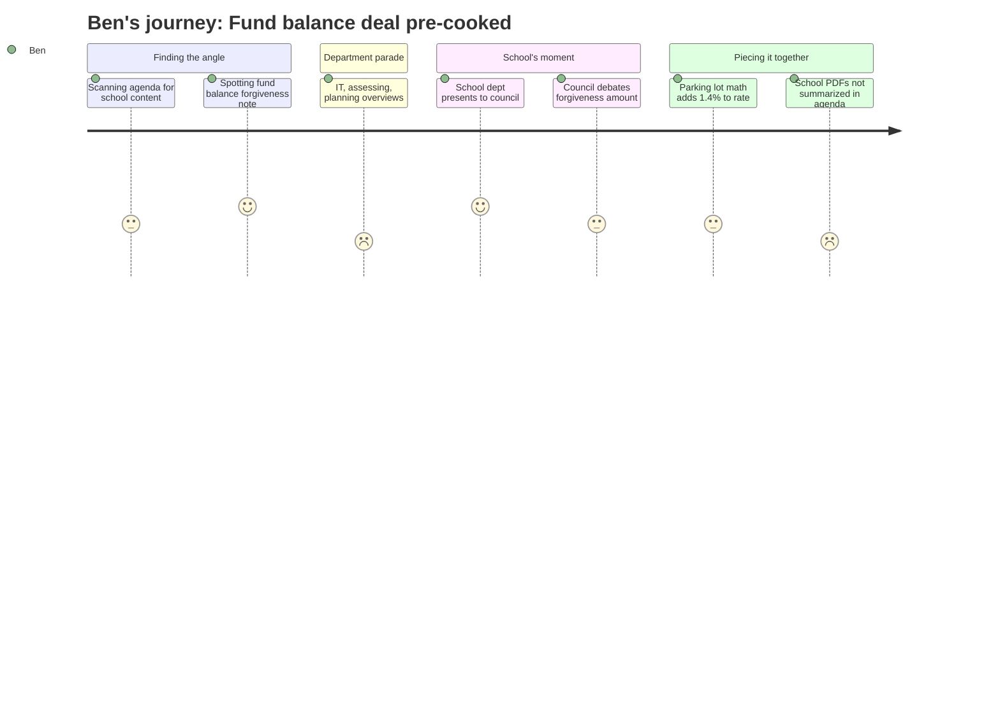

# Interpretation: Ben (PERSONA-010)
## Meeting: City Council Regular Meeting -- April 28, 2026 -- 2026-04-28

---

### Structured Points

#### 1. City and school disagree on how much the school owes
- **Fact:** The city manager's position paper states the city estimated "conservatively" that the school's fund balance overage would require $3M from the city, but school officials believe the actual amount is closer to $1–$1.5M — a gap of roughly $1.5–2M between the two estimates.
- **Source:** City Manager Position Paper, Agenda Item B.1 (Note under School department)
- **Emotional valence:** negative
- **Threat level:** 3
- **Open question:** true

#### 2. City staff recommends zero forgiveness, with specific reasoning
- **Fact:** Finance staff explicitly recommends against forgiving any fund balance, citing two concrete downstream harms: either capital purchases get delayed or cut, or the city side of the tax levy has to rise to replace the funds that would otherwise have been replenished.
- **Source:** City Manager Position Paper, Agenda Item B.1
- **Emotional valence:** negative
- **Threat level:** 3
- **Open question:** true

#### 3. Council majority already signaled support for forgiveness before the workshop
- **Fact:** The agenda notes that at the April 14 workshop, "a majority of Councilors indicated they were supportive of forgiving some level of fund balance." Tonight's workshop was nominally about deciding the amount — not whether to forgive at all.
- **Source:** City Manager Position Paper, Agenda Item B.1
- **Emotional valence:** neutral
- **Threat level:** 2
- **Open question:** true

#### 4. School needs a dollar figure from council to finalize its own FY27 budget
- **Fact:** The agenda states the school is asking council to specify a forgiveness amount because "it will have implications for their FY27 budget." The school's budget work is on hold pending this political decision.
- **Source:** City Manager Position Paper, Agenda Item B.1
- **Emotional valence:** negative
- **Threat level:** 3
- **Open question:** true

#### 5. All current parking lot items net out to a 6.5% tax increase — up from 5.1%
- **Fact:** If all items currently in the parking lot from workshops one and two are adopted, the net effect is a 1.4% additional increase on top of the baseline 5.1%, for a total of 6.5% on the city side of the tax rate. This is before the school budget referendum.
- **Source:** City Manager Position Paper, Agenda Item B.1
- **Emotional valence:** negative
- **Threat level:** 3
- **Open question:** true

#### 6. Councilor West submitted parking lot items by proxy, including a fund balance seed for capital
- **Fact:** Unable to attend the workshop, Councilor West asked to place two items in the parking lot: removing $250K in fund balance used to buy down the tax rate, and directing any fund balance above the 12% goal (or not used by the school) into a capital building reserve.
- **Source:** City Manager Position Paper, Agenda Item B.1
- **Emotional valence:** neutral
- **Threat level:** 1
- **Open question:** false

#### 7. School department submitted presentation materials, but their content is not summarized in the agenda
- **Fact:** Two PDFs from the school department are listed as attachments ("4.28.26 City Council Agenda Item from SPSD.pdf" and "FY27 Budget 4.28.26 Council Meeting.pdf"), but the position paper does not describe what the school presented or what specific ask they made to council.
- **Source:** City Manager Position Paper, Agenda Item B.1 attachment list
- **Emotional valence:** neutral
- **Threat level:** 2
- **Open question:** true

---

### Journey Map

---

### Reactions

So here's the actual story from tonight, and it's not complicated once you strip away the procedural stuff: the school district owes the city money — somewhere between $1 million and $3 million, depending on who you ask — and the council has to decide tonight whether to forgive it and how much. The city manager is saying don't forgive any of it, the school is saying please forgive around $1 to $1.5 million, and a majority of councilors apparently already indicated at the April 14 workshop that they'd forgive some of it. So the question going into tonight was basically just: pick a number. That's a story I can tell. The analogy I'm working with is something like: imagine you lent your neighbor money, your neighbor thinks they owe you $1,200 back, you think it's more like $3,000, and in the meantime your neighbor is waiting on your answer before they can figure out whether to cancel the family vacation.

What I need before I can write this properly is those two PDFs the school submitted to the council. The agenda just lists them as attachments — there's no summary of what the school actually told councilors, what their justification was, what their budget numbers look like at this point. Without that I'm writing around the edges of the real content. I'll need to pull those from the school department site or call Ellen Sanborn's office in the morning. The school budget page is listed (spsdme.org/page/budget27), so I should be able to find them.

The bigger framing issue I'm chewing on is this: the fund balance forgiveness question is real, but it's also a sideshow relative to the $7.2M structural gap and 78 positions that are still on the table. I don't want readers to walk away from my next piece thinking the city council solved the school budget problem tonight, because they didn't. Even if council forgives the full $1.5M, that doesn't save a single teacher — it just resolves a balance sheet dispute between two arms of city government. The piece I actually want to write is about how these two tracks — the city budget workshops and the school board's own process — are running in parallel, and families won't get a full picture until both are done. The referendum is coming whether people are paying attention or not.