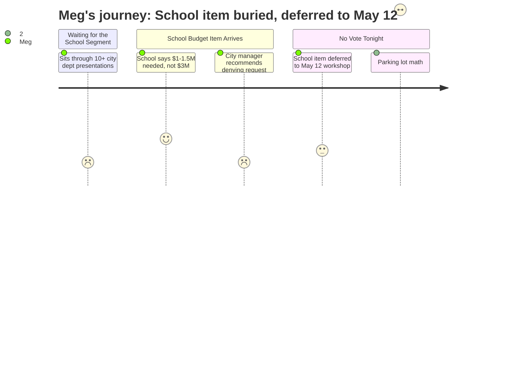

# Interpretation: Meg (PERSONA-011)
## Meeting: City Council Regular Meeting -- April 28, 2026 -- 2026-04-28

### Structured Points

#### 1. School Narrows the Fund Balance Ask to $1–$1.5M
- **Fact:** The school department told the council their anticipated FY26 budget overage requiring forgiveness is $1–$1.5 million — substantially less than the city's conservative estimate of $3 million.
- **Source:** City Manager Position Paper, Agenda Item B.1 (school budget note)
- **Emotional valence:** positive
- **Threat level:** 2
- **Open question:** true

#### 2. City Manager Officially Recommends Denying All Forgiveness
- **Fact:** Despite council interest expressed at the April 14 workshop, the city manager's written position is that the council should forgive nothing, citing impacts on city capital purchases or a required city-side tax increase.
- **Source:** City Manager Position Paper, Agenda Item B.1
- **Emotional valence:** negative
- **Threat level:** 4
- **Open question:** true

#### 3. Council Already Signaled Openness at April 14 — But No Amount Is Set
- **Fact:** The agenda notes a majority of councilors at the April 14 workshop indicated support for forgiving "some level" of fund balance. The school is now asking council to specify a dollar amount, because the number has implications for their FY27 budget planning.
- **Source:** City Manager Position Paper, Agenda Item B.1
- **Emotional valence:** neutral
- **Threat level:** 3
- **Open question:** true

#### 4. Nothing Is Decided Tonight — May 12 Is the Real Vote
- **Fact:** Tonight is Workshop #2 of 3. All parking lot items, including the school fund balance question, carry forward to the final workshop on May 12, where the council will make its decisions.
- **Source:** Agenda Item B.1 (workshop structure); Agenda Item C.1 (remaining workshop schedule)
- **Emotional valence:** negative
- **Threat level:** 3
- **Open question:** false

#### 5. Current Parking Lot Math Pushes Tax Rate From 5.1% to 6.5%
- **Fact:** As of tonight's parking lot, if all currently queued items are funded or cut as proposed, the net impact is an additional 1.4% on the property tax rate, moving from 5.1% to 6.5%.
- **Source:** City Manager Position Paper, Agenda Item B.1 (parking lot summary)
- **Emotional valence:** negative
- **Threat level:** 3
- **Open question:** false

#### 6. School Is One Stop Among ~12 on a Packed Agenda
- **Fact:** The school is listed ninth among approximately twelve presenting entities tonight. The agenda structure allocates five to ten minutes to smaller departments and ten to fifteen minutes to larger ones, with public comment and councilor questions following each.
- **Source:** Agenda Item B.1 (tonight's schedule and format)
- **Emotional valence:** neutral
- **Threat level:** 2
- **Open question:** true

#### 7. Councilor West Is Absent — School Has One Fewer Voice in the Room
- **Fact:** Councilor West could not attend and submitted two parking lot requests in advance via the city manager. Both of her items involve city-side fund balance management, not direct school forgiveness. She is not present to advocate or ask questions during the school segment.
- **Source:** City Manager Position Paper, Agenda Item B.1 (Councilor West note)
- **Emotional valence:** negative
- **Threat level:** 2
- **Open question:** false

---

### Journey Map

---

### Reactions

OK recap from tonight — **nothing was decided, but there's one important number and one date you need.**

The school part was maybe item 9 of 12 on a really long agenda. Worth knowing that this was a city council budget workshop, not a school board meeting — the school was presenting to the council about one specific question: how much of the school's FY26 budget overage will the city forgive? Here's the key update: the school is now saying they expect to need $1 to $1.5 million in forgiveness. The city had been planning for as much as $3 million, so this is actually better news than feared. The problem is the city manager's official recommendation is to forgive nothing — zero — because whatever they forgive either eats into the city's capital budget or forces a city-side tax increase. Some councilors were already on record at the April 14 meeting as being open to some forgiveness, but no dollar amount has been agreed. The school needs a number because it affects how they build the FY27 budget.

The vote is **May 12.** That's Workshop #3 and the final decision point for everything in the parking lot. Mark it. In terms of what you'll pay at the end — if all the items currently parked pass, the tax increase goes from 5.1% to 6.5%. That's the ceiling right now before May 12 sorting.

What I still don't know, and what none of tonight answered: does the forgiveness amount — whatever it ends up being — actually change how many positions get cut? The $1–$1.5M ask is real money, but with a $7.2M structural gap in the school budget, it's partial relief. Whether it translates into fewer teacher eliminations or just a softer landing for the fund balance isn't something this meeting addressed. That's the question I'm watching for at the school board level. May 12 at city council is one piece. The school board is the other.