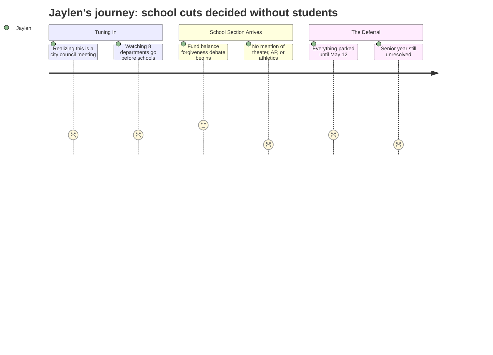

# Interpretation: Jaylen (PERSONA-012)
## Meeting: City Council Regular Meeting -- April 28, 2026 -- 2026-04-28

---

### Structured Points

#### 1. 42 Teachers Proposed for Elimination
- **Fact:** The district's FY27 budget proposal includes eliminating 78 positions total, 42 of which are teachers — roughly 12% of all district staff.
- **Source:** Fiscal Context (meeting background figures); referenced in school department materials attached to agenda (4.28.26 City Council Agenda Item from SPSD.pdf)
- **Emotional valence:** negative
- **Threat level:** 5
- **Open question:** true

#### 2. School Gets a Slot Between the Golf Course and Finance
- **Fact:** The school department is listed as agenda item 9 of 13 departments presenting at a single City Council session. Presenting departments include SPCTV, Water Resource Protection, Code Enforcement, and the Golf Course. Each gets 5–15 minutes.
- **Source:** City Council Agenda — 2026-04-28, Section B.1 schedule
- **Emotional valence:** negative
- **Threat level:** 3
- **Open question:** false

#### 3. Whether Schools Get a Financial Lifeline Is Being Decided Tonight
- **Fact:** The Council is being asked to decide whether to forgive $1–$1.5M in school fund balance overage from FY26. School officials say this amount affects how they build the FY27 budget. City staff recommend against forgiveness.
- **Source:** City Council Agenda — 2026-04-28, Position Paper of the City Manager, school budget note
- **Emotional valence:** neutral
- **Threat level:** 3
- **Open question:** true

#### 4. The Entire School Discussion Is Framed as a Financial Accounting Question
- **Fact:** The school's agenda item is presented exclusively as a fund balance forgiveness question — no agenda language mentions teacher positions, specific programs, course offerings, or student-facing services by name.
- **Source:** City Council Agenda — 2026-04-28, Position Paper note on School; agenda item title "School*"
- **Emotional valence:** negative
- **Threat level:** 2
- **Open question:** true

#### 5. No Final Decisions Tonight — Parking Lot Items Go to May 12
- **Fact:** Any items councilors want to add, cut, increase, or decrease are placed in a "parking lot" for resolution at Budget Workshop #3 on May 12. Tonight produces no binding budget decisions.
- **Source:** City Council Agenda — 2026-04-28, Position Paper of the City Manager, Parking Lot process description
- **Emotional valence:** neutral
- **Threat level:** 2
- **Open question:** true

#### 6. Students Have No Formal Role in This Forum
- **Fact:** This is a City Council workshop, not a School Board meeting. The public comment opportunity described in the agenda applies to councilors' departmental review process; students are not identified as a stakeholder group anywhere in the agenda.
- **Source:** City Council Agenda — 2026-04-28, Position Paper of the City Manager, workshop structure
- **Emotional valence:** negative
- **Threat level:** 2
- **Open question:** false

#### 7. The Clock Is Running — Senior Year Is Being Decided Now
- **Fact:** Budget Workshop #3 (final) is May 12, 2026. What gets parked, cut, or preserved at that meeting sets the FY27 budget that governs Jaylen's entire senior year.
- **Source:** City Council Agenda — 2026-04-28, Section C.1 workshop schedule
- **Emotional valence:** negative
- **Threat level:** 4
- **Open question:** true

---

### Journey Map

---

### Reactions

Okay so I actually watched part of this and I'm kind of losing my mind. This isn't even a school board meeting — it's a city council budget workshop. They're reviewing like thirteen different departments in one night. The school is sandwiched between the Golf Course and the Finance office. They literally get the same amount of time as the dog catcher. And the only thing they actually talked about regarding schools was whether the city would forgive some accounting debt the school owes them — like $1 to $1.5 million — which I guess matters, but nobody explained what happens to our classes if they don't get that money. They just said the school "believes the actual amount will be closer to $1-1.5 million." That's it. That's all you get.

Here's what I actually need to know and nobody will just say: 42 teachers are proposed to be cut. Forty-two. That's in the background materials. My coach told me some of this weeks ago and I didn't fully believe it, but it's right there. And this whole meeting went by without anyone saying "here's what that means at SPHS" or "here are the specific departments losing positions." They talked about it like it's a line on a spreadsheet. Every time I try to find out whether theater is losing its director or whether AP Lit is getting cut, the answer is buried in budget categories that don't mean anything to me. "Object code 1100." Cool, thanks.

The thing that actually got me is the timeline. They're putting everything in a "parking lot" to decide on May 12. That's two weeks from now. And then whatever they decide becomes the budget that covers my entire senior year. I have zero vote, zero formal role, not even a student seat at that table. I testified at a school board meeting once and I genuinely felt like they were waiting for me to finish so they could move on. This is a whole different level — this is the city council. I'm not even supposed to be the audience here. If I show up at City Hall on May 12 during public comment and say "please don't cut our theater director," I don't even know if that's the right room. That's the part that keeps me up. Not that the budget is bad — that nobody has told us which room we're supposed to be in.