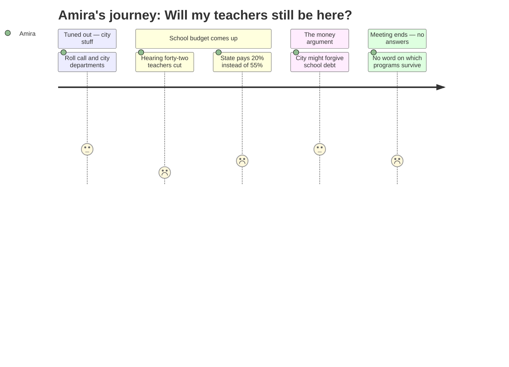

# Interpretation: Amira (PERSONA-013)
## Meeting: City Council Regular Meeting -- April 28, 2026 -- 2026-04-28

---

### Structured Points

#### 1. Forty-two teachers proposed for elimination
- **Fact:** The FY27 budget proposal includes eliminating 42 teacher positions as part of a total of 78 staff cuts, representing roughly 12% of the district's entire workforce.
- **Source:** Fiscal Context / FY27 Budget 4.28.26 Council Meeting.pdf (attached to City Council Agenda — 2026-04-28)
- **Emotional valence:** negative
- **Threat level:** 5
- **Open question:** true

#### 2. Ed tech positions also on the cut list
- **Fact:** 16 ed tech positions are proposed for elimination alongside the 42 teacher cuts — these are the staff who provide in-classroom support to students who need extra help.
- **Source:** Fiscal Context / FY27 Budget 4.28.26 Council Meeting.pdf (attached to City Council Agenda — 2026-04-28)
- **Emotional valence:** negative
- **Threat level:** 4
- **Open question:** true

#### 3. The school gets ten to fifteen minutes in a meeting about everything else
- **Fact:** The school budget is one item among roughly a dozen city departments scheduled for the workshop. Larger departments are allocated "up to ten to fifteen minutes" each; the school is listed eleventh in the agenda order.
- **Source:** City Council Agenda — 2026-04-28 [agenda]
- **Emotional valence:** negative
- **Threat level:** 2
- **Open question:** false

#### 4. State is paying less than half of what it should
- **Fact:** State funding covers only approximately 20% of actual school costs, far below the roughly 55% it should provide under the funding formula — a gap that is a primary driver of the district's $7.2M structural shortfall.
- **Source:** Fiscal Context
- **Emotional valence:** negative
- **Threat level:** 4
- **Open question:** true

#### 5. City might give the school some money back — or might not
- **Fact:** A majority of councilors indicated support for forgiving some portion of the school's fund balance overage from prior years; the school says the actual amount it needs forgiven is $1–1.5M, but city staff recommends no forgiveness at all.
- **Source:** City Council Agenda — 2026-04-28 [agenda], position paper of the City Manager
- **Emotional valence:** neutral
- **Threat level:** 3
- **Open question:** true

#### 6. Her parents' property tax worry connects directly to those teacher cuts
- **Fact:** The school tax makes up 61% of total property taxes in South Portland. The school board set a 6% tax increase ceiling — and it is that ceiling that requires the $7.2M in cuts, including the 42 teacher positions.
- **Source:** Fiscal Context
- **Emotional valence:** neutral
- **Threat level:** 2
- **Open question:** false

#### 7. No specific programs, schools, or classes named anywhere
- **Fact:** Neither the agenda text nor the attached budget materials, as reflected in the meeting context provided, name which specific schools, grade levels, courses, or student programs are affected by the proposed cuts.
- **Source:** City Council Agenda — 2026-04-28 [agenda]; Fiscal Context
- **Emotional valence:** negative
- **Threat level:** 3
- **Open question:** true

---

### Journey Map

---

### Reactions

Mom, so I actually sat through part of that council meeting thing. It was really long — like, most of it was about the city's water department and IT stuff and I almost gave up. But then they finally got to the school part and it was bad. They're saying they need to cut 42 teachers. Forty-two. And also 16 more ed techs — those are the people who help kids who need extra support in class. They just said the numbers. No names, no schools, no programs. Just 42. Which made it feel worse somehow, because I kept thinking, okay, but *who*.

The thing that actually made me mad was this: apparently the state is supposed to pay more than half of what the school costs, but they're only paying 20%. So why isn't anyone making the state pay what it owes? Nobody in that room really answered that — they said it like it was just a fact everyone already agreed to accept. And then there was this whole argument about whether the city should give the school like $1 million back from some savings account, and the city staff kept saying no, and some council people said yes, and I still don't totally understand what that actually means. Like, if they give it back, does that save some of those 42 jobs? Nobody said.

The thing is, I know you talk about property taxes at home, and I never really got what that had to do with school. But it's actually the same money. Like, the reason they're cutting teachers is partly because nobody wanted taxes to go up too much. So it's all connected. It's just that nobody at that meeting talked about which kids are going to walk in on the first day in September and find out their teacher is gone.