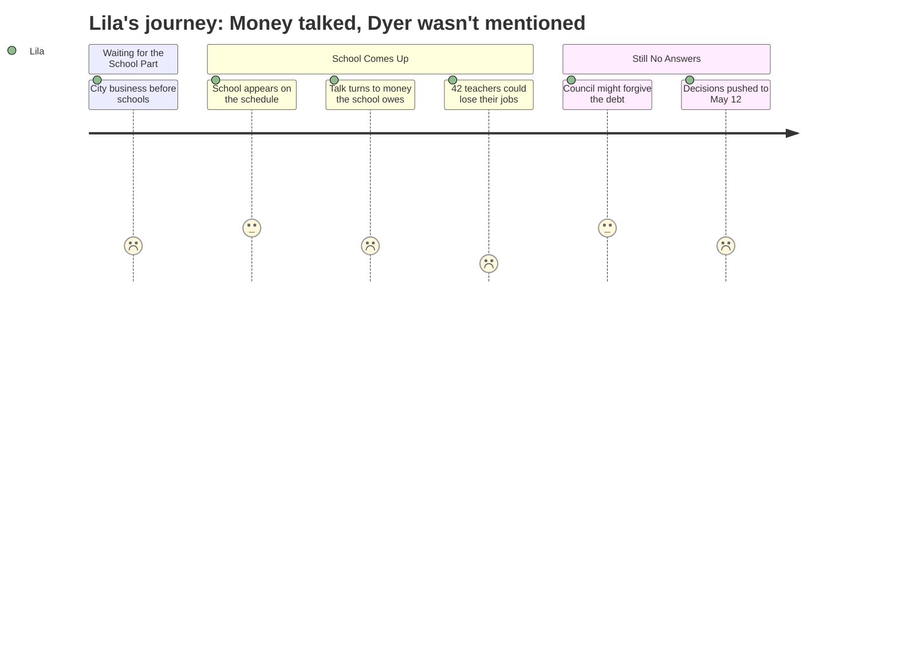

# Interpretation: Lila (PERSONA-014)
## Meeting: City Council Regular Meeting -- April 28, 2026 -- 2026-04-28

### Structured Points

#### 1. "School" appears ninth on a long city agenda
- **Fact:** The council's evening schedule lists ten subject areas before adjourning; "School" appears ninth, after SPCTV, Information Technology, Assessing, Water Resource Protection, Code Enforcement, Planning, Economic Development, and City Council business itself.
- **Source:** City Council Agenda — 2026-04-28, Workshop Discussion schedule ("Tonight's schedule")
- **Emotional valence:** negative
- **Threat level:** 2
- **Open question:** false

#### 2. The school discussion centers on money the school owes the city — not on closures or reconfiguration
- **Fact:** The only school-specific item described in the agenda is whether the City Council will forgive $1–1.5M in fund balance that the school overspent. The agenda position paper contains no reference to the proposed elementary reconfiguration, to individual schools, or to what students should expect next year.
- **Source:** City Council Agenda — 2026-04-28, City Manager position paper note (asterisked "School" entry)
- **Emotional valence:** negative
- **Threat level:** 3
- **Open question:** true

#### 3. Forty-two teachers are proposed for elimination in FY27
- **Fact:** The FY27 school budget proposes cutting 42 teaching positions as part of 78 total staff reductions required to close the district's $7.2M structural gap. Lila has had the same teacher for two years through a looping classroom arrangement.
- **Source:** Fiscal Context, FY27 budget background (78 positions total, 42 teachers)
- **Emotional valence:** negative
- **Threat level:** 5
- **Open question:** true

#### 4. City staff recommends against forgiving the school's debt
- **Fact:** Finance Director Ellen Sanborn and the City Manager recommend that the Council not forgive the school's fund balance overage, warning that doing so would either delay city capital purchases or require raising property taxes on the city side of the budget.
- **Source:** City Council Agenda — 2026-04-28, City Manager position paper note
- **Emotional valence:** negative
- **Threat level:** 3
- **Open question:** false

#### 5. Council majority has already signaled support for partial forgiveness
- **Fact:** The position paper notes that at the April 14 workshop, a majority of Councilors indicated they were supportive of forgiving some level of fund balance. School officials estimate the actual overage is $1–1.5M, lower than the $3M conservative city estimate.
- **Source:** City Council Agenda — 2026-04-28, City Manager position paper note
- **Emotional valence:** positive
- **Threat level:** 1
- **Open question:** false

#### 6. No decisions made tonight — everything deferred to May 12
- **Fact:** The agenda structure makes clear that all "parking lot" items — including the school fund balance question — will be resolved at the third and final budget workshop on May 12, 2026. Tonight is informational only.
- **Source:** City Council Agenda — 2026-04-28, Workshop Discussion structure and Proposed Workshop schedule
- **Emotional valence:** negative
- **Threat level:** 2
- **Open question:** true

---

### Journey Map

---

### Reactions

My mom went to the city council meeting last night and when she got home really late I was still awake waiting. I asked her if they talked about Dyer and she kind of made a face and said they talked about school money but not really about my school. She said they spent forever on stuff like the IT department and water things and I don't even know what half of that is. The school part didn't even come until like ninth. NINTH. Like they talked about a million other things first.

The part that made my stomach feel really bad is she said forty-two teachers might lose their jobs. Forty-two! I've had the same teacher for two whole years because we do looping and she knows everything about me, like how I need to sit near the window and how I always need extra time on math tests. I asked my mom if she was going to be one of the ones who gets fired and my mom said she doesn't know yet. She kept saying "we'll see" which is what grown-ups say when they don't want to tell you something bad.

And here's the worst part: they didn't even decide anything. My mom said there's another meeting on May 12 where they actually pick what happens. So I still don't know where I'm going next year. I still don't know if my teacher is staying. I still don't know if Emma and Priya are going to be at the same school as me. Nobody at that whole long meeting said anything about what happens to us. It's like we're not even part of it.