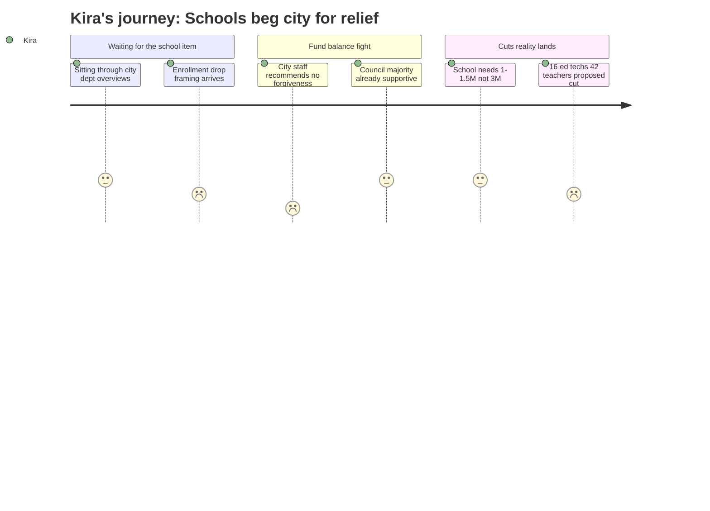

# Interpretation: Kira (PERSONA-015)
## Meeting: City Council Regular Meeting -- April 28, 2026 -- 2026-04-28

---

### Structured Points

#### 1. City Staff Recommends Against Any Fund Balance Forgiveness
- **Fact:** The City Manager's position paper explicitly recommends against forgiving the school's fund balance overage, warning that doing so would either delay city capital projects or require additional property tax increases on the city side of the ledger.
- **Source:** City Council Budget Workshop #2 Agenda, Position Paper of the City Manager, April 28, 2026
- **Emotional valence:** negative
- **Threat level:** 4
- **Open question:** true

#### 2. Council Majority Already Signaled Support for Some Forgiveness
- **Fact:** At the April 14 workshop, a majority of councilors indicated they were "supportive of forgiving some level of fund balance." The school is now asking council to specify a dollar amount, because the number directly shapes how deep FY27 cuts must go.
- **Source:** City Council Budget Workshop #2 Agenda, Position Paper of the City Manager, April 28, 2026
- **Emotional valence:** positive
- **Threat level:** 2
- **Open question:** true

#### 3. School Says It Needs $1–$1.5M, Not the $3M the City Estimated
- **Fact:** The city had conservatively estimated it might need to forgive up to $3M; the school department says the actual overage requiring forgiveness is closer to $1–$1.5M. The district has submitted supporting materials to council making this case.
- **Source:** City Council Budget Workshop #2 Agenda, Position Paper of the City Manager; "4.28.26 City Council Agenda Item from SPSD.pdf" (attachment)
- **Emotional valence:** positive
- **Threat level:** 2
- **Open question:** true

#### 4. 16 Ed Tech Positions Proposed for Elimination
- **Fact:** The district's FY27 budget proposes eliminating 16 ed tech positions as part of a 78-position total reduction, which equals 12% of all district staff.
- **Source:** "FY27 Budget 4.28.26 Council Meeting.pdf" (attachment to April 28, 2026 City Council agenda); Fiscal Context
- **Emotional valence:** negative
- **Threat level:** 5
- **Open question:** true

#### 5. 42 Teacher Positions Proposed for Elimination
- **Fact:** Forty-two teacher positions are proposed for elimination. The budget materials presented to council do not publicly specify which teaching positions — including specialist, interventionist, or itinerant roles — are included in that count.
- **Source:** "FY27 Budget 4.28.26 Council Meeting.pdf" (attachment to April 28, 2026 City Council agenda); Fiscal Context
- **Emotional valence:** negative
- **Threat level:** 5
- **Open question:** true

#### 6. School's Fiscal Relief Requires City Council Action, Not School Board Action
- **Fact:** The school's ability to reduce the depth of FY27 cuts depends entirely on the city council specifying a forgiveness amount — either tonight or at the May 12 final workshop. The school board has no authority to close this gap unilaterally.
- **Source:** City Council Budget Workshop #2 Agenda, Position Paper of the City Manager, April 28, 2026
- **Emotional valence:** negative
- **Threat level:** 3
- **Open question:** false

#### 7. State Covers 20% of Costs When It Should Cover 55%
- **Fact:** State funding covers approximately 20% of actual school costs against an expected share of roughly 55%. This structural shortfall — not local overspending — is the root driver of the $7.2M gap that is now producing the cuts.
- **Source:** Fiscal Context (Key budget figures for FY27)
- **Emotional valence:** negative
- **Threat level:** 4
- **Open question:** false

---

### Journey Map

---

### Reactions

The piece that made me put my phone down and actually start taking notes was the fund balance forgiveness fight. The school is up there asking the *city council* — not the school board, the city council — to decide how deep the cuts go this year. And the city manager's office is sitting there recommending no forgiveness at all. Zero. The argument is basically: if we forgive the school's overage, we have to raise city taxes or skip capital projects. Like the school is responsible for the structural crisis it's in. Health insurance went up 12%. The state is supposed to cover 55% of costs and it's covering 20%. That's not the school mismanaging money — that's a funding system that's failing. The city staff recommendation felt like being told to pay back a debt that someone else ran up.

What I can't get out of my head is the 16 ed techs. I know what ed techs actually do because I work alongside them every single day at multiple buildings. They're not administrative overhead. They're running intervention groups, they're doing MTSS check-ins, they're the ones in the hallway who know which kid had a rough morning because they were there at drop-off. You cut 16 of them and you're not trimming fat — you're pulling out the connective tissue that makes early intervention function. And the 42 teacher cuts worry me just as much, but for a different reason: I still don't know which 42. Are specialists in that number? Because if they're cutting itinerant and specialist positions to save money, you're taking the one thing that lets small schools offer any breadth of programming at all and eliminating it. Kids at the schools that already have the least will lose the most.

The one thing keeping me from completely spiraling is that the council already said in April they'd forgive *something*, and the actual number the school needs is $1 to $1.5 million — not the $3 million the city had been estimating. That's real. The gap is smaller than it looked a few weeks ago. But smaller than feared is not the same as okay. We're still talking about 78 positions and a community that has to show up to a city council budget workshop to plead for the school's survival. May 12 is the moment everything comes to a head. I'll be in that room.