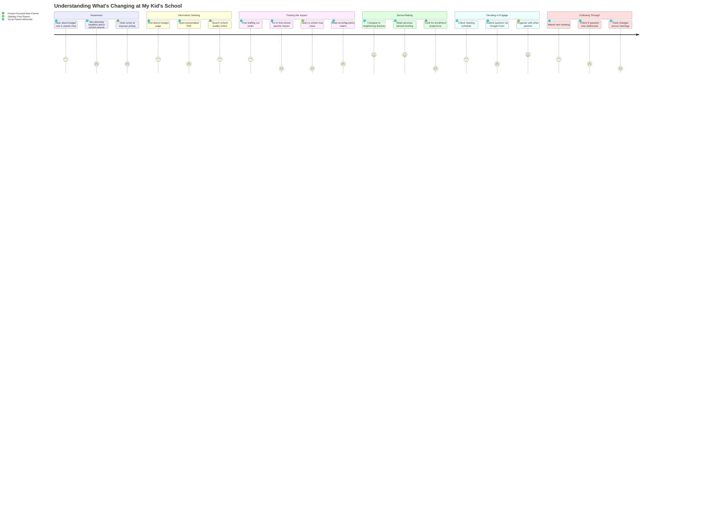

# Understanding What's Changing at My Kid's School

## Persona

**Maria** (Concerned Elementary Parent, PERSONA-001) is the primary actor. **Jess** (Anxious Pre-K Parent, PERSONA-003) follows a similar arc but enters at a different life stage — she's evaluating the system she's about to join, not defending the one she's in. **Rachel** (Disruption-Averse Parent, PERSONA-008) joins when structural changes (school closure, redistricting) are proposed, bringing intense engagement and a stability-first lens.

## Goal

Understand how the proposed FY27 budget changes affect my child's daily school experience — class sizes, teachers, programs, and whether their school stays open — and decide whether and how to engage in the public process.

## Steps / Stages

### 1. Awareness

Maria hears something is happening with the school budget. The trigger is indirect — a parent group chat mention, a local news headline ("South Portland faces $8.4M school budget gap"), a flyer in the school newsletter, or a neighbor's comment. The information is vague and possibly alarming.

Jess encounters it even more indirectly — a daycare parent mentions "they might close a school" and she starts wondering if South Portland is the right place to send her kid.

> **PP-01:** The initial signal is fragmented and context-free. Parents hear "cuts" or "school closure" without any framing for scale, probability, or what it means for their specific school.

### 2. Information Seeking

Maria goes to the district website (spsdme.org/budget27). She finds a page with links to PDFs — meeting packets, presentations, spreadsheets. The volume is overwhelming. She clicks on the most recent presentation and starts reading, but the slides assume familiarity with EPS formulas, fund balance policy, and FTE counts.

Jess searches "South Portland schools quality" and finds GreatSchools ratings and scattered news articles. The budget page doesn't speak to incoming families at all.

> **PP-02:** Budget documents are organized by meeting date, not by stakeholder question. There is no entry point for "what does this mean for my kid's school?" Parents must reverse-engineer the answer from financial documents designed for board members.

### 3. Parsing the Impact

Maria identifies that 42 teaching positions are being cut and one elementary school is closing. But she can't find: which school her child attends would gain or lose teachers, what class sizes would look like, or whether art/music/PE are affected. She cross-references the staffing table with the reconfiguration options but the connection isn't explicit.

Rachel becomes activated at this stage — the school closure proposal directly threatens her child's routine. She starts reading everything, attending every meeting, and organizing with other parents.

> **PP-03:** The staffing reduction is presented as a district-wide aggregate (354→312 teachers). There are no school-by-school projections. A parent cannot answer "how does this affect Brown Elementary?" from the published materials.

> **PP-04:** The reconfiguration models were scored on a matrix but the criteria weights and trade-offs are not explained in plain language. The pivot from closing Skillin to closing Dyer happened between meetings with no public document explaining the reasoning.

### 4. Sense-Making

Maria talks to other parents, compares notes, and forms a view. She may check neighboring districts (Scarborough, Cape Elizabeth) as benchmarks. She reads the synthesis or briefing if it's been shared in her network. She develops specific questions she wants answered.

Jess asks: "Will full-day kindergarten still exist? Will my neighborhood school be open in two years?" She can't find forward-looking answers.

> **PP-05:** No forward enrollment projections or multi-year outlook has been published. Parents making decisions about where to live or whether to stay cannot see beyond the current year.

### 5. Deciding to Engage

Maria decides whether to attend a meeting, submit a question via the Google Form, email a board member, or organize with other parents. The decision depends on whether she feels her input can change anything and whether the engagement format is accessible (timing, childcare, format).

Rachel is already fully engaged — she's packing hearings, circulating petitions, and contacting board members directly. Her question is not whether to engage but how to be effective.

> **PP-06:** Public engagement is concentrated in evening meetings that conflict with family schedules. The Google Form exists but its impact is unclear — there's no feedback loop showing how submitted questions influenced decisions.

### 6. Following Through

After engaging, Maria watches for the outcome. Did the board change course? Did her question get answered? The next meeting packet may or may not address what she raised. The budget process continues through March workshops, April council hearings, and the June referendum. Staying informed requires sustained attention across multiple meetings and bodies.

> **PP-07:** There is no update mechanism for engaged parents. Each meeting is a fresh start — no "here's what changed since last time" summary. Parents who can't attend every session fall behind.

## Pain Points

### Pain Points Summary

| ID | Pain Point | Score | Stage | Root Cause | Opportunity |
|----|------------|-------|-------|------------|-------------|
| PP-01 | Initial signals are fragmented and alarming | 2 | Awareness | Budget info reaches parents through informal channels without context | Proactive, plain-language summary distributed through school newsletters and parent networks before rumors form |
| PP-02 | Budget documents organized by meeting, not by question | 2 | Information Seeking | Documents serve the board process, not stakeholder needs | Question-indexed entry points: "What does this mean for [school name]?" |
| PP-03 | No school-by-school impact data | 1 | Parsing the Impact | Staffing presented as district aggregates only | Per-school class size projections under proposed budget |
| PP-04 | Reconfiguration rationale not documented for public | 2 | Parsing the Impact | Decision pivot happened in discussion, not in a published document | Written rationale for school closure choice, addressing matrix scores and community input |
| PP-05 | No forward enrollment projections | 1 | Sense-Making | District hasn't published multi-year outlook | 3-5 year enrollment projections by school, informing reconfiguration viability |
| PP-06 | Engagement formats inaccessible to many parents | 2 | Deciding to Engage | Evening meetings conflict with family schedules; no feedback loop on submitted questions | Async engagement options with visible response tracking |
| PP-07 | No update mechanism between meetings | 1 | Following Through | Each meeting is standalone; no cumulative change log | "What changed since last meeting" summary distributed after each session |

## Opportunities

- **Persona-targeted briefings** (already built) address PP-01 and PP-02 by providing curated entry points for each stakeholder type
- **Per-school impact sheets** would address PP-03 — a single page per school showing current vs. proposed staffing, class sizes, and programs
- **A "what changed" digest** after each meeting (PP-07) could be generated from meeting transcripts using the evidence pool pipeline
- **Forward-looking FAQ for incoming families** (PP-05) would serve Jess and other pre-K parents evaluating the district
- **Written decision rationale** (PP-04) is a transparency improvement the board could adopt without any technical infrastructure

## Lifecycle

| Phase | Date | Commit | Notes |
|-------|------|--------|-------|
| Draft | 2026-03-10 | _pending_ | Initial creation |
| Validated | 2026-03-11 | TBD | Approved by stakeholder review |
