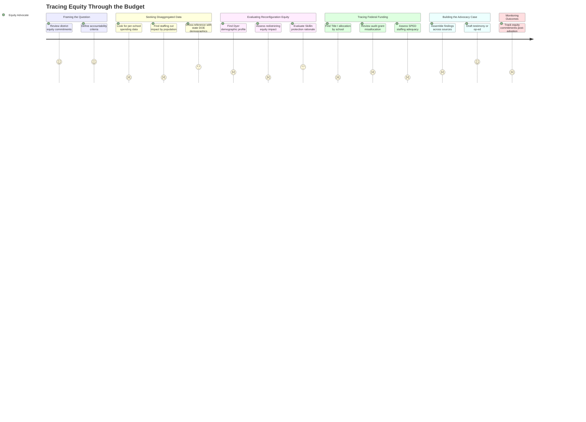

# Tracing Equity Through the Budget

## Persona

**Priya** (Equity-Focused Community Member, PERSONA-005) is the sole actor. She reads the budget through an equity lens — looking for how resources reach the district's most underserved students and whether stated equity commitments translate into allocations.

## Goal

Determine whether the FY27 budget allocates resources equitably across student populations — particularly English learners, students with disabilities, students of color, and students experiencing poverty — and build an evidence-based advocacy position where it falls short.

## Steps / Stages

### 1. Framing the Question

Priya starts from the district's own equity commitments — strategic plan language, board resolutions, the community school vote. She asks: does the proposed budget fund what the district says it values? The framing is accountability, not opposition.

### 2. Seeking Disaggregated Data

Priya looks for per-school resource allocation — staffing, program funding, support services — broken down by student demographics. She cross-references the budget with school demographic profiles from the state DOE data warehouse.

> **PP-01:** Per-school spending comparisons are not published. The budget is organized by cost center and function code, not by building. Priya cannot determine whether high-need schools receive proportionally more resources.

> **PP-02:** The 78-position cut is presented as a district-wide aggregate. There is no disaggregated impact analysis showing which students lose which supports. Does the Title I school lose more ed techs than the school with 5% poverty? Impossible to tell from published data.

### 3. Evaluating the Reconfiguration Through an Equity Lens

The closure of Dyer Elementary is the most consequential equity decision in this budget. Priya asks: what are Dyer's demographics? What are the receiving schools' demographics? Will redistricting concentrate or disperse vulnerable populations?

The Skillin pivot is also significant — the board chose to protect Skillin explicitly because it serves the most immigrant families. Priya supports that outcome but wants it documented as equity-informed decision-making, not just political responsiveness.

> **PP-03:** The Dyer closure's equity implications are not analyzed in any published document. The evaluation matrix included equity criteria, but the specific demographic impact of moving Dyer students to other schools has not been modeled publicly.

### 4. Tracing Federal and State Funding

Priya examines how Title I, IDEA, and other targeted funds flow through the budget. The FY25 audit found $400K in misallocated grant funds, including Title I money that had to be moved to the general fund due to ineligibility or overspending. This is a supplement-not-supplant compliance risk.

She also looks at the CDS transition — 80-90 four-year-olds with special education needs entering district responsibility. With 78 staff positions being cut simultaneously, she questions whether remaining SPED staffing meets legal obligations.

> **PP-04:** Title I and IDEA fund flow is not traced in budget presentations. Federal funds appear as a revenue line item but their use at the building level is opaque. The audit finding about $400K in misallocated grants raises serious compliance questions.

> **PP-05:** No SPED adequacy analysis accompanies the proposed staffing cuts. With 23% of students in special education and the CDS mandate adding 80-90 preschoolers, the remaining staffing's ability to meet IEP obligations is unaddressed.

### 5. Building the Advocacy Case

Priya synthesizes her findings: the demographic data, the allocation gaps, the audit findings, the reconfiguration equity implications. She drafts an op-ed, prepares testimony for the March 23 workshop, or shares findings with coalition partners.

> **PP-06:** The equity case requires assembling data from multiple disconnected sources — state DOE demographic profiles, district budget presentations, audit reports, and meeting transcripts. There is no integrated equity view of the budget.

### 6. Monitoring Outcomes

After the budget is adopted (or amended), Priya tracks whether equity commitments made during the process are honored in implementation. Did the Community School model get funded? Were multilingual support staff retained? Did Dyer families get equitable transitions?

> **PP-07:** There is no mechanism for post-adoption equity monitoring. Once the budget passes, there's no published tracking of whether equity-specific commitments are implemented as described.

## Pain Points

### Pain Points Summary

| ID | Pain Point | Score | Stage | Root Cause | Opportunity |
|----|------------|-------|-------|------------|-------------|
| PP-01 | Per-school spending data not published | 1 | Seeking Disaggregated Data | Budget organized by function, not building | Per-school resource allocation report |
| PP-02 | Staffing cuts not disaggregated by student population | 1 | Seeking Disaggregated Data | Cuts presented as district aggregates | Impact analysis by student demographic and school |
| PP-03 | Dyer closure equity impact not modeled | 1 | Evaluating Reconfiguration | Closure decision lacks published demographic analysis | Equity impact assessment for redistricting scenarios |
| PP-04 | Federal fund flow opaque at building level | 1 | Tracing Federal Funding | Title I/IDEA appear only as revenue lines; audit found misallocation | Transparent federal fund tracing with supplement-not-supplant documentation |
| PP-05 | No SPED adequacy analysis with proposed cuts | 1 | Tracing Federal Funding | Staffing cuts not cross-referenced with IEP/CDS obligations | SPED staffing adequacy review against legal requirements |
| PP-06 | Equity data requires assembly from multiple disconnected sources | 2 | Building the Advocacy Case | No integrated equity view exists | Budget equity dashboard or overlay linking demographics, allocations, and outcomes |
| PP-07 | No post-adoption equity monitoring | 2 | Monitoring Outcomes | Budget process ends at adoption; no implementation tracking | Quarterly equity checkpoint tied to budget commitments |

## Opportunities

- **Equity overlay analysis** — cross-reference the evidence pool data (budget allocations, staffing tables, demographic profiles) to produce the integrated equity view that doesn't exist in published materials
- **Redistricting equity model** — using school demographic data, project the composition of receiving schools after Dyer closure
- **Federal fund tracing** — extract Title I and IDEA allocations from budget detail (when published at March 23 workshop) and map to building-level use
- **SPED compliance assessment** — compare proposed staffing to IEP caseload data and CDS transition requirements
- **Equity commitment tracker** — document specific equity-related commitments made during budget deliberations and create a follow-up checklist

## Lifecycle

| Phase | Date | Commit | Notes |
|-------|------|--------|-------|
| Draft | 2026-03-10 | _pending_ | Initial creation |
| Validated | 2026-03-11 | TBD | Approved by stakeholder review |
