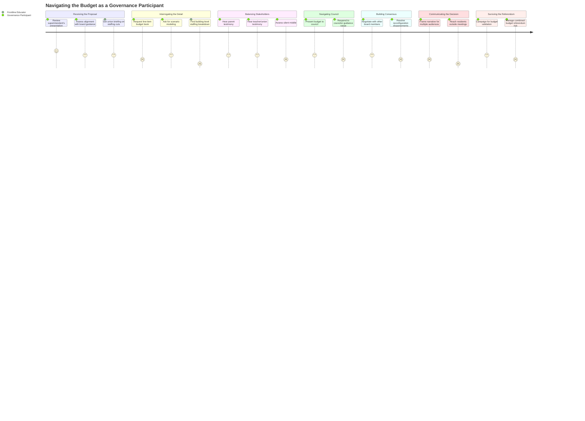

# Navigating the Budget as a Governance Participant

## Persona

**Linda** (School Board Insider, PERSONA-007) is the primary actor — a board member or finance committee member who must pass a responsible budget that survives the validation vote. **Marcus** (High School Teacher, PERSONA-004) follows a parallel track as a frontline stakeholder who engages through union channels and public testimony, translating budget abstractions into classroom impact.

## Goal

Navigate the budget deliberation process — from superintendent's proposal through board vote, council approval, and public referendum — making informed decisions that balance competing stakeholder demands while maintaining fiscal health and public trust.

## Steps / Stages

### 1. Receiving the Proposal

Linda receives the superintendent's proposed budget ($75.85M, 78 position cuts, Dyer closure) at the March 9 regular meeting. She's seen the building blocks through prior workshops, but this is the first integrated proposal. She needs to assess it as a whole: does it align with the board's guidance? Is it defensible at referendum?

Marcus receives the proposal through union briefings and colleague discussions. His first question: which 42 teaching positions? Which departments? Which buildings?

### 2. Interrogating the Detail

Linda reviews the budget in finance committee workshops. She asks for scenario modeling: what if health insurance comes in at 10% instead of 12%? What does a 5% levy look like vs. 3.33%? She needs the line-item budget book (not published until March 23) to evaluate specific trade-offs.

Marcus compares proposed staffing to current levels. He tracks which positions are vacancies vs. occupied. He talks to department chairs across SPHS to understand the full scope.

> **PP-01:** The superintendent's presentation is a high-level summary. The line-item budget book comes two weeks later (March 23). Board members are expected to evaluate and publicly discuss a proposal they can't fully interrogate yet.

> **PP-02:** The 42 teaching positions are not broken down by building or department in any public document. Marcus — and Linda — cannot assess the classroom impact without this detail.

### 3. Balancing Stakeholders

Linda hears from every constituency represented by the persona set:
- Parents demanding class sizes stay small and schools stay open (Maria, Rachel)
- Teachers protecting positions and programs (Marcus)
- Equity advocates pushing for disaggregated impact analysis (Priya)
- Taxpayers insisting on fiscal restraint (Tom)
- Incoming families worried about the system's trajectory (Jess)

She needs to weigh these against fiscal reality, legal obligations (SPED, CDS mandate, collective bargaining), and the referendum's political dynamics.

> **PP-03:** Public engagement is dominated by activated stakeholders (Rachel's school closure opposition, Marcus's union testimony). Linda has limited signal from the "silent middle" — residents who have views but don't attend meetings. David is a representative example.

### 4. Navigating the Council Relationship

Linda presents the budget to City Council in April. The February 10 joint session revealed tension: the school board wants a specific tax target from council, council wants a responsible proposal from the board, and neither wants to own the final number. The structural ambiguity — council approves the school budget but has no operational authority over schools — makes this inherently awkward.

> **PP-04:** The council-board relationship lacks a clear protocol for budget guidance. Council guidance ranged from 3% to 6% with no formal resolution. The board must guess at an acceptable number and defend it across a spectrum of councilor preferences.

Marcus is not directly involved here, but the outcome — what the council accepts — determines whether his colleagues keep their jobs.

### 5. Building Consensus

Linda negotiates with other board members to find a budget that can pass 5-0 or 6-1 (a split vote weakens the referendum position). The key disagreements: reconfiguration model choice, whether to push the levy closer to 6% to restore positions, and how to communicate cuts.

Board member Feller has publicly broken from the 6% ceiling. Chair DeAngelis is focused on equity in the reconfiguration. The internal dynamics require informal consensus-building before any public vote.

> **PP-05:** Board deliberation on budget trade-offs happens informally (conversations, email) and formally only in public session. There's no structured framework for surfacing and resolving internal disagreements on specific line items before the public vote.

### 6. Communicating the Decision

After the board votes (potentially March 30), Linda must communicate the decision to all constituencies. The narrative must work for parents (this protects classrooms), taxpayers (this is fiscally responsible), teachers (this was the least-bad option), and equity advocates (this prioritizes vulnerable students).

> **PP-06:** The communication gap is widely acknowledged — multiple board members and community members have noted that most residents don't understand the $8.4M gap or why cuts are necessary. The budget story hasn't been told effectively outside of meetings attended by fewer than 100 people.

### 7. Surviving the Referendum

June 9 is the validation vote. If the budget fails, the district must cut further. Linda's job from April through June is ensuring enough voters understand and accept the budget. The referendum covers the combined city/school budget — school opposition can sink the whole thing.

> **PP-07:** The referendum is binary on the combined budget. A voter opposed to the school increase but supportive of the city budget has no way to express that. Conversely, school supporters could be dragged down by city-side opposition. Linda has no control over the city-side narrative.

## Pain Points

### Pain Points Summary

| ID | Pain Point | Score | Stage | Root Cause | Opportunity |
|----|------------|-------|-------|------------|-------------|
| PP-01 | Line-item detail not available at proposal time | 2 | Interrogating the Detail | Budget book published weeks after superintendent's presentation | Simultaneous release of proposal summary and line-item detail |
| PP-02 | Teaching cuts not broken down by building/department | 1 | Interrogating the Detail | Staffing presented as aggregate; building-level impact not public | Per-building staffing model published with proposal |
| PP-03 | Public engagement skews toward activated minorities | 2 | Balancing Stakeholders | Meeting format favors those who attend; no mechanism for broad input | Survey or structured input from representative sample, not just meeting attendees |
| PP-04 | Council-board budget guidance protocol unclear | 2 | Navigating Council | Structural ambiguity in municipal-school governance | Formalized pre-budget guidance process with documented council resolution |
| PP-05 | Board internal deliberation unstructured | 2 | Building Consensus | Trade-offs resolved informally; no decision matrix for the board | Structured option evaluation framework for board workshops |
| PP-06 | Budget story not reaching residents | 1 | Communicating the Decision | Communication limited to meeting attendees (<100 people) | Multi-channel communication: newsletters, social media, local media partnerships, neighborhood meetings |
| PP-07 | Combined referendum creates misaligned incentives | 2 | Surviving the Referendum | State law bundles city and school budgets | Clear communication separating school and city budget components in referendum materials |

## Opportunities

- **Per-building staffing model** (PP-01, PP-02) — the analysis project can produce this from budget data when the line-item book is published
- **Stakeholder sentiment analysis** (PP-03) — meeting transcripts in the evidence pools can be analyzed for representation bias and recurring themes
- **Decision trade-off framework** (PP-05) — a structured comparison of budget options (staffing levels at different levy rates, with/without closure) that makes implicit trade-offs explicit
- **Budget explainer for broad distribution** (PP-06) — a simplified version of the general briefing, sized for newsletter/social media distribution
- **Referendum voter guide** (PP-07) — explain what's in each side of the combined budget, what happens if it fails, and how the number was derived

## Lifecycle

| Phase | Date | Commit | Notes |
|-------|------|--------|-------|
| Draft | 2026-03-10 | _pending_ | Initial creation |
| Validated | 2026-03-11 | TBD | Approved by stakeholder review |
